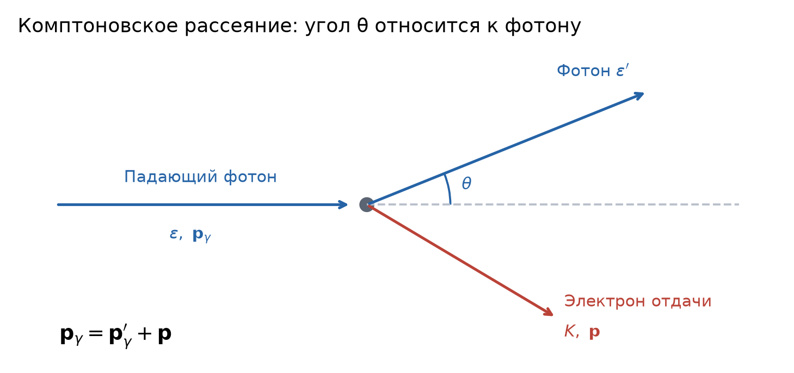
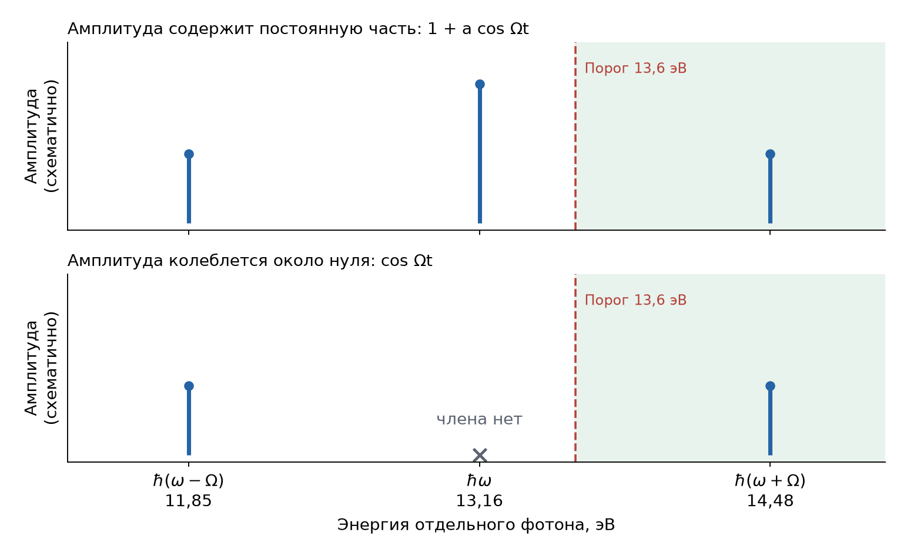
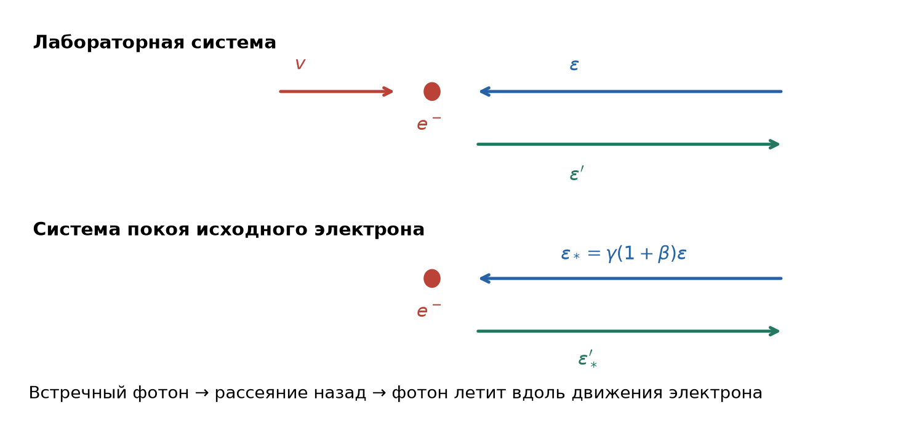

# Неделя 1 · 1–7 сентября

## Фотоэффект. Эффект Комптона

[Все недели](../README.md) · [Указатель задач](../TASKS.md) · [Теория](#theory) · [К задачам](#tasks) · [Неделя 2 →](./week-02.md)

<a name="tasks"></a>

**Задачи:** [0-1-1](#task-0-1-1) · [0-1-2](#task-0-1-2) · [1.7](#task-1-7) · [Т1.1](#task-t1-1) · [Т1.2](#task-t1-2) · [1.35](#task-1-35) · [1.48](#task-1-48) · [Т1.3](#task-t1-3) · [1.51](#task-1-51)

<a name="week-1"></a>

<a name="week-01"></a>

### Обозначения и постоянные

Кинетическую энергию обозначаем $`K`$ или $`T_{\rm kin}`$, температуру — $`T`$, энергию фотона — $`\varepsilon`$, полную энергию массивной частицы — $`E`$. Буква $`m`$ означает **массу покоя**, если явно не оговорено иное. В условии отдельной задачи исходное обозначение кинетической энергии $`T`$ иногда сохраняется.


```math
\begin{gathered}
c=2.99792458\cdot10^8\ \text{м/с},\qquad
h=6.62607015\cdot10^{-34}\ \text{Дж}\cdot\text{с},\\
\hbar=\frac{h}{2\pi}=1.054571817\cdot10^{-34}\ \text{Дж}\cdot\text{с},\qquad
k_B=1.380649\cdot10^{-23}\ \text{Дж/К},\\
1\ \text{эВ}=1.602176634\cdot10^{-19}\ \text{Дж},\\
m_ec^2=0.510999\ \text{МэВ},\qquad
m_pc^2=938.272\ \text{МэВ},\qquad
m_nc^2=939.565\ \text{МэВ},\\
uc^2=931.494\ \text{МэВ},\qquad
hc=1239.842\ \text{эВ}\cdot\text{нм}=1239.842\ \text{МэВ}\cdot\text{фм},\\
\hbar c=197.327\ \text{МэВ}\cdot\text{фм},\qquad
\sigma=5.670374419\cdot10^{-8}\ \frac{\text{Вт}}{\text{м}^2\text{К}^4},\\
b=2.89777\cdot10^{-3}\ \text{м}\cdot\text{К},\qquad
a_0=0.529177\ \text{Å}.
\end{gathered}
```


Здесь $`u`$ — атомная единица массы, $`a_0`$ — боровский радиус; $`1\ \text{Å}=10^{-10}`$ м, $`1\ \text{фм}=10^{-15}`$ м. Система единиц — СИ. Знаки $`\approx`$ и $`\sim`$ обозначают соответственно приближение и оценку масштаба.

<a name="theory"></a>

### Теоретический минимум

#### 1. Фотон и релятивистская кинематика

Фотон имеет энергию и импульс


```math
\varepsilon=h\nu=\hbar\omega=\frac{hc}{\lambda},\qquad
p_\gamma=\frac{\varepsilon}{c}=\frac h\lambda.
```


Обычная частота $`\nu`$ измеряется в Гц; круговая частота $`\omega=2\pi\nu`$. Подставлять круговую частоту в $`h\nu`$ нельзя: для неё нужна постоянная $`\hbar`$.

Для частицы массы $`m`$:


```math
E^2=p^2c^2+m^2c^4,\qquad E=K+mc^2,
```


```math
pc=\sqrt{K(K+2mc^2)},\qquad
E=\gamma mc^2,\quad p=\gamma mv,\quad
\gamma=(1-v^2/c^2)^{-1/2}.
```


При $`K\ll mc^2`$ получается $`K\approx p^2/(2m)`$; при $`K\gg mc^2`$ — $`K\approx pc`$. Формулу $`mv^2/2`$ нельзя применять к электронам с энергией порядка МэВ и выше.

#### 2. Фотоэффект

Экспериментальные закономерности: существует красная граница, максимальная энергия фотоэлектронов определяется частотой, а число выбиваемых электронов в однофотонном режиме растёт с интенсивностью. Энергия отдельного фотона расходуется на освобождение электрона и его кинетическую энергию:


```math
K_{\max}=\hbar\omega-A_{\rm вых},\qquad
\hbar\omega_0=A_{\rm вых},\qquad
eU_{\rm зап}=K_{\max}.
```


Последнее равенство предполагает, что контактная разность потенциалов уже учтена. Для отдельного атома вместо работы выхода стоит энергия ионизации $`I`$; отдачей тяжёлого иона обычно пренебрегают.

Если свет содержит несколько частот, условие $`\hbar\omega\ge I`$ проверяется **для каждой спектральной компоненты отдельно**.

#### 3. Световое давление

Пусть на единицу площади нормально падает энергия $`S\,dt`$. Её импульс равен $`S\,dt/c`$. При поглощении он целиком передаётся поверхности, при зеркальном отражении нормальная компонента меняет знак и переданный импульс удваивается:


```math
P_{\rm погл}=\frac Sc,\qquad P_{\rm зерк}=\frac{2S}{c}.
```


Для непрозрачной поверхности с коэффициентом отражения $`R`$:


```math
P=\frac{(1+R)S}{c}.
```


Это давление направленного пучка. Давление изотропного равновесного излучения имеет другую формулу: $`P=u_\gamma/3`$.

#### 4. Комптоновское рассеяние: вывод




*Рис. 1. Схема направлений; длины стрелок условны. Векторная сумма импульсов после столкновения равна исходному импульсу фотона. Угол θ отсчитывается между направлениями двух фотонов.*

Фотон энергии $`\varepsilon`$ рассеивается под углом $`\theta`$ на первоначально покоящейся свободной частице массы $`m`$. После столкновения энергия фотона $`\varepsilon'`$, импульс частицы $`\mathbf p`$.


```math
E=mc^2+\varepsilon-\varepsilon',\qquad
\mathbf p=\mathbf p_\gamma-\mathbf p'_\gamma.
```


Следовательно,


```math
p^2c^2=\varepsilon^2+\varepsilon'^2
-2\varepsilon\varepsilon'\cos\theta.
```


Подставляем это в $`E^2=m^2c^4+p^2c^2`$:


```math
m^2c^4+2mc^2(\varepsilon-\varepsilon')
+(\varepsilon-\varepsilon')^2
=m^2c^4+\varepsilon^2+\varepsilon'^2
-2\varepsilon\varepsilon'\cos\theta.
```


После сокращения одинаковых слагаемых:


```math
mc^2(\varepsilon-\varepsilon')
=\varepsilon\varepsilon'(1-\cos\theta),
```


```math
\boxed{\varepsilon'=\frac{\varepsilon}
{1+\dfrac{\varepsilon}{mc^2}(1-\cos\theta)}}.
```


Переходя к $`\lambda=hc/\varepsilon`$, получаем


```math
\boxed{\lambda'-\lambda=\frac h{mc}(1-\cos\theta)}.
```


Здесь $`\lambda_C=h/(mc)`$ — обычная комптоновская длина волны; $`\bar\lambda_C=\hbar/(mc)`$ — приведённая. Для электрона они равны соответственно $`2.4263`$ пм и $`0.38616`$ пм. Эти величины различаются в $`2\pi`$ раз.

Максимальная отдача соответствует $`\theta=\pi`$:


```math
K_{\max}=\varepsilon-\varepsilon'_{\min}
=\frac{2\varepsilon^2}{mc^2+2\varepsilon}.
```


Та же кинематика применима к упругому рассеянию безмассового нейтрино на покоящемся электроне: законы сохранения не зависят от природы взаимодействия.

#### 5. Движущаяся частица и эффект Доплера

При переходе в систему, движущуюся со скоростью $`\beta c`$ вдоль $`x`$, энергия фотона преобразуется как


```math
\varepsilon_* =\gamma\varepsilon(1-\beta\cos\alpha),
```


где $`\alpha`$ — угол фотона к оси $`x`$ в исходной системе. При лобовом столкновении $`\cos\alpha=-1`$, поэтому энергия в системе электрона увеличивается в $`\gamma(1+\beta)`$ раз. После обратного рассеяния и возвращения в лабораторную систему возникает второй такой множитель. Этим объясняется большая энергия фотона при обратном комптоновском эффекте.

#### 6. Порог Черенкова

Заряженная частица излучает в прозрачной среде, если её скорость превышает **фазовую скорость света в среде**:


```math
v>\frac cn,\qquad
\cos\theta_C=\frac{c}{nv}=\frac1{n\beta}.
```


Для электрона пороговая кинетическая энергия


```math
K_C=m_ec^2\left(\frac1{\sqrt{1-n^{-2}}}-1\right).
```


Угол $`\theta_C`$ — угол фотонов к электрону; он не равен углу самого электрона отдачи к налетающему нейтрино.

## Группа 0

<a name="task-0-1-1"></a>

### Задача 0-1-1. Давление света в опыте Лебедева

**Условие.** В опытах П. Н. Лебедева, доказавшего существование светового давления, падающий световой поток составлял $`S = 6`$ Вт/см². Вычислить давление, которое испытывали зачернённые и зеркальные лепестки его измерительной установки.

**Краткая теория.** Давление — переданный за единицу времени импульс на единицу площади. При поглощении фотон передаёт $`\varepsilon/c`$, при отражении назад — $`2\varepsilon/c`$. Падение считаем нормальным.

**Решение.** Пусть площадь лепестка $`A`$, время наблюдения $`\Delta t`$, энергия одного фотона $`\varepsilon`$. На лепесток попадает $`N=SA\Delta t/\varepsilon`$ фотонов. При поглощении переданный импульс $`\Delta p=N\varepsilon/c`$, поэтому


```math
P_{\rm ч}=\frac FA=\frac{\Delta p}{A\Delta t}
=\frac{SA\Delta t}{\varepsilon}\frac{\varepsilon}{cA\Delta t}
=\frac Sc.
```


При отражении начальная нормальная компонента импульса фотона $`+\varepsilon/c`$ меняется на $`-\varepsilon/c`$. Фотон теряет $`2\varepsilon/c`$ по направлению к лепестку, лепесток получает столько же, и давление удваивается. Теперь переводим плотность потока в СИ:


```math
S=6\ \frac{\text{Вт}}{\text{см}^2}
=6\cdot10^4\ \frac{\text{Вт}}{\text{м}^2}.
```


Тогда


```math
P_{\rm ч}=\frac Sc=\frac{6\cdot10^4}{2.998\cdot10^8}
\approx2.00\cdot10^{-4}\ \text{Па},
```


```math
P_{\rm з}=\frac{2S}{c}\approx4.00\cdot10^{-4}\ \text{Па}.
```


**Ответ:** $`\boxed{P_{\rm ч}=2.0\cdot10^{-4}\ \text{Па},\quad P_{\rm з}=4.0\cdot10^{-4}\ \text{Па}.}`$

<a name="task-0-1-2"></a>

### Задача 0-1-2. Рассеяние фотона назад

**Условие.** Монохроматическое гамма-излучение рассеивается на покоящихся электронах. Найти частоту излучения, рассеиваемого назад, если энергия налетающего фотона равна энергии покоя электрона.

**Краткая теория.** Используем формулу Комптона для энергии; рассеянию назад соответствует $`\theta=\pi`$.

**Решение.** По условию $`\varepsilon=m_ec^2`$, а $`1-\cos\pi=2`$. Поэтому


```math
\varepsilon'=\frac{m_ec^2}{1+2}=\frac{m_ec^2}{3}.
```


Искомая обычная частота:


```math
\nu'=\frac{\varepsilon'}h=\frac{m_ec^2}{3h}
=\frac{0.510999\cdot10^6\cdot1.60218\cdot10^{-19}}
{3\cdot6.62607\cdot10^{-34}}
\approx4.12\cdot10^{19}\ \text{Гц}.
```


**Ответ:** $`\boxed{\nu'\approx4.12\cdot10^{19}\ \text{Гц}.}`$ Энергия фотона уменьшается втрое, до $`170.3`$ кэВ.

## Группа 1

<a name="task-1-7"></a>

### Задача 1.7. Фотоэффект при амплитудной модуляции

**Условие.** Электромагнитная волна с круговой частотой $`\omega = 2\cdot10^{16}`$ с⁻¹ промодулирована по амплитуде синусоидой с круговой частотой $`\Omega = 2\cdot10^{15}`$ с⁻¹. Найти энергию $`\mathcal{E}`$ фотоэлектронов, выбиваемых этой волной из атомов водорода с энергией ионизации $`\mathcal{E}_{\mathrm{и}} = 13{,}6`$ эВ.

**Краткая теория.** Амплитудная модуляция создаёт боковые спектральные компоненты $`\omega\pm\Omega`$. Для каждой компоненты применяется уравнение Эйнштейна $`K=\hbar\omega_i-I`$. В решении обозначим кинетическую энергию фотоэлектрона через $`K=\mathcal{E}`$, а энергию ионизации через $`I=\mathcal{E}_{\mathrm{и}}`$.

**Решение.** Сначала определим частоты, из которых состоит поле, и лишь затем применим уравнение фотоэффекта. **Несущая** — исходное колебание частоты $`\omega`$, амплитуда которого меняется со временем. Наличие компоненты $`\omega`$ в итоговом поле зависит от того, как именно меняется амплитуда.

**1. Амплитуда колеблется около ненулевого значения.** Обычная запись модуляции:


```math
E(t)=E_0[1+a\cos\Omega t]\cos\omega t.
```


Раскрываем скобки и используем тождество $`2\cos\alpha\cos\beta=\cos(\alpha+\beta)+\cos(\alpha-\beta)`$:


```math
E(t)=E_0\cos\omega t+aE_0\cos\Omega t\cos\omega t
```


```math
=E_0\cos\omega t+\frac{aE_0}{2}\cos(\omega+\Omega)t
+\frac{aE_0}{2}\cos(\omega-\Omega)t.
```


Здесь есть три компоненты: $`\omega`$ и две боковые частоты $`\omega\pm\Omega`$. Член на частоте $`\omega`$ возникает именно из постоянной единицы в квадратных скобках.

**2. Амплитуда сама является синусоидой без постоянной части.** Если условие понимать буквально как $`E(t)=E_0\cos\Omega t\cos\omega t`$, то


```math
E(t)=\frac{E_0}{2}\cos(\omega+\Omega)t
+\frac{E_0}{2}\cos(\omega-\Omega)t.
```


В этом разложении нет слагаемого $`\cos\omega t`$: постоянная составляющая амплитуды отсутствует, поэтому отдельная спектральная линия на частоте несущей не возникает. Выбор синуса вместо косинуса меняет фазы, но не набор частот; например,


```math
\sin\Omega t\cos\omega t
=\frac12\bigl[\sin(\omega+\Omega)t-\sin(\omega-\Omega)t\bigr].
```




*Рис. 2. В обоих вариантах только верхняя боковая линия лежит правее порога ионизации. Высоты линий показаны схематично и не влияют на энергию отдельного фотоэлектрона.*


**3. Какие компоненты ионизуют атом.** Энергия фотона каждой компоненты $`\varepsilon_i=\hbar\omega_i`$, поскольку в условии даны круговые частоты. При $`\hbar=6.58212\cdot10^{-16}`$ эВ·с:


```math
\hbar(\omega-\Omega)=11.85\ \text{эВ},\quad
\hbar\omega=13.16\ \text{эВ},\quad
\hbar(\omega+\Omega)=14.48\ \text{эВ}.
```


Закон сохранения энергии при однофотонной ионизации даёт $`\hbar\omega_i=I+K`$. Поскольку $`K\ge0`$, ионизация возможна только при $`\hbar\omega_i\ge I=13.6`$ эВ. Нижняя боковая линия и, если она присутствует, несущая этого порога не достигают. Верхняя боковая линия достигает его в обоих вариантах модуляции.

Поэтому энергия фотоэлектронов однозначна:


```math
K=\hbar(\omega+\Omega)-I=14.4807-13.6
\approx0.88\ \text{эВ}.
```


**Ответ:** $`\boxed{K\approx0.88\ \text{эВ}\approx0.9\ \text{эВ}.}`$ Слабая интенсивность верхней боковой компоненты уменьшает число фотоэлектронов, но не их энергию. Использовано приближение однофотонной ионизации без отдачи тяжёлого иона.

<a name="task-t1-1"></a>

### Задача Т1.1. Максимальный угол электрона в нейтринном детекторе

**Условие.** Детектор нейтрино SUPERKAMIOKANDE (Япония) используется для детектирования нейтрино с энергией выше 3.5 МэВ. При взаимодействии нейтрино с водой, наполняющей детектор, выбиваются энергичные электроны, которые производят обнаруживаемое датчиками черенковское излучение. Определить максимальный угол (по отношению к направлению движения исходного нейтрино), под которым движутся производящее черенковское излучение электроны отдачи при энергии нейтрино, равной порогу детектирования. Показатель преломления воды $`n = 1.333`$, нейтрино считать безмассовыми частицами.

**Краткая теория.** Нужны законы сохранения для упругого рассеяния нейтрино на покоящемся электроне и условие $`\beta_e>1/n`$.

**Решение.** Обозначим энергию нейтрино $`E_\nu`$, кинетическую энергию электрона $`K`$, его импульс $`p`$, угол электрона $`\theta_e`$. После столкновения энергия нейтрино равна $`E'_\nu=E_\nu-K`$.

Из сохранения импульса


```math
\mathbf p'_\nu=\mathbf p_\nu-\mathbf p,
```


поэтому, учитывая $`p_\nu c=E_\nu`$,


```math
(E_\nu-K)^2=E_\nu^2+p^2c^2-2E_\nu pc\cos\theta_e.
```


Подставляем $`p^2c^2=K(K+2m_ec^2)`$:


```math
-2E_\nu K=2m_ec^2K-2E_\nu pc\cos\theta_e.
```


Отсюда


```math
\cos\theta_e
=\frac{E_\nu+m_ec^2}{E_\nu}
\sqrt{\frac{K}{K+2m_ec^2}}.
```


При переходе к последней формуле использованы $`pc=\sqrt{K(K+2m_ec^2)}`$ и $`K/\sqrt{K(K+2m_ec^2)}=\sqrt{K/(K+2m_ec^2)}`$.

Теперь выясним, какую энергию подставлять для максимального угла. Производная


```math
\frac{d}{dK}\frac{K}{K+2m_ec^2}
=\frac{2m_ec^2}{(K+2m_ec^2)^2}>0.
```


Значит, $`\cos\theta_e`$ растёт с $`K`$, а сам угол уменьшается. Нужна наименьшая энергия электрона, при которой он ещё излучает. Из $`\beta_C=1/n`$, $`\gamma_C=(1-\beta_C^2)^{-1/2}`$ и $`K_C=(\gamma_C-1)m_ec^2`$ получаем порог


```math
K_C=m_ec^2\left(\frac1{\sqrt{1-n^{-2}}}-1\right)
=0.2618\ \text{МэВ}.
```


Проверим, достижим ли этот порог при данной энергии нейтрино. Из условия $`\cos\theta_e\le1`$:


```math
\frac{(E_\nu+m_ec^2)^2}{E_\nu^2}
\frac{K}{K+2m_ec^2}\le1
\quad\Rightarrow\quad
K\le\frac{2E_\nu^2}{2E_\nu+m_ec^2}=3.262\ \text{МэВ}.
```


Порог $`0.262`$ МэВ лежит внутри разрешённого интервала, поэтому его действительно можно использовать для поиска наибольшего угла.

Следовательно,


```math
\cos\theta_{e,\sup}
=\frac{3.5+0.511}{3.5}
\sqrt{\frac{0.2618}{0.2618+1.022}}
\approx0.5176,
```


```math
\theta_{e,\sup}\approx58.83^\circ.
```


**Ответ:** $`\boxed{\theta_e\lesssim59^\circ.}`$ Строго это верхняя грань: на самом пороге интенсивность черенковского излучения обращается в нуль; излучающие электроны имеют немного меньший угол. Порог $`3.5`$ МэВ в условии относится к энергии нейтрино, а $`0.262`$ МэВ — к кинетической энергии электрона.

<a name="task-t1-2"></a>

### Задача Т1.2. Энергия черенковского фотона

**Условие.** Покажите, что электрон, движущийся в среде с показателем преломления $`n > 1`$ со скоростью $`V > c/n`$, способен излучать фотоны (излучение Вавилова—Черенкова). Найдите энергию фотона $`\varepsilon(\theta)`$ в зависимости от направления излучения $`\theta`$ относительно исходного направления движения электрона. Каково максимально возможное значение $`\theta_{\max}`$? Энергию фотона можно считать малой по сравнению с энергией покоя.

**Краткая теория.** Используем сохранение энергии и импульса в стандартной модели прозрачной недиспергирующей среды: импульс возбуждения света $`q=\hbar k=n\varepsilon/c`$. Скорость электрона может быть релятивистской даже при малой энергии испускаемого фотона. Скорость $`V`$ из условия далее обозначена строчной буквой $`v`$.

**Решение.** Сначала выразим импульс света в среде через энергию. Из $`v_{\rm фаз}=\omega/k=c/n`$ следует $`k=n\omega/c`$, поэтому $`q=\hbar k=n\hbar\omega/c=n\varepsilon/c`$. Эта связь отличается от вакуумной $`q=\varepsilon/c`$ и обеспечивает возможность черенковского излучения.

Пусть до излучения электрон имеет полную энергию $`E=\gamma m_ec^2`$ и импульс $`p=\gamma m_ev`$. После излучения


```math
E'=E-\varepsilon,\qquad
\mathbf p'=\mathbf p-\mathbf q.
```


Вычтем начальное соотношение $`E^2-p^2c^2=m_e^2c^4`$ из конечного:


```math
(E-\varepsilon)^2-c^2(p^2+q^2-2pq\cos\theta)
-(E^2-p^2c^2)=0,
```


```math
-2E\varepsilon+\varepsilon^2-n^2\varepsilon^2
+2npc\varepsilon\cos\theta=0.
```


Для ненулевой энергии фотона делим на $`\varepsilon`$ и переносим слагаемые:


```math
(n^2-1)\varepsilon=2npc\cos\theta-2E.
```


Поскольку $`pc/E=(\gamma m_ev)c/(\gamma m_ec^2)=v/c=\beta`$, правая часть равна $`2E(n\beta\cos\theta-1)`$. Поэтому


```math
\boxed{\varepsilon(\theta)
=\frac{2E}{n^2-1}(n\beta\cos\theta-1)
=\frac{2\gamma m_ec^2n}{n^2-1}\frac vc
\left(\cos\theta-\frac{c}{nv}\right)}.
```


Поскольку $`n^2-1>0`$, условие $`\varepsilon>0`$ даёт


```math
\cos\theta>\frac1{n\beta}.
```


Такой угол существует лишь при $`n\beta>1`$, то есть $`v>c/n`$. Верхняя граница угла:


```math
\boxed{\theta_{\max}=\arccos\frac{c}{nv}}.
```


При $`\theta\to\theta_{\max}`$ энергия стремится к нулю. Условие $`\varepsilon\ll m_ec^2`$ выделяет соответствующую часть зависимости, близкую к черенковскому конусу. Углы дополнительно должны удовлетворять $`E-\varepsilon\ge m_ec^2`$.

**Ответ:** энергия задаётся полученной формулой, а $`\boxed{\theta<\arccos[c/(nv)]}`$; равенство соответствует предельному случаю $`\varepsilon\to0`$.

**Почему сохраняется $`\gamma`$.** Мы обозначаем через $`m_e`$ массу покоя, поэтому полная энергия электрона $`E=\gamma m_ec^2`$. Формула без $`\gamma`$ требует либо дополнительного приближения $`v\ll c`$, либо обозначения через $`m`$ величины $`E/c^2`$. Условие $`\varepsilon\ll m_ec^2`$ ограничивает энергию фотона и само по себе ничего не говорит о малости скорости электрона.

## Группа 2

<a name="task-1-35"></a>

### Задача 1.35. Обратный комптоновский эффект

**Условие.** Фотон от рубинового лазера ($`\lambda = 0{,}6943`$ мкм) испытывает лобовое соударение с электроном, имеющим кинетическую энергию $`T = 500`$ МэВ. Оценить энергию $`\mathcal{E}_\gamma`$ фотона, образующегося в результате «обратного комптон-эффекта» (т. е. при $`180^\circ`$-рассеянии фотона на движущемся электроне). См. также задачу 4.51.

**Краткая теория.** Переходим в систему покоя электрона, применяем формулу Комптона для рассеяния назад, затем возвращаемся в лабораторную систему. Далее $`K=T`$ — кинетическая энергия электрона, $`\varepsilon`$ — энергия исходного фотона, $`\varepsilon^\prime=\mathcal{E}_\gamma`$ — энергия рассеянного.

**Решение.** Начальные параметры:


```math
\varepsilon=\frac{hc}{\lambda}=\frac{1239.842}{694.3}
=1.78574\ \text{эВ},\qquad
\gamma=1+\frac{K}{m_ec^2}=979.476.
```


Направление электрона выберем положительным:



*Рис. 3. Падающий фотон летит против движения электрона, рассеянный — вдоль него. Поэтому оба доплеровских преобразования повышают энергию.*

В лабораторной системе угол падающего фотона к скорости электрона $`\alpha=\pi`$. В формуле преобразования энергии $`\varepsilon_* =\gamma\varepsilon(1-\beta\cos\alpha)`$ получаем $`1-\beta\cos\pi=1+\beta`$. Поэтому в системе покоя начального электрона


```math
\varepsilon_* =\gamma(1+\beta)\varepsilon.
```


Для движения строго вдоль оси преобразование Лоренца сохраняет направления «вперёд» и «назад». Поэтому поворот фотона на $`180^\circ`$ в лабораторной системе соответствует $`180^\circ`$ и в системе начального электрона. Применяем формулу Комптона при $`1-\cos\pi=2`$:


```math
\varepsilon'_* =\frac{\varepsilon_*}
{1+2\varepsilon_*/(m_ec^2)}.
```


При обратном переходе из системы электрона в лабораторную используется $`\varepsilon'=\gamma\varepsilon'_* (1+\beta\cos\alpha'_*)`$. Теперь фотон летит вдоль положительной оси, $`\alpha'_*=0`$, и снова возникает множитель $`\gamma(1+\beta)`$. Следовательно,


```math
\varepsilon'=\gamma(1+\beta)\varepsilon'_*
=\frac{\gamma^2(1+\beta)^2\varepsilon}
{1+2\gamma(1+\beta)\varepsilon/(m_ec^2)}.
```


При $`\gamma\gg1`$, $`1+\beta\approx2`$:


```math
\boxed{\varepsilon'\approx
\frac{4\gamma^2\varepsilon}
{1+4\gamma\varepsilon/(m_ec^2)}}.
```


Параметр отдачи $`4\gamma\varepsilon/(m_ec^2)=0.01369\ll1`$. Поэтому основная оценка


```math
\varepsilon'\approx4\gamma^2\varepsilon\approx6.85\ \text{МэВ}.
```


С учётом отдачи точная для этой геометрии формула даёт $`6.76`$ МэВ. Если также использовать $`K\gg m_ec^2`$, после замены $`\gamma\approx K/(m_ec^2)`$ и деления числителя и знаменателя на $`2K`$ получаем:


```math
\varepsilon'\approx
\varepsilon\frac{2K}{(m_ec^2)^2/(2K)+2\varepsilon}.
```


**Ответ:** $`\boxed{\varepsilon'\sim7\ \text{МэВ};\quad \varepsilon'_{\rm с\ отдачей}\approx6.76\ \text{МэВ}.}`$

<a name="task-1-48"></a>

### Задача 1.48. Компенсация отдачи доплеровским сдвигом

**Условие.** Возбужденное ядро с энергией возбуждения $`\Delta\mathcal{E} = 1`$ МэВ с $`A = 100`$ движется с кинетической энергией $`T = 100`$ эВ и испускает гамма-квант. Под каким углом к направлению движения ядра сдвиг $`\gamma`$-кванта по энергии будет равен нулю?

**Краткая теория.** Испускание фотона сопровождается отдачей ядра, уменьшающей энергию фотона относительно $`\Delta E`$. Движение источника создаёт доплеровский сдвиг. Требуется $`\varepsilon_\gamma=\Delta E`$. В решении используем обозначения $`K=T`$ и $`\Delta E=\Delta\mathcal{E}`$.

**Решение.** Пусть масса ядра после перехода $`M\approx Au`$. Тогда


```math
Mc^2\approx100\cdot931.5=93150\ \text{МэВ}.
```


В системе покоя исходного ядра импульсы фотона и ядра отдачи противоположны и равны по модулю:


```math
p_R=\frac{\varepsilon_*}{c}.
```


Поскольку отдача нерелятивистская,


```math
\Delta E=\varepsilon_*+\frac{p_R^2}{2M}
=\varepsilon_*+\frac{\varepsilon_*^2}{2Mc^2}.
```


Относительная энергия отдачи порядка $`\Delta E/(2Mc^2)=5.37\cdot10^{-6}`$, поэтому в нулевом приближении $`\varepsilon_*\approx\Delta E`$. Подставляя это значение только в малое квадратичное слагаемое уравнения энергии, получаем первый порядок поправки:


```math
\varepsilon_*\approx\Delta E
\left(1-\frac{\Delta E}{2Mc^2}\right).
```


Скорость исходного ядра


```math
\beta\approx\sqrt{\frac{2K}{Mc^2}}\ll1.
```


Для угла $`\theta`$ в лабораторной системе


```math
\varepsilon_\gamma=\frac{\varepsilon_*}{\gamma(1-\beta\cos\theta)}
\approx\varepsilon_*(1+\beta\cos\theta).
```


Отбрасывая произведения малых поправок,


```math
\varepsilon_\gamma\approx\Delta E
\left(1-\frac{\Delta E}{2Mc^2}+\beta\cos\theta\right).
```


Для нулевого сдвига:


```math
\beta\cos\theta=\frac{\Delta E}{2Mc^2},\qquad
\cos\theta=\frac{\Delta E}{2\sqrt{2KMc^2}}.
```


При $`K=10^{-4}`$ МэВ:


```math
\cos\theta=\frac1{2\sqrt{2\cdot10^{-4}\cdot93150}}
=0.1158.
```


**Ответ:** $`\boxed{\theta\approx83.35^\circ.}`$ Фотон испускается в переднюю полусферу: положительный доплеровский сдвиг компенсирует потери на отдачу.

<a name="task-t1-3"></a>

### Задача Т1.3. Различение фотоэлектронов и комптоновских электронов

**Условие.** При прохождении гамма-квантов с энергией $`E_\gamma = 1`$ МэВ через органический сцинтиллятор образуется две группы первичных быстрых электронов: в результате внутреннего фотоэффекта (ионизации атомов) и в результате комптоновского рассеяния. При каком энергетическом разрешении регистрирующей аппаратуры удастся отличить фотоэлектроны от комптоновских электронов с наибольшей энергией?

**Краткая теория.** Максимальная энергия комптоновского электрона достигается при рассеянии фотона назад. Фотоэлектрон получает $`K_{\rm ph}=E_\gamma-I_b`$, где $`I_b`$ — энергия связи.

**Решение.** При рассеянии энергия фотона $`\varepsilon'=E_\gamma/[1+(E_\gamma/m_ec^2)(1-\cos\theta)]`$. Электрон получает разность $`K_C=E_\gamma-\varepsilon'`$. Чтобы эта разность была наибольшей, нужно минимизировать $`\varepsilon'`$, то есть максимизировать знаменатель. Поскольку $`1-\cos\theta\le2`$, максимум достигается при $`\theta=\pi`$. Подставляем этот угол и приводим разность к общему знаменателю:


```math
K_{C,\max}=E_\gamma-
\frac{E_\gamma}{1+2E_\gamma/(m_ec^2)}
=\frac{2E_\gamma^2}{m_ec^2+2E_\gamma}.
```


Численно комптоновская граница:


```math
K_{C,\max}=\frac{2E_\gamma^2}{m_ec^2+2E_\gamma}
=\frac2{0.511+2}=0.7965\ \text{МэВ}.
```


Расстояние от начальной энергии фотона до этой границы:


```math
E_\gamma-K_{C,\max}
=\frac{m_ec^2}{2+m_ec^2/E_\gamma}
=0.2035\ \text{МэВ}.
```


Для лёгких атомов органического сцинтиллятора энергия связи мала относительно $`0.2`$ МэВ; даже оценка $`I_b\lesssim10`$ кэВ  даёт


```math
K_{\rm ph}-K_{C,\max}
=0.2035\ \text{МэВ}-I_b\approx0.2\ \text{МэВ}.
```


**Ответ:** $`\boxed{\delta E\lesssim0.2\ \text{МэВ}}`$, или примерно $`\boxed{\delta E/E_\gamma\lesssim20\%}`$. Аппаратное разрешение — характерная ширина отклика на фиксированную энергию: если она больше расстояния между группами, их сигналы перекрываются. Поэтому для уверенного разделения она должна быть заметно меньше найденного промежутка. Оценка относится к первичным электронам, как указано в условии.

<a name="task-1-51"></a>

### Задача 1.51. Обнаружение тяжёлой воды по рассеянию гамма-квантов

**Условие.** Гамма-кванты с энергией $`\mathcal{E} = 661`$ кэВ от источника $`^{117}\mathrm{Cs}`$ рассеиваются в воде. Каково должно быть относительное энергетическое разрешение $`\Delta\mathcal{E}/\mathcal{E}`$ гамма-спектрометра, чтобы можно было по $`90^\circ`$-рассеянию гамма-квантов обнаружить примесь тяжелой воды $`\mathrm{D_2O}`$?

**Примечание к условию.** В актуальном задачнике напечатано $`{}^{117}\mathrm{Cs}`$. Для указанной линии около 661 кэВ имеется в виду источник $`{}^{137}\mathrm{Cs}`$; в расчёте используется непосредственно заданная энергия фотона.

**Краткая теория.** Для различения изотопов нужен сдвиг при упругом рассеянии на ядрах: масса протона и масса дейтрона различны. Рассеяние на электронах даёт практически одинаковый комптоновский сдвиг в H₂O и D₂O. Далее энергию фотона $`\mathcal{E}`$ обозначаем через $`\varepsilon`$, а аппаратную ширину линии — через $`\delta\varepsilon`$.

**Решение.** Длина волны исходного излучения


```math
\lambda=\frac{hc}{\varepsilon}
=\frac{1239.842}{661000}\ \text{нм}
=1.876\cdot10^{-12}\ \text{м}.
```


Она существенно больше размера ядра, но меньше межатомного масштаба. В рассматриваемом упругом канале отдачу получает ядро целиком; дейтрон рассматривается как связанное целое.

При $`\theta=90^\circ`$ энергия фотона после рассеяния на ядре массы $`M`$:


```math
\varepsilon'_M=\frac{\varepsilon}{1+\varepsilon/(Mc^2)}.
```


Поскольку $`\varepsilon\ll Mc^2`$, используем $`(1+x)^{-1}\approx1-x`$:


```math
\varepsilon'_M\approx\varepsilon-\frac{\varepsilon^2}{Mc^2}.
```


С $`m_D\approx2m_p`$ расстояние между линиями


```math
\Delta\varepsilon=\varepsilon'_D-\varepsilon'_H
\approx\frac{\varepsilon^2}{c^2}
\left(\frac1{m_p}-\frac1{2m_p}\right)
=\frac{\varepsilon^2}{2m_pc^2}.
```


Следовательно,


```math
\frac{\Delta\varepsilon}{\varepsilon}
\approx\frac{0.661}{2\cdot938.272}
=3.52\cdot10^{-4},\qquad
\Delta\varepsilon\approx0.233\ \text{кэВ}.
```


**Ответ:** $`\boxed{\delta\varepsilon/\varepsilon\lesssim3.5\cdot10^{-4}\approx0.035\%}`$, то есть абсолютное разрешение порядка $`\boxed{0.23\ \text{кэВ}}`$ или лучше. Это требование по разделению энергий; обнаружение малой примеси дополнительно зависит от числа событий и фона.

---

[Все недели](../README.md) · [Указатель задач](../TASKS.md) · [Теория](#theory) · [К задачам](#tasks) · [Неделя 2 →](./week-02.md)

[Сообщить об ошибке в этой неделе](https://github.com/NeTotDEDD/FIZOS_Kvanty/issues/new?template=correction.yml)
