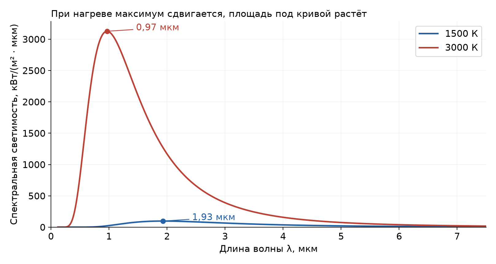
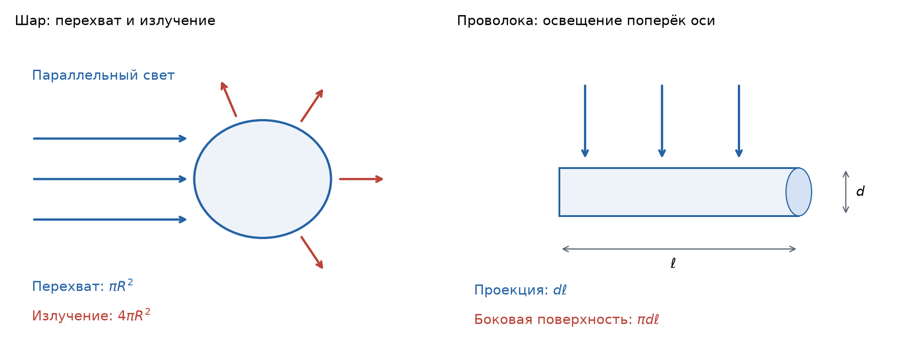

# Неделя 2 · 8–14 сентября

## Законы излучения абсолютно чёрного тела

[Все недели](../README.md) · [Указатель задач](../TASKS.md) · [Теория](#theory) · [К задачам](#tasks) · [← Неделя 1](./week-01.md) · [Неделя 3 →](./week-03.md)

<a name="tasks"></a>

**Задачи:** [0-2-1](#task-0-2-1) · [0-2-2](#task-0-2-2) · [11.26](#task-11-26) · [11.38](#task-11-38) · [11.50](#task-11-50) · [11.44](#task-11-44) · [Т2.1](#task-t2-1) · [Т2.2](#task-t2-2) · [11.76](#task-11-76)

<a name="week-2"></a>

<a name="week-02"></a>

### Обозначения и постоянные

Кинетическую энергию обозначаем $`K`$ или $`T_{\rm kin}`$, температуру — $`T`$, энергию фотона — $`\varepsilon`$, полную энергию массивной частицы — $`E`$. Буква $`m`$ означает **массу покоя**, если явно не оговорено иное. В условии отдельной задачи исходное обозначение кинетической энергии $`T`$ иногда сохраняется.


```math
\begin{gathered}
c=2.99792458\cdot10^8\ \text{м/с},\qquad
h=6.62607015\cdot10^{-34}\ \text{Дж}\cdot\text{с},\\
\hbar=\frac{h}{2\pi}=1.054571817\cdot10^{-34}\ \text{Дж}\cdot\text{с},\qquad
k_B=1.380649\cdot10^{-23}\ \text{Дж/К},\\
1\ \text{эВ}=1.602176634\cdot10^{-19}\ \text{Дж},\\
m_ec^2=0.510999\ \text{МэВ},\qquad
m_pc^2=938.272\ \text{МэВ},\qquad
m_nc^2=939.565\ \text{МэВ},\\
uc^2=931.494\ \text{МэВ},\qquad
hc=1239.842\ \text{эВ}\cdot\text{нм}=1239.842\ \text{МэВ}\cdot\text{фм},\\
\hbar c=197.327\ \text{МэВ}\cdot\text{фм},\qquad
\sigma=5.670374419\cdot10^{-8}\ \frac{\text{Вт}}{\text{м}^2\text{К}^4},\\
b=2.89777\cdot10^{-3}\ \text{м}\cdot\text{К},\qquad
a_0=0.529177\ \text{Å}.
\end{gathered}
```


Здесь $`u`$ — атомная единица массы, $`a_0`$ — боровский радиус; $`1\ \text{Å}=10^{-10}`$ м, $`1\ \text{фм}=10^{-15}`$ м. Система единиц — СИ. Знаки $`\approx`$ и $`\sim`$ обозначают соответственно приближение и оценку масштаба.

<a name="theory"></a>

### Теоретический минимум

#### 1. АЧТ, равновесное излучение и закон Кирхгофа

**Абсолютно чёрное тело (АЧТ)** поглощает всё падающее на него излучение при любых частотах и направлениях. Его модель — маленькое отверстие в полости с непрозрачными стенками при одинаковой температуре: попавший внутрь луч испытывает многократные отражения и почти наверняка поглощается.

Излучение в полости находится в тепловом равновесии со стенками; его спектр зависит только от температуры. «Чёрное» не означает «не излучающее»: нагретое АЧТ излучает максимально возможную тепловую мощность при данной температуре.

Закон Кирхгофа связывает излучение и поглощение. Для поверхности при температуре $`T`$:


```math
M_\omega(T)=A_\omega M_\omega^{(0)}(T),
```


где $`A_\omega`$ — коэффициент поглощения, индекс $`(0)`$ обозначает АЧТ. Здесь предполагаются изотропные оптические свойства; в общем случае равенство записывают для соответствующих направлений и поляризаций. Для серого тела $`A_\omega=\epsilon=\mathrm{const}`$.

#### 2. Плотность энергии, светимость и яркость

Обозначим через $`u_\omega`$ энергию в единице объёма на единицу интервала круговой частоты:


```math
u(T)=\int_0^\infty u_\omega(T)\,d\omega.
```


Энергетическая светимость $`M`$ — мощность, уходящая с единицы площади поверхности во внешнюю полусферу. Спектральная яркость $`B_\omega`$ дополнительно относится к единице телесного угла и к проекции излучающей площади:


```math
dP=B_\omega\cos\theta\,dS\,d\Omega\,d\omega.
```


Для изотропного равновесного излучения


```math
B_\omega=\frac{c}{4\pi}u_\omega.
```


Интегрируя по внешней полусфере,


```math
M_\omega=\int_{\rm полусфера}B_\omega\cos\theta\,d\Omega
=2\pi B_\omega\int_0^{\pi/2}\cos\theta\sin\theta\,d\theta
=\pi B_\omega=\frac c4u_\omega.
```


Следовательно,


```math
\boxed{M=\frac c4u},\qquad \boxed{M_\omega=\pi B_\omega}.
```


Множитель $`1/4`$ возникает из углового усреднения. Для направленного пучка формулу $`M=cu/4`$ применять нельзя.

#### 3. Закон Стефана–Больцмана и давление излучения

Для АЧТ


```math
\boxed{M=\sigma T^4},\qquad
\boxed{u=aT^4},\qquad a=\frac{4\sigma}{c}.
```


Давление изотропного фотонного газа получается усреднением квадрата направляющего косинуса: $`\langle\cos^2\theta\rangle=1/3`$. Поэтому


```math
\boxed{P_\gamma=\frac u3=\frac{4\sigma}{3c}T^4}.
```


Тепловое равновесие тела означает $`P_{\rm получ}=P_{\rm отдан}`$. Для серого тела, окружённого изотропным тепловым излучением температуры $`T_0`$:


```math
P_{\rm net}=\epsilon\sigma S(T^4-T_0^4).
```


При нагреве направленным светом нужно различать площадь перехвата и площадь излучения. Для шара они равны $`\pi R^2`$ и $`4\pi R^2`$; для длинного цилиндра, освещаемого поперёк оси, — $`d\ell`$ и $`\pi d\ell`$.

#### 4. Подсчёт состояний и формула Планка

В объёме $`V`$ одному состоянию волнового вектора соответствует объём $`(2\pi)^3/V`$ в пространстве $`\mathbf k`$. У света две независимые поляризации, поэтому число мод в сферическом слое $`k\ldots k+dk`$:


```math
dN=2\frac{V}{(2\pi)^3}4\pi k^2dk.
```


Поскольку $`\omega=ck`$,


```math
\frac{dN}{V}=\frac{\omega^2}{\pi^2c^3}\,d\omega.
```


Тепловая энергия одной моды выводится из квантованных уровней $`n\hbar\omega`$. При $`q=\exp[-\hbar\omega/(k_BT)]`$:


```math
Z=\sum_{n=0}^\infty q^n=\frac1{1-q},\qquad
\bar n=\frac{\sum n q^n}{\sum q^n}=\frac{q}{1-q}
=\frac1{e^{\hbar\omega/(k_BT)}-1}.
```


Умножая плотность мод на $`\hbar\omega\bar n`$, получаем формулу Планка:


```math
\boxed{u_\omega(T)=\frac{\hbar\omega^3}{\pi^2c^3}
\frac1{e^{\hbar\omega/(k_BT)}-1}}.
```


Нулевая энергия мод $`\hbar\omega/2`$ не включена в тепловой спектр, который уходит через отверстие. Для светимости:


```math
M_\omega^{(0)}=\frac{\hbar\omega^3}{4\pi^2c^2}
\frac1{e^{\hbar\omega/(k_BT)}-1}.
```


Интегрируем, введя $`x=\hbar\omega/(k_BT)`$:


```math
u=\frac{k_B^4T^4}{\pi^2\hbar^3c^3}
\int_0^\infty\frac{x^3\,dx}{e^x-1}.
```


Интеграл можно получить из $`1/(e^x-1)=\sum_{r=1}^{\infty}e^{-rx}`$:


```math
\int_0^\infty\frac{x^3dx}{e^x-1}
=\sum_{r=1}^{\infty}\frac6{r^4}
=6\frac{\pi^4}{90}=\frac{\pi^4}{15}.
```


Отсюда


```math
\sigma=\frac{\pi^2k_B^4}{60\hbar^3c^2}.
```


#### 5. Пределы Рэлея–Джинса и Вина

Если $`x=\hbar\omega/(k_BT)\ll1`$, то $`e^x-1\approx x`$:


```math
u_\omega\approx\frac{k_BT\omega^2}{\pi^2c^3},\qquad
M_\omega\approx\frac{k_BT\omega^2}{4\pi^2c^2}.
```


Это закон Рэлея–Джинса. Продолжать его до бесконечных частот нельзя: интеграл разойдётся — получится ультрафиолетовая катастрофа классической теории.

Если $`x\gg1`$, то $`e^x-1\approx e^x`$:


```math
u_\omega\approx\frac{\hbar\omega^3}{\pi^2c^3}
e^{-\hbar\omega/(k_BT)}.
```


Это высокочастотная формула Вина. В этой области небольшое изменение температуры может сильно изменить интенсивность.

#### 6. Спектр по длинам волн и закон смещения Вина

Спектральная плотность меняется при смене переменной. Поскольку $`\omega=2\pi c/\lambda`$,


```math
M_\lambda=M_\omega\left|\frac{d\omega}{d\lambda}\right|
=M_\omega\frac{2\pi c}{\lambda^2}
=\frac{2\pi hc^2}{\lambda^5}
\frac1{e^{hc/(\lambda k_BT)}-1}.
```




*Рис. 4. Обе кривые построены в одном масштабе. Положение максимума определяет температура по закону Вина, а площадь под кривой — полную светимость.*

Максимум $`M_\lambda`$ ищется дифференцированием. С $`x=hc/(\lambda k_BT)`$:


```math
\frac{d\ln M_\lambda}{d\ln\lambda}
=-5+\frac{x}{1-e^{-x}}=0,
```


```math
5(1-e^{-x})=x,\qquad x_{\max}=4.965114\ldots
```


и


```math
\boxed{\lambda_{\max}T=b=\frac{hc}{4.965114\,k_B}}.
```


Максимумы распределений по $`\lambda`$ и по $`\omega`$ — разные точки спектра: якобиан $`|d\omega/d\lambda|`$ нельзя опускать.

## Группа 0

<a name="task-0-2-1"></a>

### Задача 0-2-1. Смещение максимума спектра

**Условие.** Вследствие повышения температуры положение максимума спектральной энергетической светимости абсолютно черного тела переместилось с 2 мкм на 1 мкм. Во сколько раз изменилась его интегральная энергетическая светимость?

**Краткая теория.** Закон Вина даёт температуру по положению максимума; закон Стефана–Больцмана связывает интегральную светимость с четвёртой степенью температуры.

**Решение.** Из $`\lambda_1T_1=\lambda_2T_2`$:


```math
\frac{T_2}{T_1}=\frac{\lambda_1}{\lambda_2}=2.
```


Следовательно,


```math
\frac{M_2}{M_1}=\frac{\sigma T_2^4}{\sigma T_1^4}=2^4=16.
```


**Ответ:** $`\boxed{\text{светимость увеличилась в 16 раз}.}`$ Для проверки: $`T_1\approx1449`$ К, $`T_2\approx2898`$ К.

<a name="task-0-2-2"></a>

### Задача 0-2-2. Давление излучения внутри Солнца

**Условие.** Оценить давление теплового излучения во внутренней области Солнца, где температура равна $`T = 1{,}3\cdot10^7`$ К.

**Краткая теория.** В локальном тепловом равновесии излучение изотропно: $`P_\gamma=u/3`$, $`u=4\sigma T^4/c`$.

**Решение.**


```math
P_\gamma=\frac{4\sigma}{3c}T^4
=\frac{4\cdot5.67037\cdot10^{-8}}{3\cdot2.99792\cdot10^8}
(1.3\cdot10^7)^4.
```


Поскольку $`(1.3\cdot10^7)^4=2.8561\cdot10^{28}`$ К⁴,


```math
P_\gamma\approx7.20\cdot10^{12}\ \text{Па}.
```


**Ответ:** $`\boxed{P_\gamma\approx7.2\cdot10^{12}\ \text{Па}.}`$ Это только вклад излучения; давление вещества сюда не включено.

## Группа 1

<a name="task-11-26"></a>

### Задача 11.26. Температура Солнца

**Условие.** Оценить температуру Солнца, исходя из его видимого углового размера $`\alpha_{\mathrm{С}} = 0{,}01`$ рад и температуры земной поверхности ($`T_{\mathrm{З}}\simeq300`$ К).

**Краткая теория.** Используем тепловой баланс: Земля перехватывает солнечный поток диском, а излучает всей поверхностью. Угловой размер понимаем как угловой диаметр Солнца. В решении $`\alpha_\odot=\alpha_{\mathrm{С}}`$, $`T_\oplus=T_{\mathrm{З}}`$; значки $`\odot`$ и $`\oplus`$ обозначают Солнце и Землю.

**Решение.** Пусть $`R_\odot`$ — радиус Солнца, $`r`$ — расстояние до Земли. Светимость Солнца и плотность потока возле Земли:


```math
L_\odot=4\pi R_\odot^2\sigma T_\odot^4,\qquad
S_\oplus=\frac{L_\odot}{4\pi r^2}
=\sigma T_\odot^4\frac{R_\odot^2}{r^2}.
```




*Рис. 5. Слева — геометрия задачи 11.26, справа — задачи Т2.1. Направленный свет нагревает по площади проекции, а тепло излучается всей поверхностью.*

В простой модели чёрной изотермической Земли


```math
\pi R_\oplus^2 S_\oplus=4\pi R_\oplus^2\sigma T_\oplus^4.
```


Сокращая общие множители, получаем


```math
T_\odot^4\frac{R_\odot^2}{r^2}=4T_\oplus^4.
```


Для малого углового диаметра $`R_\odot/r\approx\alpha_\odot/2`$:


```math
T_\odot^4\frac{\alpha_\odot^2}{4}=4T_\oplus^4,
\qquad
T_\odot=\frac{2T_\oplus}{\sqrt{\alpha_\odot}}
=\frac{600}{0.1}=6000\ \text{К}.
```


**Ответ:** $`\boxed{T_\odot\approx6000\ \text{К}.}`$ Это оценка без альбедо, парникового эффекта и неравномерности температуры Земли.

<a name="task-11-38"></a>

### Задача 11.38. Изменение яркости лампы при повышении напряжения

**Условие.** Напряжение в сети возросло на 5%. На сколько процентов увеличится освещенность, создаваемая вакуумной лампой накаливания с температурой нити 1500 К на длине волны 500 нм? Нить считать абсолютно черным телом. Рассмотреть случаи, когда сопротивление нити $`R = \mathrm{const}`$ и когда $`R = R(T) = R_0 + \alpha(T - T_0)`$.

**Краткая теория.** Электрическая мощность $`U^2/R`$ в равновесии уходит в излучение $`S\sigma T^4`$. Спектральную интенсивность при фиксированной длине волны определяет формула Планка. Сначала найдём линейную оценку, затем проверим её точность.

**Решение.** При неизменной геометрии относительное изменение освещённости совпадает с относительным изменением $`M_\lambda`$.

**1. Как меняется температура.** Из


```math
\frac{U^2}{R(T)}=S\sigma T^4
```


после логарифмического дифференцирования:


```math
2\frac{dU}{U}-\frac{dR}{R}=4\frac{dT}{T}.
```


Введём $`q=T R'(T)/R(T)`$. Тогда


```math
\boxed{\frac{dT}{T}=\frac2{4+q}\frac{dU}{U}}.
```


При $`R=\mathrm{const}`$ имеем $`q=0`$, поэтому $`\Delta T/T\approx\tfrac12\cdot0.05=0.025`$.

Для линейного сопротивления


```math
q=\frac{\alpha T}{R_0+\alpha(T-T_0)}.
```


Для численной оценки дополнительно принимаем $`R\propto T`$, то есть $`R_0-\alpha T_0`$ мало относительно $`\alpha T`$ и $`q\approx1`$. Тогда $`\Delta T/T\approx\tfrac25\cdot0.05=0.020`$.

**2. Как меняется спектральная интенсивность.** При фиксированной $`\lambda`$


```math
M_\lambda=\frac{C_\lambda}{e^x-1},\qquad
x=\frac{hc}{\lambda k_BT}=19.184\gg1.
```


При фиксированной длине волны $`C_\lambda`$ не меняется, а $`dx=-x\,dT/T`$. Поэтому


```math
d\ln M_\lambda=-\frac{e^x}{e^x-1}\,dx
=\frac{x}{1-e^{-x}}\frac{dT}{T}.
```


Поскольку $`d\ln M_\lambda=dM_\lambda/M_\lambda`$, получаем


```math
\frac{dM_\lambda}{M_\lambda}
=\frac{x}{1-e^{-x}}\frac{dT}{T}
\approx x\frac{dT}{T}.
```


Отсюда линейные оценки:


```math
\left.\frac{\Delta M_\lambda}{M_\lambda}\right|_{R=\mathrm{const}}
\approx19.184\cdot0.025=0.4796,
```


```math
\left.\frac{\Delta M_\lambda}{M_\lambda}\right|_{R\propto T}
\approx19.184\cdot0.020=0.3837.
```


**Ответ в первом порядке по изменению напряжения:** $`\boxed{48\%\ \text{при}\ R=\mathrm{const};\quad38\%\ \text{при}\ R\propto T.}`$

**Проверка конечного изменения на 5%.** Малость $`\Delta T/T`$ не гарантирует малости $`x\Delta T/T`$. Здесь эта величина около $`0.4`$–$`0.5`$, поэтому полезно не линеаризовать экспоненту. Чтобы получить конечное изменение, запишем баланс до и после изменения напряжения и поделим уравнения:


```math
\left(\frac{U'}U\right)^2
=\frac{R(T')}{R(T)}\left(\frac{T'}T\right)^4.
```


При постоянном сопротивлении первая дробь справа равна единице; при $`R\propto T`$ она равна $`T'/T`$, и показатель степени становится равен пяти. Поэтому


```math
\frac{T'}T=1.05^{1/2}\quad(R=\mathrm{const}),\qquad
\frac{T'}T=1.05^{2/5}\quad(R\propto T).
```


Используем


```math
\frac{M_\lambda(T')}{M_\lambda(T)}
=\frac{e^x-1}{e^{xT/T'}-1}.
```


Получаем увеличение соответственно на $`\boxed{58.8\%}`$ и $`\boxed{44.9\%}`$. Эти числа точнее для конечного изменения напряжения; $`48\%`$ и $`38\%`$ — его первый порядок.

**Для произвольного указанного линейного $`R(T)`$.** Без $`R_0`$, $`\alpha`$, $`T_0`$ единственного численного ответа нет. В первом порядке


```math
\frac{\Delta M_\lambda}{M_\lambda}\approx
\frac{2x}{4+\alpha T/R(T)}\,0.05.
```


Для конечного изменения нужно найти $`T'`$ из $`R(T')T'^4=1.05^2R(T)T^4`$ и подставить его в формулу Планка.

<a name="task-11-50"></a>

### Задача 11.50. Яркостная температура лазерного импульса

**Условие.** Определить температуру абсолютно черного тела, спектральная яркость излучения которого равна яркости лазерного излучения с энергией в импульсе $`\mathcal{E} = 1`$ Дж. Считать, что расходимость лазерного пучка определяется только дифракцией на выходном отверстии, а немонохроматичность — длительностью импульса.

**Краткая теория.** Сравниваем именно спектральные яркости — мощность на площадь, телесный угол и частотный интервал. Нужны дифракционная расходимость, связь длительности импульса с шириной его спектра и предел Рэлея–Джинса.

**Решение.** Пусть диаметр выходного отверстия $`D`$, длительность импульса $`\tau`$. Площадь пучка


```math
S=\frac{\pi D^2}{4},\qquad
q=\frac{\mathcal E}{S\tau}
=\frac{4\mathcal E}{\pi D^2\tau}.
```


Для отверстия размера $`D`$ заметная дифракционная расходимость возникает, когда разность хода от его краёв становится порядка длины волны: $`D\sin\theta\sim\lambda`$. При малом угле это даёт $`\theta\sim\lambda/D`$. В оценке принимаем коэффициент равным единице. Телесный угол конуса получаем интегрированием $`d\Omega=2\pi\sin\vartheta\,d\vartheta`$:


```math
\Delta\Omega=2\pi(1-\cos\theta)\approx\pi\theta^2.
```


Значит,


```math
\Delta\Omega\approx\pi\theta^2
\approx\pi\frac{\lambda^2}{D^2}.
```


Почему спектральная ширина обратно пропорциональна длительности? Например, для прямоугольной огибающей импульса амплитуда спектра на отстройке $`\delta\omega`$ пропорциональна


```math
\int_{-\tau/2}^{\tau/2}e^{i\delta\omega t}\,dt
=\frac{2\sin(\delta\omega\tau/2)}{\delta\omega}.
```


Первый нуль достигается при $`|\delta\omega|=2\pi/\tau`$. Берём этот характерный масштаб как $`\Delta\omega\approx2\pi/\tau`$, то есть $`\Delta\nu\approx1/\tau`$. Другой профиль импульса изменил бы только коэффициент порядка единицы.

По определению яркости $`q=\int B_\omega\cos\vartheta\,d\Omega\,d\omega`$. Для узкого пучка $`\cos\vartheta\approx1`$, и характерная яркость связана с потоком как $`q\approx B_\omega\Delta\Omega\Delta\omega`$. Поэтому


```math
B_\omega^{\rm лаз}\approx\frac q{\Delta\Omega\Delta\omega}
=\frac{4\mathcal E}{\pi D^2\tau}
\frac{D^2}{\pi\lambda^2}\frac{\tau}{2\pi}
=\frac{2\mathcal E}{\pi^3\lambda^2}.
```


Для АЧТ в пределе Рэлея–Джинса


```math
M_\omega^{(0)}=\frac{k_BT\omega^2}{4\pi^2c^2}
=\frac{k_BT}{\lambda^2},\qquad
B_\omega^{(0)}=\frac{M_\omega^{(0)}}\pi
=\frac{k_BT}{\pi\lambda^2}.
```


Приравниваем яркости и сокращаем $`\lambda^{-2}`$:


```math
\frac{k_BT_{\rm eff}}\pi=\frac{2\mathcal E}{\pi^3},\qquad
\boxed{T_{\rm eff}\approx\frac{2\mathcal E}{\pi^2k_B}}.
```


При $`\mathcal E=1`$ Дж:


```math
T_{\rm eff}\approx1.47\cdot10^{22}\ \text{К}.
```


**Ответ:** $`\boxed{T_{\rm eff}\sim10^{22}\ \text{К}}`$, а с принятыми определениями ширины спектра и пучка — $`1.47\cdot10^{22}`$ К. Это яркостная температура на частоте лазера, а не температура его вещества. Численный коэффициент зависит от формы импульса и принятой ширины дифракционного пучка; масштаб $`k_BT_{\rm eff}\sim\mathcal E`$ устойчив. Для оптического лазера условие $`\hbar\omega\ll k_BT_{\rm eff}`$ выполнено с огромным запасом.

## Группа 2

<a name="task-11-44"></a>

### Задача 11.44. Тело излучает только ниже граничной частоты

**Условие.** Поверхность некоторого тела приготовлена таким образом, что коэффициент поглощения электромагнитного излучения $`A = 1`$ для частот $`\omega\le\omega_0`$ и $`A = 0`$ при $`\omega>\omega_0`$. Это тело помещено в вакуум и в отсутствие других источников излучения нагревается за счет внутреннего источника энергии до температуры $`T`$. Определить эту температуру, если известно, что для такого же тела с абсолютно черной поверхностью в тех же условиях равновесная температура $`T^* = 300`$ К. Граничная частота соответствует температуре $`\Theta = \hbar\omega_0/k_{\mathrm{Б}} = 300`$ К.

**Краткая теория.** По закону Кирхгофа поверхность излучает только там, где поглощает. Мощность источника фиксирована, поэтому интеграл спектральной светимости в разрешённой полосе должен равняться $`\sigma T_*^4`$. В решении коэффициент поглощения обозначен $`A_\omega`$, чтобы подчеркнуть зависимость от частоты, а температура $`T^*`$ записана как $`T_*`$.

**Решение.** Делим тепловой баланс на площадь поверхности:


```math
\int_0^{\omega_0}M_\omega^{(0)}(T)\,d\omega=\sigma T_*^4.
```


**Оценка в низкочастотном приближении.** Предположим $`T\gg\Theta`$. Тогда во всей излучаемой полосе $`\hbar\omega\le k_B\Theta\ll k_BT`$, и можно применять закон Рэлея–Джинса:


```math
\int_0^{\omega_0}\frac{k_BT\omega^2}{4\pi^2c^2}\,d\omega
=\frac{k_BT\omega_0^3}{12\pi^2c^2}
=\sigma T_*^4.
```


Подставляя $`\sigma=\pi^2k_B^4/(60\hbar^3c^2)`$ и сокращая $`k_B,c`$,


```math
T=\frac{12\pi^2c^2\sigma}{k_B\omega_0^3}T_*^4
=\frac{\pi^4}{5}\frac{k_B^3T_*^4}{\hbar^3\omega_0^3}
=\frac{\pi^4}{5}\frac{T_*^4}{\Theta^3}.
```


При $`T_*=\Theta=300`$ К:


```math
\boxed{T_{\rm RJ}\approx5845\ \text{К}}.
```


Проверка: $`\Theta/T\approx0.051\ll1`$, так что использованное приближение согласовано.

**Уточнение по полной формуле Планка.** При $`x=\hbar\omega/(k_BT)`$ точный баланс принимает вид


```math
T^4\int_0^{\Theta/T}\frac{x^3\,dx}{e^x-1}
=\frac{\pi^4}{15}T_*^4.
```


Численное решение даёт $`\boxed{T\approx5956\ \text{К}}`$. Направление поправки закономерно: формула Рэлея–Джинса немного завышает излучение при той же температуре, значит, точная равновесная температура выше. Для проверки можно разложить интеграл:


```math
\int_0^y\frac{x^3dx}{e^x-1}
=\frac{y^3}{3}-\frac{y^4}{8}+\frac{y^5}{60}
-\frac{y^7}{5040}+\cdots,\qquad y=\Theta/T.
```


**Ответ:** низкочастотная оценка $`\boxed{T\approx5.84\cdot10^3\ \text{К}}`$; более точное значение в той же модели $`\boxed{5.96\cdot10^3\ \text{К}}`$.

<a name="task-t2-1"></a>

### Задача Т2.1. Нитиноловая проволока на спутнике

**Условие.** Нитинол (сплав никеля и титана) обладает эффектом "памяти формы": он восстанавливает ее при нагреве выше температуры $`t = 130`$ °C. Проволока из нитинола, подогреваемая пропускаемым через неё током, используется в качестве привода для раскрытия антенн космических аппаратов. Насколько различаются токи через проволоку, необходимые для запуска такого привода у искусственного спутника Земли, находящегося на теневой и солнечной сторонах геостационарной орбиты? Температуру проволоки считать однородной по объему, сопротивление — не зависящим от температуры. Солнечная постоянная равна $`J = 1{,}4\cdot10^3`$ Вт/м². Диаметр проволоки $`d = 1{,}5`$ мм, удельное сопротивление $`\rho = 0{,}8\cdot10^{-6}`$ Ом·м, коэффициент серости $`\epsilon = 0{,}66`$. Считать, что на солнечной стороне орбиты проволока находится на освещённой стороне спутника. Тепловым излучением Земли на геостационарной орбите и тепловым излучением корпуса спутника можно пренебречь

**Краткая теория.** Пороговый ток определяется стационарным тепловым балансом при $`T_*=403.15`$ К. Серое тело одинаково характеризуется $`\epsilon`$ при поглощении и излучении. Предполагаем, что ось проволоки лежит вдоль поверхности корпуса, то есть перпендикулярна лучам.

**Решение.** Для длинного участка проволоки длины $`\ell`$ торцами пренебрегаем:


```math
S_\perp=\frac{\pi d^2}{4},\quad
R=\frac{\rho\ell}{S_\perp}=\frac{4\rho\ell}{\pi d^2},\quad
S_{\rm изл}=\pi d\ell.
```


**В тени** вся энергия поступает за счёт тока:


```math
I_0^2\frac{4\rho\ell}{\pi d^2}
=\epsilon\sigma T_*^4\pi d\ell.
```


Сокращая $`\ell`$ и решая относительно $`I_0`$:


```math
\boxed{I_0=\frac\pi2d^{3/2}\sqrt{\frac{\epsilon\sigma T_*^4}{\rho}}}
=3.208\ \text{А}.
```


**На Солнце** при поперечном освещении тень проволоки — прямоугольник со сторонами $`d`$ и $`\ell`$ (рис. 5 справа). Поэтому падающая мощность равна $`Jd\ell`$, поглощённая — $`\epsilon Jd\ell`$. Боковая площадь излучения остаётся равной $`\pi d\ell`$. Баланс принимает вид


```math
I_\odot^2\frac{4\rho\ell}{\pi d^2}
+\epsilon Jd\ell
=\epsilon\sigma T_*^4\pi d\ell.
```


Делим на теневой баланс:


```math
\frac{I_\odot^2}{I_0^2}
=1-\frac{J}{\pi\sigma T_*^4},\qquad
I_\odot=I_0\sqrt{1-\frac{J}{\pi\sigma T_*^4}}
=2.689\ \text{А}.
```


Искомая разность


```math
\boxed{\Delta I=I_0-I_\odot
=I_0\left(1-\sqrt{1-\frac{J}{\pi\sigma T_*^4}}\right)
\approx0.519\ \text{А}}.
```


**Ответ:** $`\boxed{I_{\rm тень}\approx3.21\ \text{А},\quad I_\odot\approx2.69\ \text{А},\quad\Delta I\approx0.52\ \text{А}.}`$ Это предельные токи поддержания пороговой температуры. Чтобы достичь её за конечное время и превысить, нужен небольшой запас мощности. При другой ориентации проволоки меняется её освещённая проекция.

<a name="task-t2-2"></a>

### Задача Т2.2. Изменение прозрачности атмосферы

**Условие.** Средняя температура поверхности Земли составляет 15°C. В результате природных процессов или влияния промышленных выбросов прозрачность атмосферы может измениться. Оценить, как изменится равновесная температура земной поверхности если прозрачность атмосферы уменьшится на 5% для излучения: а) с длиной волны меньше $`\lambda_0 = 20000`$ Å; б) с длиной волны более $`\lambda_0 = 20000`$ Å. Под прозрачностью понимается доля излучения, преодолевающая расстояние от верхних слоёв атмосферы до поверхности. Считать для оценки, что прозрачность атмосферы постоянна для $`\lambda>\lambda_0`$ и $`\lambda<\lambda_0`$

**Краткая теория.** Используем двухдиапазонную модель теплового баланса: солнечная энергия поступает преимущественно в коротковолновом диапазоне, Земля излучает в длинноволновом. Уменьшение прозрачности на $`5\%`$ трактуем как относительное изменение $`\tau' =0.95\tau`$.

**Решение.** Граница диапазонов


```math
\lambda_0=20000\ \text{Å}=2\ \text{мкм}.
```


По закону Вина для Солнца с $`T_\odot\sim6000`$ К максимум около $`0.48`$ мкм, а для Земли с $`T_0=288.15`$ К — около $`10.1`$ мкм. Поэтому в оценке считаем солнечный поток коротковолновым, земной — длинноволновым.

Обозначим прозрачности $`\tau_s`$, $`\tau_l`$, а усреднённый падающий солнечный поток $`F`$. Простейшее эффективное уравнение баланса:


```math
\tau_sF=\tau_l\sigma T_0^4.
```


**а) Уменьшилась коротковолновая прозрачность.** Новый баланс


```math
0.95\tau_sF=\tau_l\sigma T_a^4.
```


Делим на исходный:


```math
\left(\frac{T_a}{T_0}\right)^4=0.95,\qquad
T_a=T_0\,0.95^{1/4}.
```


```math
\Delta T_a=288.15(0.95^{1/4}-1)=-3.67\ \text{К}.
```


**б) Уменьшилась длинноволновая прозрачность.** Уходящее излучение при прежней температуре ослабляется:


```math
\tau_sF=0.95\tau_l\sigma T_b^4,
```


```math
T_b=T_0\,0.95^{-1/4},\qquad
\Delta T_b=+3.72\ \text{К}.
```


В первом порядке эти результаты можно получить непосредственно:


```math
4\frac{dT}{T}=\frac{d\tau_s}{\tau_s}-\frac{d\tau_l}{\tau_l},
\qquad |\Delta T|\approx\frac{0.05}{4}\,288.15=3.60\ \text{К}.
```


**Ответ:** а) охлаждение примерно на $`\boxed{4^\circ\text{C}}`$; б) потепление примерно на $`\boxed{4^\circ\text{C}}`$. Разность температур в К и °C численно одинакова.

**Граница применимости.** Результат относится к указанной эффективной двухдиапазонной модели. Она не описывает отдельно собственное излучение атмосферы, конвекцию и обратные связи. По одной лишь прозрачности нельзя однозначно вычислить температуру в полной атмосферной модели; здесь требуется оценка в указанном приближении. Если «5%» означает пять процентных пунктов, понадобятся исходные значения прозрачности.

<a name="task-11-76"></a>

### Задача 11.76. Потеря массы Солнца и период обращения Земли

**Условие.** На сколько изменится из-за теплового излучения Солнца период обращения Земли вокруг Солнца за $`\tau=10^6`$ лет? Температуру поверхности Солнца $`T_{\mathrm C}=6000`$ К и его радиус $`R_{\mathrm C}=7\cdot10^5`$ км считать постоянными, а массу $`M_{\mathrm C}=2\cdot10^{33}`$ г — мало меняющейся за указанное время. Орбиту Земли считать круговой.

**Краткая теория.** Излучая энергию, Солнце теряет массу по закону $`dM=-dE/c^2`$. Сила тяготения остаётся центральной, поэтому сохраняется орбитальный момент Земли. При медленной потере массы орбита расширяется и период увеличивается.

**Решение.** Обозначим период обращения через $`P`$, чтобы не путать его с температурой. По закону Стефана—Больцмана светимость и изменение массы равны


```math
W=4\pi R_{\mathrm C}^2\sigma T_{\mathrm C}^4,\qquad \Delta M_{\mathrm C}=-\frac{W\tau}{c^2}.
```


Сферически симметричная потеря массы не создаёт момента силы. Для почти круговой орбиты удельный момент $`\ell=vr`$ постоянен, а условие центростремительного ускорения даёт $`v^2r=GM_{\mathrm C}`$. Исключая $`v`$, получаем


```math
\ell^2=GM_{\mathrm C}r=\mathrm{const},\qquad \frac{\Delta r}{r}=-\frac{\Delta M_{\mathrm C}}{M_{\mathrm C}}.
```


Период $`P=2\pi r/v=2\pi r^2/\ell`$, следовательно,


```math
\frac{\Delta P}{P}=2\frac{\Delta r}{r}=-2\frac{\Delta M_{\mathrm C}}{M_{\mathrm C}}
=\frac{2W\tau}{M_{\mathrm C}c^2}.
```


При $`R_{\mathrm C}=7\cdot10^8`$ м, $`M_{\mathrm C}=2\cdot10^{30}`$ кг и $`\tau=10^6\cdot3{,}156\cdot10^7`$ с:


```math
W\simeq4{,}53\cdot10^{26}\ \text{Вт},\qquad
\frac{|\Delta M_{\mathrm C}|}{M_{\mathrm C}}\simeq7{,}95\cdot10^{-8}\ll1.
```


Линеаризация оправданна; изменение идёт за время, гораздо большее одного года. При $`P=3{,}156\cdot10^7`$ с


```math
\boxed{\Delta P\simeq2P\frac{W\tau}{M_{\mathrm C}c^2}\simeq5{,}0\ \text{с}.}
```


Период **увеличится** примерно на пять секунд. Это изменение длительности одного оборота к концу указанного интервала, а не суммарное отставание Земли по орбитальной фазе.


---

[Все недели](../README.md) · [Указатель задач](../TASKS.md) · [Теория](#theory) · [К задачам](#tasks) · [← Неделя 1](./week-01.md) · [Неделя 3 →](./week-03.md)

[Сообщить об ошибке в этой неделе](https://github.com/NeTotDEDD/FIZOS_Kvanty/issues/new?template=correction.yml)
