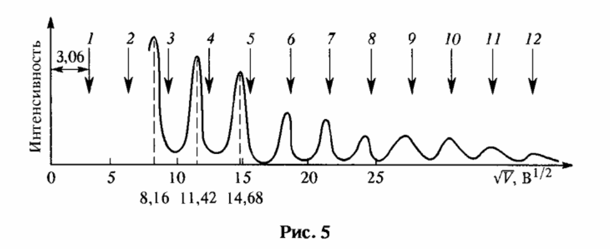
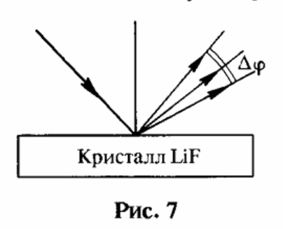
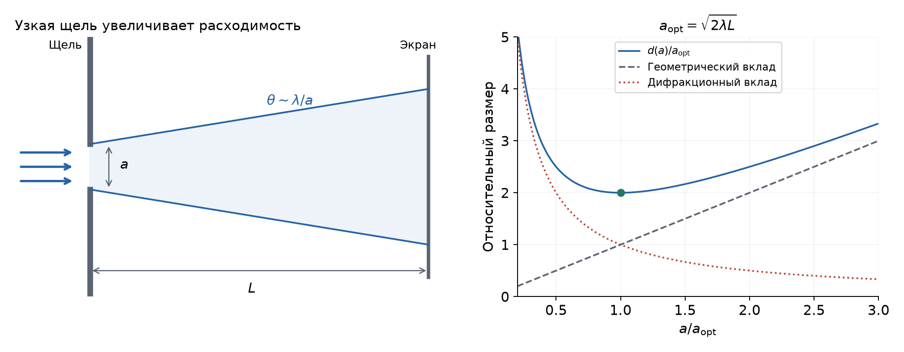
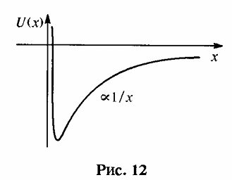
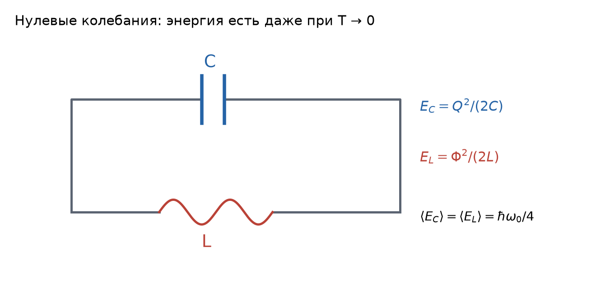

# Неделя 3 · 15–21 сентября

## Волны де Бройля. Соотношение неопределённостей

[Все недели](../README.md) · [Указатель задач](../TASKS.md) · [Теория](#theory) · [К задачам](#tasks) · [← Неделя 2](./week-02.md) · [Неделя 4 →](./week-04.md)

<a name="tasks"></a>

**Задачи:** [0-3-1](#task-0-3-1) · [0-3-2](#task-0-3-2) · [2.12](#task-2-12) · [2.15](#task-2-15) · [2.26](#task-2-26) · [2.30](#task-2-30) · [2.38](#task-2-38) · [2.44](#task-2-44) · [Т3.1](#task-t3-1)

<a name="week-3"></a>

<a name="week-03"></a>

### Обозначения и постоянные

Кинетическую энергию обозначаем $`K`$ или $`T_{\rm kin}`$, температуру — $`T`$, энергию фотона — $`\varepsilon`$, полную энергию массивной частицы — $`E`$. Буква $`m`$ означает **массу покоя**, если явно не оговорено иное. В условии отдельной задачи исходное обозначение кинетической энергии $`T`$ иногда сохраняется.


```math
\begin{gathered}
c=2.99792458\cdot10^8\ \text{м/с},\qquad
h=6.62607015\cdot10^{-34}\ \text{Дж}\cdot\text{с},\\[0pt]
\hbar=\frac{h}{2\pi}=1.054571817\cdot10^{-34}\ \text{Дж}\cdot\text{с},\qquad
k_B=1.380649\cdot10^{-23}\ \text{Дж/К},\\[0pt]
1\ \text{эВ}=1.602176634\cdot10^{-19}\ \text{Дж},\\[0pt]
m_ec^2=0.510999\ \text{МэВ},\qquad
m_pc^2=938.272\ \text{МэВ},\qquad
m_nc^2=939.565\ \text{МэВ},\\[0pt]
uc^2=931.494\ \text{МэВ},\qquad
hc=1239.842\ \text{эВ}\cdot\text{нм}=1239.842\ \text{МэВ}\cdot\text{фм},\\[0pt]
\hbar c=197.327\ \text{МэВ}\cdot\text{фм},\qquad
\sigma=5.670374419\cdot10^{-8}\ \frac{\text{Вт}}{\text{м}^2\text{К}^4},\\[0pt]
b=2.89777\cdot10^{-3}\ \text{м}\cdot\text{К},\qquad
a_0=0.529177\ \text{Å}.
\end{gathered}
```


Здесь $`u`$ — атомная единица массы, $`a_0`$ — боровский радиус; $`1\ \text{Å}=10^{-10}`$ м, $`1\ \text{фм}=10^{-15}`$ м. Система единиц — СИ. Знаки $`\approx`$ и $`\sim`$ обозначают соответственно приближение и оценку масштаба.

<a name="theory"></a>

### Теоретический минимум

#### 1. Волна де Бройля

Свободной частице с определёнными энергией и импульсом соответствует плоская волна


```math
\psi(\mathbf r,t)=A\exp\left[\frac{i}{\hbar}
(\mathbf p\cdot\mathbf r-Et)\right].
```


Сравнивая с $`\exp[i(\mathbf k\cdot\mathbf r-\omega t)]`$, получаем


```math
\mathbf p=\hbar\mathbf k,\qquad E=\hbar\omega,\qquad
\boxed{\lambda=\frac hp}.
```


Квадрат модуля волновой функции задаёт плотность вероятности. Плоская волна не локализована; локализованная частица описывается пакетом волн с разными импульсами.

Для нерелятивистской частицы


```math
\lambda=\frac h{\sqrt{2mK}}.
```


Для электрона, ускоренного напряжением $`U`$ и первоначально почти покоящегося:


```math
K=eU,\qquad
\lambda[\text{Å}]\approx\frac{12.264}{\sqrt{U[\text{В}]}}.
```


В релятивистском случае


```math
\boxed{\lambda=\frac{hc}{\sqrt{K(K+2mc^2)}}}.
```


Групповая скорость пакета $`d\omega/dk=dE/dp`$ совпадает со скоростью частицы. Фазовая скорость $`\omega/k`$ в общем случае от неё отличается.

#### 2. Брэгговское отражение

Пусть расстояние между параллельными отражающими плоскостями $`d`$, угол скольжения луча к плоскостям $`\varphi`$. Разность хода лучей, отражённых соседними плоскостями, равна $`2d\sin\varphi`$. Условие конструктивной интерференции:


```math
\boxed{2d\sin\varphi=m\lambda},\qquad m=1,2,\ldots
```


Здесь $`m`$ — порядок отражения, а не масса. Угол скольжения отсчитывается **от плоскости**; при отсчёте от нормали синус заменится косинусом.

При фиксированном $`d`$ и первом порядке малые изменения удовлетворяют


```math
\frac{d\lambda}{\lambda}=\cot\varphi\,d\varphi.
```


С учётом $`K\propto\lambda^{-2}`$:


```math
\boxed{\frac{|dK|}{K}=2\frac{|d\lambda|}{\lambda}
=2\cot\varphi\,|d\varphi|}.
```


Углы в дифференциальных формулах подставляются в радианах.

Если когерентно отражают $`N`$ плоскостей, сумма амплитуд имеет вид


```math
\mathcal A\propto\sum_{j=0}^{N-1}e^{ij\delta}
=e^{i(N-1)\delta/2}\frac{\sin(N\delta/2)}{\sin(\delta/2)},
\qquad
\delta=\frac{4\pi d\sin\varphi}{\lambda}.
```


Возле максимума порядка $`m`$ первый нуль возникает при изменении фазы примерно на $`2\pi/N`$. Отсюда оценка разрешающей способности:


```math
\boxed{\frac\lambda{\delta\lambda}\sim mN}.
```


#### 3. Преломление электронных волн

Если потенциальная энергия электрона внутри металла ниже на $`eU_0`$, его кинетическая энергия возрастает с $`eU`$ до $`e(U+U_0)`$. Для нерелятивистского движения


```math
\boxed{n=\frac{k_{\rm in}}{k_{\rm out}}
=\frac{p_{\rm in}}{p_{\rm out}}
=\sqrt{1+\frac{U_0}{U}}}.
```


Это показатель преломления волн де Бройля. Пусть внешний угол скольжения $`\varphi`$, внутренний — $`\varphi'`$. На плоской границе сохраняется касательная компонента импульса:


```math
p_{\rm out}\cos\varphi=p_{\rm in}\cos\varphi',
\qquad n\cos\varphi'=\cos\varphi.
```


Внутренняя длина волны $`\lambda_{\rm in}=\lambda/n`$. Поэтому условие Брэгга принимает вид


```math
2d\sin\varphi'=m\frac\lambda n,
\qquad
\boxed{2d\sqrt{n^2-\cos^2\varphi}=m\lambda}.
```


#### 4. Неопределённости: оценка и точная форма

Для стандартных отклонений координаты и импульса справедливо соотношение Гейзенберга–Вейля:


```math
\boxed{\sigma_x\sigma_p\ge\frac\hbar2},\qquad
\sigma_x^2=\langle x^2\rangle-\langle x\rangle^2.
```


Краткое обоснование: из неравенства Коши для векторов $`(\hat x-\langle x\rangle)\psi`$ и $`(\hat p-\langle p\rangle)\psi`$, а также $`[\hat x,\hat p]=i\hbar`$, следует


```math
\sigma_x^2\sigma_p^2
\ge\left|\langle\Delta\hat x\Delta\hat p\rangle\right|^2
\ge\left|\frac{\langle[\hat x,\hat p]\rangle}{2i}\right|^2
=\frac{\hbar^2}{4}.
```


Это точное неравенство. При оценке локализации часто пишут $`p\sim\hbar/l`$; при оценке дифракции по первому минимуму — $`p_\perp\sim h/a`$. Численные коэффициенты разные, потому что ширина по первому минимуму и стандартное отклонение не совпадают.

Для волнового пакета конечной длительности характерно $`\Delta\omega\,\Delta t\sim1`$, или $`\Delta E\,\Delta t\sim\hbar`$. Это связь ширины спектра и временного масштаба; она **не означает нарушения закона сохранения энергии**.

#### 5. Оценка основного состояния

Локализация на масштабе $`l`$ требует импульса порядка $`\hbar/l`$, а значит, кинетической энергии порядка $`\hbar^2/(2ml^2)`$. Для связанного состояния записывают оценочную функцию


```math
E(l)\sim\frac{\hbar^2}{2ml^2}+U(l)
```


и ищут её минимум. Так получается характерный размер и масштаб энергии связи. Для гармонического осциллятора использование точного неравенства Вейля даёт точную минимальную энергию $`\hbar\omega/2`$; для произвольного потенциала простая подстановка $`p\sim\hbar/l`$ остаётся оценкой.

#### 6. Расплывание свободного волнового пакета

При свободном движении


```math
\hat x(t)=\hat x(0)+\frac{\hat p(0)}m t.
```


Если начальная ковариация координаты и импульса равна нулю, то


```math
\sigma_x^2(t)=\sigma_x^2(0)+\frac{t^2}{m^2}\sigma_p^2(0)
\ge s+\frac{\hbar^2t^2}{4m^2s},\qquad s=\sigma_x^2(0).
```


Минимум правой части по $`s`$ достигается при $`s=\hbar t/(2m)`$:


```math
\boxed{\sigma_{x,\min}(t)=\sqrt{\frac{\hbar t}{m}}}.
```


Эта формула предполагает именно отсутствие начальных корреляций. В общем выражении имеется дополнительный член $`2t\,\mathrm{Cov}(x,p)/m`$.

## Группа 0

<a name="task-0-3-1"></a>

### Задача 0-3-1. Равенство дебройлевской и комптоновской длин волн

**Условие.** Определить кинетическую энергию электрона, при которой его дебройлевская и комптоновская длины волны равны между собой.

**Краткая теория.** Используем $`\lambda_{\rm dB}=h/p`$ и обычную комптоновскую длину $`\lambda_C=h/(m_ec)`$. После нахождения импульса энергию вычисляем релятивистски.

**Решение.** Из равенства длин волн


```math
\frac hp=\frac h{m_ec}\quad\Rightarrow\quad p=m_ec.
```


Следовательно,


```math
E=\sqrt{p^2c^2+m_e^2c^4}=\sqrt2\,m_ec^2,
```


```math
K=E-m_ec^2=(\sqrt2-1)m_ec^2
=0.414214\cdot0.510999\ \text{МэВ}
=0.21166\ \text{МэВ}.
```


**Ответ:** $`\boxed{K\approx212\ \text{кэВ}.}`$ Нерелятивистская подстановка дала бы $`256`$ кэВ и здесь недостаточно точна: $`v=c/\sqrt2`$.

**Соглашение о длине волны.** Если под «комптоновской» понимать приведённую величину $`\hbar/(m_ec)`$, условие другое: $`p=2\pi m_ec`$, и $`K=(\sqrt{1+4\pi^2}-1)m_ec^2\approx2.74`$ МэВ. В основном ответе используется обычная длина $`h/(m_ec)`$, входящая в формулу сдвига Комптона.

<a name="task-0-3-2"></a>

### Задача 0-3-2. Минимальная энергия осциллятора

**Условие.** Исходя из соотношения неопределенностей для координаты и импульса в форме Вейля, оцените минимальную энергию осциллятора с частотой $`\omega`$.

**Краткая теория.** Для гармонического осциллятора $`H=p^2/(2m)+m\omega^2x^2/2`$. Используем $`\sigma_x\sigma_p\ge\hbar/2`$.

**Решение.** Разделяя средние значения и дисперсии,


```math
\langle H\rangle=
\frac{\langle p\rangle^2+\sigma_p^2}{2m}
+\frac{m\omega^2}{2}(\langle x\rangle^2+\sigma_x^2).
```


Минимум по средним координате и импульсу получается при $`\langle x\rangle=\langle p\rangle=0`$. Поэтому


```math
\langle H\rangle\ge
\frac{\sigma_p^2}{2m}+\frac{m\omega^2\sigma_x^2}{2}
\ge\frac{\hbar^2}{8m\sigma_x^2}
+\frac{m\omega^2\sigma_x^2}{2}.
```


Обозначим $`s=\sigma_x^2\gt 0`$. Условие минимума:


```math
\frac{d}{ds}\left(\frac{\hbar^2}{8ms}+\frac{m\omega^2s}{2}\right)
=-\frac{\hbar^2}{8ms^2}+\frac{m\omega^2}{2}=0,
```


```math
s=\frac{\hbar}{2m\omega},\qquad
\sigma_p^2=\frac{\hbar m\omega}{2}.
```


В этой точке средние кинетическая и потенциальная энергии равны:


```math
\langle K\rangle=\frac{\hbar\omega}{4},\qquad
\langle U\rangle=\frac{\hbar\omega}{4}.
```


Осталось проверить, что найденная нижняя граница достижима: иначе мы получили бы лишь неравенство для энергии. Возьмём нормированную гауссову функцию


```math
\psi(x)=\left(\frac{m\omega}{\pi\hbar}\right)^{1/4}
e^{-m\omega x^2/(2\hbar)}.
```


Её плотность вероятности пропорциональна $`e^{-ax^2}`$ при $`a=m\omega/\hbar`$. Из гауссовых интегралов $`\int e^{-ax^2}dx=\sqrt{\pi/a}`$ и $`\int x^2e^{-ax^2}dx=\sqrt\pi/(2a^{3/2})`$ следует $`\langle x^2\rangle=1/(2a)=\hbar/(2m\omega)`$. Кроме того,


```math
\psi''(x)=\left(\frac{m^2\omega^2x^2}{\hbar^2}-\frac{m\omega}{\hbar}\right)\psi(x),
```


```math
\hat H\psi=-\frac{\hbar^2}{2m}\psi''+\frac{m\omega^2x^2}{2}\psi
=\frac{\hbar\omega}{2}\psi.
```


Члены с $`x^2`$ сократились, и функция действительно имеет найденную энергию. **Ответ:** $`\boxed{E_{\min}=\hbar\omega/2}`$. Нулевая энергия невозможна: она требовала бы одновременно нулевых разбросов $`x`$ и $`p`$.

## Группа 1

<a name="task-2-12"></a>

### Задача 2.12. Дифракция электронов на никеле

**Условие.** На рис. 5 приведена кривая, полученная в опытах Дэвиссона и Джермера по рассеянию электронов от монокристалла никеля, падающих под углом скольжения $`80^\circ`$. По оси абсцисс отложено значение $`\sqrt V`$, где $`V`$ — энергия электронов в вольтах, по оси ординат — относительная интенсивность рассеянных электронов. При больших порядках отражения $`m`$ максимумы эквидистантны (расстояние между ними $`3{,}06`$ В¹ᐟ²), а при малых эта закономерность, показанная стрелками, нарушается. Оценить немонохроматичность используемых электронов и показатель преломления никеля для волны де Бройля электронов, соответствующих 3-му, 4-му и 5-му максимумам, которые наблюдаются при $`\sqrt V`$, равном соответственно $`8{,}16`$, $`11{,}42`$ и $`14{,}68`$ В¹ᐟ². Найти межплоскостное расстояние $`d`$ никеля.




*Рис. 6 (рис. 5 в условии). Стрелки показывают эквидистантный ряд, а пики — наблюдаемые максимумы.*

**Краткая теория.** Используем $`\lambda=h/\sqrt{2m_e eU}`$, условие Брэгга и преломление электронных волн. Сначала определяем $`d`$ по большим порядкам, где влияние внутреннего потенциала мало, затем — $`n`$ по смещению малых порядков относительно этого ряда. В решении величину $`V`$, заданную в условии в вольтах, обозначим через $`U`$; соответствующая кинетическая энергия электрона $`K=eU`$.

**Решение.**

**1. Немонохроматичность.** Обозначим $`C=2d\sin\varphi`$. Без преломления для соседних порядков при фиксированной геометрии $`\lambda_m=C/m`$, $`\lambda_{m+1}=C/(m+1)`$. Их относительное расстояние:


```math
\frac{\lambda_m-\lambda_{m+1}}{\lambda_m}
=\frac{C/m-C/(m+1)}{C/m}
=\frac1{m+1}\sim\frac1m.
```


Если ширина спектра сравнима с этим расстоянием, соседние отражения перестают различаться. При $`m_{\max}=12`$, считая спектральное уширение основным ограничением, получаем


```math
\frac{\Delta\lambda}{\lambda}\sim\frac1{12}.
```


Поскольку $`K\propto\lambda^{-2}`$,


```math
\boxed{\frac{\Delta K}{K}\sim2\frac{\Delta\lambda}{\lambda}
\sim\frac16\approx17\%}.
```


Это оценка по графику, предполагающая, что другие механизмы уширения не определяют исчезновение максимумов.

**2. Межплоскостное расстояние.** При больших энергиях $`n\approx1`$, поэтому


```math
2d\sin\varphi=m\lambda,\qquad
\sqrt U=\frac{12.264\,m}{2d[\text{Å}]\sin\varphi}.
```


Разность $`\sqrt U`$ соседних порядков равна


```math
3.06=\frac{12.264}{2d[\text{Å}]\sin80^\circ},
```


```math
\boxed{d=\frac{12.264}{2\cdot3.06\sin80^\circ}
\approx2.035\ \text{Å}}.
```


**3. Показатели преломления.** Обозначим гипотетическое положение максимума без преломления $`U_m^{(0)}`$, а наблюдаемое — $`U_m`$. Имеем


```math
\sqrt{U_m^{(0)}}=3.06m,
```


```math
2d\sin\varphi=m\frac{12.264}{\sqrt{U_m^{(0)}}},\qquad
2d\sqrt{n_m^2-\cos^2\varphi}=m\frac{12.264}{\sqrt{U_m}}.
```


Делим второе уравнение на первое:


```math
\frac{\sqrt{n_m^2-\cos^2\varphi}}{\sin\varphi}
=\sqrt{\frac{U_m^{(0)}}{U_m}}.
```


После возведения в квадрат:


```math
\boxed{n_m=\sqrt{
\frac{U_m^{(0)}}{U_m}\sin^2\varphi+\cos^2\varphi}}.
```


| Порядок $`m`$ | $`\sqrt{U_m}`$, В¹ᐟ² | $`\sqrt{U_m^{(0)}}`$, В¹ᐟ² | $`n_m`$ |
|---:|---:|---:|---:|
| 3 | 8.16 | 9.18 | 1.121 |
| 4 | 11.42 | 12.24 | 1.070 |
| 5 | 14.68 | 15.30 | 1.041 |

**Ответ:** $`\boxed{\Delta K/K\sim1/6,\quad d\approx2.03\ \text{Å}}`$; $`\boxed{n_3\approx1.12,\ n_4\approx1.07,\ n_5\approx1.04}`$. Рост $`n-1`$ при уменьшении энергии соответствует тому, что внутренний потенциал металла сильнее влияет на медленные электроны.

<a name="task-2-15"></a>

### Задача 2.15. Монохроматизация нейтронов кристаллом LiF

**Условие.** Чтобы получить пучок нейтронов, обладающих заданной энергией $`\mathcal{E} = 1`$ эВ, используют брэгговское отражение первого порядка от кристалла LiF, для которого расстояние между плоскостями кристаллической решетки $`d = 2{,}32`$ Å (рис. 7). На кристалл падает пучок нейтронов с различными энергиями. Оценить разброс нейтронов по энергиям $`\Delta\mathcal{E}`$ в отраженном пучке, если угловая ширина этого пучка $`\Delta\varphi = 0{,}1^\circ`$. Какую толщину кристалла $`D`$ следует выбирать в этом эксперименте? Кристалл вырезан так, что отражающие плоскости параллельны поверхности кристалла.




*Рис. 7. Схема из условия: отражающие плоскости параллельны поверхности кристалла; угловой разброс связываем с шириной спектра через закон Брэгга.*

**Краткая теория.** Первый порядок: $`2d\sin\varphi=\lambda`$. Энергетическую ширину связываем с угловой дифференцированием; конечная толщина ограничивает число интерферирующих плоскостей и разрешение. Угловая ширина должна быть выражена в радианах, поскольку формулу получают дифференцированием синуса. Далее $`K=\mathcal{E}`$ и $`\Delta K=\Delta\mathcal{E}`$ — энергия нейтронов и её разброс.

**Решение.** Длина волны нейтрона:


```math
\lambda=\frac h{\sqrt{2m_nK}}
=2.860\cdot10^{-11}\ \text{м}=0.2860\ \text{Å}.
```


Тогда


```math
\sin\varphi=\frac{0.2860}{2\cdot2.32}=0.06164,
\qquad \varphi=3.534^\circ=0.06168\ \text{рад}.
```


Угловая ширина


```math
\Delta\varphi=0.1\frac\pi{180}=1.7453\cdot10^{-3}\ \text{рад}.
```


Ширину $`\Delta\varphi`$ используем как ширину по углу скольжения. Если прибор задаёт ширину по полному углу рассеяния $`2\varphi`$, её нужно предварительно разделить на два. Из дифференциала закона Брэгга


```math
2d\cos\varphi\,\Delta\varphi=\Delta\lambda,
\qquad
\frac{\Delta\lambda}{\lambda}=\cot\varphi\,\Delta\varphi.
```


Следовательно,


```math
\Delta K\approx2K\cot\varphi\,\Delta\varphi
=2\cdot1\cdot\frac{1.7453\cdot10^{-3}}{\tan3.534^\circ}
\approx0.0565\ \text{эВ}.
```


**Толщина кристалла.** Число плоскостей $`N\approx D/d`$. Для первого порядка разрешающая способность $`\lambda/\delta\lambda\sim N`$. Чтобы собственная ширина отражения не превышала заданную,


```math
\frac Dd\gtrsim\frac\lambda{\Delta\lambda}
=\frac{\tan\varphi}{\Delta\varphi}.
```


Таким образом,


```math
D\gtrsim\frac{d\tan\varphi}{\Delta\varphi}
=\frac{\lambda}{2\cos\varphi\,\Delta\varphi}
\approx\frac\lambda{2\Delta\varphi}.
```


Численно $`D\gtrsim82`$ Å $`=8.2`$ нм, что соответствует примерно 35–36 отражающим плоскостям. Для малой добавочной ширины разумно брать толщину больше этого порога; поглощение и динамическая дифракция в данной оценке не учитываются.

**Ответ:** $`\boxed{\Delta K\approx0.057\ \text{эВ},\quad D\gtrsim82\ \text{Å}.}`$ В приложенном ответе $`0.58`$ эВ — ошибка примерно в десять раз: из его же формулы при $`0.1^\circ`$ получается около $`0.058`$ эВ. Значение толщины $`82`$ Å согласуется с исправленным разбросом.

<a name="task-2-26"></a>

### Задача 2.26. Энергия частиц для исследования малых структур

**Условие.** Какова должна быть кинетическая энергия $`T`$ электронов (протонов) для исследования распределения заряда и ядерной материи внутри ядра с точностью $`l\sim1`$ фм ($`10^{-13}`$ см), и структур с линейными размерами $`l\sim10^{-4}`$ фм, что соответствует радиусу слабого взаимодействия?

**Краткая теория.** Для дифракционного разрешения берём критерий $`\lambda_{\rm dB}\lesssim l`$. Сначала находим нужный импульс, затем применяем релятивистскую связь энергии и импульса. В этой оценке используется обычная дебройлевская длина $`h/p`$, поэтому естественный масштаб длины для частицы — $`\Lambda=h/(mc)`$. Кинетическую энергию $`T`$ из условия далее обозначаем через $`K`$.

**Решение.** Дифракционная картина чувствительна к детали размера $`l`$, когда разность фаз на этом масштабе не мала: $`2\pi l/\lambda`$ должно быть порядка единицы или больше. Выбираем конкретный оценочный критерий $`\lambda\lesssim l`$. Он фиксирует коэффициент порядка единицы и позволяет последовательно сравнивать электрон и протон. Тогда


```math
\frac hp\lesssim l\quad\Rightarrow\quad pc\gtrsim\frac{hc}{l}.
```


Кинетическая энергия монотонно растёт с $`p`$, поэтому


```math
\boxed{K\gtrsim\sqrt{m^2c^4+\left(\frac{hc}{l}\right)^2}-mc^2}
```


```math
=mc^2\left[\sqrt{1+\left(\frac{\Lambda}{l}\right)^2}-1\right],
\qquad \Lambda=\frac h{mc}.
```


**1. Масштаб $`l=1`$ фм.** Требуемый импульс:


```math
pc\gtrsim1239.842\ \text{МэВ}.
```


Для электрона:


```math
K_e\gtrsim\sqrt{1239.842^2+0.510999^2}-0.510999
\approx1239.33\ \text{МэВ}\approx1.24\ \text{ГэВ}.
```


Для протона:


```math
K_p\gtrsim\sqrt{1239.842^2+938.272^2}-938.272
\approx616.58\ \text{МэВ}\approx0.617\ \text{ГэВ}.
```


**2. Масштаб $`l=10^{-4}`$ фм.**


```math
pc\gtrsim1.239842\cdot10^7\ \text{МэВ}=12.39842\ \text{ТэВ}.
```


Обе частицы ультрарелятивистские, их энергии почти совпадают:


```math
K_e\gtrsim12.3984\ \text{ТэВ},\qquad
K_p\gtrsim12.3975\ \text{ТэВ}.
```


**Ответ при критерии $`\lambda\lesssim l`$:**

| Частица | $`l=1`$ фм | $`l=10^{-4}`$ фм |
|---|---:|---:|
| Электрон | $`K\gtrsim1.24`$ ГэВ | $`K\gtrsim12.4`$ ТэВ |
| Протон | $`K\gtrsim0.617`$ ГэВ | $`K\gtrsim12.4`$ ТэВ |

**Проверка физического смысла.** На масштабе $`10^{-4}`$ фм найденный импульс много больше $`mc`$ и для электрона, и для протона. Поэтому обе энергии должны быть почти одинаковы: $`K\approx pc`$. Получать существенно разные ультрарелятивистские энергии при одном критерии разрешения было бы непоследовательно.

Разрешение в реальном рассеянии связано с переданным импульсом $`q`$, $`l\sim\hbar/q`$, и зависит от угла. Если условиться использовать оценку $`p\sim\hbar/l`$ вместо $`p\sim h/l`$, результаты будут другими: около $`197`$ МэВ для электрона и $`20.5`$ МэВ для протона при $`1`$ фм, около $`1.97`$ ТэВ для обеих частиц при $`10^{-4}`$ фм. Это иное соглашение об оценке, а не замена постоянной в одной и той же формуле. Основной ответ выше последовательно использует критерий $`\lambda\lesssim l`$.

## Группа 2

<a name="task-2-30"></a>

### Задача 2.30. Минимальное пятно пучка атомов серебра

**Условие.** Оценить минимально достижимый диаметр $`d`$ пятна, которое можно создать на детекторе пучком атомов серебра, испускаемых печью с температурой $`t^\circ = 1200`$ °C. Расстояние от выходной щели печи до детектора равно $`L = 1`$ м. Расчет произвести: 1) исходя из волновой природы частиц в приближении Фраунгофера; 2) исходя из соотношения неопределенностей. Убедиться в эквивалентности обоих подходов.

**Краткая теория.** Узкая щель уменьшает геометрический размер пучка, но увеличивает дифракционную расходимость. Оптимальный размер получается при сравнимых геометрическом и дифракционном вкладах. Точный коэффициент зависит от определения размера пятна; ниже явно зададим способ оценки ширины, чтобы оба подхода можно было сравнить. В решении $`T=t^\circ+273.15`$ — абсолютная температура в кельвинах.

**Решение.** Температура в Кельвинах и масса атома:


```math
T=1473.15\ \text{К},\qquad m_{\rm Ag}=107.8682u
\approx1.7912\cdot10^{-25}\ \text{кг}.
```


Возьмём характерный тепловой импульс $`p\approx\sqrt{3mk_BT}`$, соответствующий среднеквадратичной скорости газа. Тогда


```math
\lambda=\frac hp\approx6.34\cdot10^{-12}\ \text{м}.
```




*Рис. 8. При сужении щели исходная ширина уменьшается, а расходимость растёт. Минимум суммарной оценки возникает, когда оба вклада равны.*

**1. Волновой подход (дифракция Фраунгофера).** Для щели ширины $`a`$ в дальней зоне амплитуда волны пропорциональна интегралу


```math
\int_{-a/2}^{a/2}e^{ikx\sin\theta}\,dx
=\frac{2\sin(ka\sin\theta/2)}{k\sin\theta}.
```


Первый нуль достигается при $`ka\sin\theta/2=\pi`$, то есть $`a\sin\theta=\lambda`$. Отсюда угловой радиус центрального максимума $`\theta\approx\lambda/a`$, а полный поперечный размер на экране $`2L\theta\approx2\lambda L/a`$. В области оптимума используем сумму геометрического и дифракционного вкладов как оценку:


```math
d(a)\approx a+\frac{2\lambda L}{a}.
```


Это оценочная интерполяция между широким и узким отверстием, а не точная формула распределения интенсивности в области Френеля. Минимизируем:


```math
\frac{dd}{da}=1-\frac{2\lambda L}{a^2}=0,
\qquad a_{\rm opt}=\sqrt{2\lambda L}.
```


Тогда


```math
d_{\min}\approx2\sqrt{2\lambda L}
=2\sqrt{\frac{2hL}{\sqrt{3mk_BT}}}.
```


**2. Неопределённость поперечного импульса.** У частицы, отклонившейся на угол первого минимума, поперечная компонента импульса $`\Delta p_x\sim p\sin\theta`$. По найденному волновым методом условию $`a\sin\theta=\lambda`$ и соотношению де Бройля $`p\lambda=h`$:


```math
\Delta p_x\sim p\frac\lambda a=\frac ha,
\qquad a\Delta p_x\sim h.
```


Таким образом, оценочная связь неопределённостей здесь следует из той же дифракционной картины. За время пролёта $`t=L/v=mL/p`$ поперечное смещение в одну сторону:


```math
\Delta x_{\rm spread}\sim\frac{\Delta p_x}{m}t
\sim\frac{hL}{ap}=\frac{\lambda L}{a}.
```


Добавляя исходную ширину и распространение в обе стороны,


```math
d(a)\sim a+2\Delta x_{\rm spread}
\sim a+\frac{2\lambda L}{a}.
```


Получаем то же условие оптимума и тот же масштаб пятна. Использование $`h`$ здесь соответствует ширине по дифракционному минимуму; для стандартных отклонений надо использовать $`\hbar/2`$ и другое определение диаметра.

**Ответ:** $`\boxed{d_{\min}\sim7\ \text{мкм}}`$. Указанная формула с приведёнными постоянными даёт $`7.12`$ мкм; точность этой оценки ограничена выбором характерной тепловой скорости и определения ширины пятна. Устойчивый результат обоих подходов — $`\boxed{d\sim\sqrt{hL/p}}`$.

<a name="task-2-38"></a>

### Задача 2.38. Электрон над поверхностью жидкого гелия

**Условие.** Электрон притягивается к поверхности жидкого гелия электростатическими силами изображения, потенциальная энергия которых, как известно, равна


```math
U(x)=-\frac{e^2}{4x}\frac{\epsilon-1}{\epsilon+1},
```


где $`x`$ — кратчайшее расстояние от электрона до поверхности, $`e`$ — заряд электрона, $`\epsilon = 1{,}057`$ — диэлектрическая проницаемость гелия (рис. 12). В то же время медленный электрон не может проникнуть внутрь гелия из-за отталкивания (так называемое отрицательное сродство гелия к электрону). Поэтому можно считать, что на поверхности ($`x = 0`$) потенциальная энергия испытывает бесконечный скачок и электрон оказывается в потенциальной яме (рис. 12). Пользуясь этой моделью и соотношением неопределенностей, оценить по порядку величины среднее расстояние $`\langle x\rangle`$ электрона от поверхности гелия в основном состоянии и энергию связи $`\mathcal{E}_{\mathrm{св}}`$ электрона вблизи поверхности гелия.

**Краткая теория.** Притяжение изображения даёт кулоновский потенциал $`U=-A/x`$ на полупрямой $`x\gt 0`$. Локализация создаёт кинетическую энергию порядка $`\hbar^2/(2mx^2)`$. В решении диэлектрическую проницаемость $`\epsilon`$ обозначаем через $`\epsilon_r`$, энергию уровня — через $`E_0`$, а положительную энергию отрыва — через $`E_{\rm bind}`$. Рис. 12 из условия приведён ниже как рис. 9 конспекта.




*Рис. 9. Электрон находится справа от непроницаемой поверхности. При x > 0 энергия отрицательна и стремится к нулю при удалении от гелия. График показывает знак и форму потенциала схематично.*

**Знак и система единиц.** В актуальном задачнике потенциал записан с минусом, соответствующим притяжению. Перепишем данную гауссову формулу в СИ:


```math
U(x)=-\frac A x,\qquad
A=\frac{e^2}{16\pi\epsilon_0}
\frac{\epsilon_r-1}{\epsilon_r+1}\gt 0,\qquad x\gt 0.
```


При $`x\le0`$ принимаем $`U=+\infty`$. В гауссовой системе это $`U=-[e^2/(4x)](\epsilon_r-1)/(\epsilon_r+1)`$.

**Решение методом оценки.** Полагая $`p\sim\hbar/x`$, записываем


```math
E(x)\sim\frac{\hbar^2}{2m_ex^2}-\frac A x.
```


Минимум определяется уравнением


```math
\frac{dE}{dx}=-\frac{\hbar^2}{m_ex^3}+\frac A{x^2}=0,
\qquad
a=\frac{\hbar^2}{m_eA}.
```


Выразим $`a`$ через боровский радиус $`a_0=4\pi\epsilon_0\hbar^2/(m_ee^2)`$:


```math
\boxed{a=4\frac{\epsilon_r+1}{\epsilon_r-1}a_0}
=4\frac{2.057}{0.057}\cdot0.529177\ \text{Å}
\approx76.4\ \text{Å}.
```


Энергия в минимуме:


```math
E_0\sim\frac{m_eA^2}{2\hbar^2}-\frac{m_eA^2}{\hbar^2}
=-\frac{m_eA^2}{2\hbar^2}.
```


Используя энергию ионизации водорода $`\mathrm{Ry}=13.6057`$ эВ,


```math
\boxed{E_0\approx-\frac{\mathrm{Ry}}{16}
\left(\frac{\epsilon_r-1}{\epsilon_r+1}\right)^2}
\approx-6.53\cdot10^{-4}\ \text{эВ}.
```


**Ответ по порядку величины:** $`\boxed{\bar x\sim76\ \text{Å},\quad E_0\approx-6.5\cdot10^{-4}\ \text{эВ}.}`$ Положительная энергия связи, то есть энергия отрыва электрона, $`\boxed{E_{\rm bind}=|E_0|\approx0.65\ \text{мэВ}.}`$

**Уточнение смысла среднего расстояния.** Минимизация оценивает характерный размер $`a`$, а не строгое математическое ожидание $`\langle x\rangle`$. Для данной идеальной модели точная основная волновая функция на полупрямой имеет вид


```math
\psi_0(x)=\frac2{a^{3/2}}x e^{-x/a},\qquad x\gt 0.
```


Она удовлетворяет $`\psi(0)=0`$. Проверим энергию непосредственной подстановкой. Для $`\psi\propto xe^{-x/a}`$ имеем $`\psi''/\psi=1/a^2-2/(ax)`$, поэтому


```math
-\frac{\hbar^2}{2m_e}\frac{\psi''}{\psi}-\frac A x
=-\frac{\hbar^2}{2m_ea^2}
+\frac1x\left(\frac{\hbar^2}{m_ea}-A\right).
```


При $`a=\hbar^2/(m_eA)`$ коэффициент $`1/x`$ обращается в нуль; остаётся постоянная энергия $`E_0=-\hbar^2/(2m_ea^2)`$. Нормировка и среднее следуют из $`\int_0^\infty x^n e^{-bx}dx=n!/b^{n+1}`$:


```math
\int_0^\infty|\psi_0|^2dx=\frac4{a^3}\frac{2!}{(2/a)^3}=1,
```


```math
\langle x\rangle=\frac4{a^3}\frac{3!}{(2/a)^4}
=\frac32a\approx115\ \text{Å}.
```


Для положения максимума вероятности дифференцируем $`\ln|\psi|^2=\mathrm{const}+2\ln x-2x/a`$: условие $`2/x-2/a=0`$ даёт $`x=a\approx76`$ Å. Характерный размер, наиболее вероятное расстояние и математическое ожидание — разные величины: оценка размера равна $`76`$ Å, точное среднее этой модели — около $`115`$ Å.

<a name="task-2-44"></a>

### Задача 2.44. Минимальная обнаружимая сила

**Условие.** Действие силы на свободно движущуюся частицу массой $`m`$ можно обнаружить, наблюдая изменение ее координаты во времени. Оценить в соответствии с квантово-механическими законами, какую минимальную силу, действующую по направлению движения частицы, можно обнаружить таким способом за время наблюдения $`\tau`$.

**Краткая теория.** Более точное измерение исходной координаты увеличивает разброс импульса и последующее расплывание пакета. Сравниваем смещение от силы с минимальной неопределённостью предсказанного положения. Явно предполагаем отсутствие исходной корреляции координаты и импульса; именно при этом дисперсии складываются без смешанного члена.

**Решение.** Известное равномерное движение вычитаем. Постоянная сила создаёт дополнительное смещение


```math
\ell_F=\frac{F\tau^2}{2m}.
```


Обозначим начальную дисперсию координаты $`s=\sigma_{x0}^2`$. Из неравенства Вейля


```math
\sigma_p^2\ge\frac{\hbar^2}{4s}.
```


Разброс конечной координаты в принятой модели:


```math
\sigma_x^2(\tau)=s+\frac{\tau^2}{m^2}\sigma_p^2
\ge s+\frac{\hbar^2\tau^2}{4m^2s}.
```


Минимизируем правую часть:


```math
1-\frac{\hbar^2\tau^2}{4m^2s^2}=0
\quad\Rightarrow\quad s_{\rm opt}=\frac{\hbar\tau}{2m}.
```


В этой точке оба вклада равны:


```math
\sigma_{x,\min}^2=\frac{\hbar\tau}{m},\qquad
\sigma_{x,\min}=\sqrt{\frac{\hbar\tau}{m}}.
```


Порог обнаружения по отношению сигнал/шум порядка единицы:


```math
\frac{F\tau^2}{2m}\gtrsim\sqrt{\frac{\hbar\tau}{m}}.
```


Отсюда


```math
\boxed{F_{\min}\sim\frac{2m}{\tau^2}
\sqrt{\frac{\hbar\tau}{m}}
=\sqrt{\frac{4m\hbar}{\tau^3}}}.
```


**Ответ:** $`\boxed{F_{\min}\sim2\sqrt{m\hbar/\tau^3}.}`$ Проверка размерности: $`m\hbar/\tau^3`$ имеет размерность кг²·м²/с⁴, его корень — ньютон.

**Что именно ограничивает эта оценка.** Это стандартный квантовый предел принятой схемы с некоррелированным начальным пакетом и пренебрежимо малой добавочной погрешностью конечного отсчёта. Он не является универсальным запретом для всех квантовых способов измерения силы: при специально подготовленных корреляциях выражение для дисперсии меняется. Такая оговорка нужна, поскольку само неравенство Вейля не требует статистической независимости $`x`$ и $`p`$.

<a name="task-t3-1"></a>

### Задача Т3.1. Нулевые колебания напряжения в LC-контуре

**Условие.** Нобелевская премия по физике 2025 г. присуждена за наблюдение квантовых эффектов в макроскопической системе: квантовой электрической цепи. Пусть идеальный колебательный контур, с параметрами $`C = 6.6`$ пФ и $`L = 0.31`$ нГн, находится при практически нулевой температуре. Оценить минимально возможное среднеквадратичное значение напряжения в контуре.

**Краткая теория.** LC-контур эквивалентен гармоническому осциллятору с частотой $`\omega_0=1/\sqrt{LC}`$. В основном состоянии его энергия $`\hbar\omega_0/2`$, поровну распределённая между электрической и магнитной частями. Используем результат задачи 0-3-2.




*Рис. 10. В основном состоянии энергия электрической и магнитной частей равна ℏω₀/4. Напряжение связано только с электрической частью через CV²/2.*

**Решение.** Пусть $`Q`$ — заряд конденсатора, $`\Phi`$ — сопряжённая ему потоковая переменная. Энергия контура


```math
H=\frac{Q^2}{2C}+\frac{\Phi^2}{2L},\qquad
V=\frac QC.
```


Чтобы применить результат механического осциллятора, выберем обобщённую координату $`\Phi`$ и сопряжённый импульс $`Q`$, для которых $`[\hat\Phi,\hat Q]=i\hbar`$. Сравнение


```math
\frac{Q^2}{2C}+\frac{\Phi^2}{2L}
\quad\longleftrightarrow\quad
\frac{p^2}{2m}+\frac{m\omega_0^2x^2}{2}
```


даёт $`m\leftrightarrow C`$ и $`C\omega_0^2=1/L`$, то есть $`\omega_0=1/\sqrt{LC}`$. В задаче 0-3-2 уже показано, что в основном состоянии каждый из двух квадратичных вкладов равен $`\hbar\omega_0/4`$. Поэтому для электрической энергии конденсатора, с учётом $`Q=CV`$ и $`\langle V\rangle=0`$, получаем


```math
\left\langle\frac{Q^2}{2C}\right\rangle
=\frac12C\langle V^2\rangle
=\frac{\hbar\omega_0}{4}.
```


Следовательно,


```math
\langle V^2\rangle=\frac{\hbar\omega_0}{2C}
=\frac{\hbar}{2C\sqrt{LC}},
```


```math
\boxed{V_{\rm rms}=\sqrt{\langle V^2\rangle}
=\left(\frac{\hbar^2}{4C^3L}\right)^{1/4}}.
```


Переводим в СИ:


```math
C=6.6\cdot10^{-12}\ \text{Ф},\qquad L=0.31\cdot10^{-9}\ \text{Гн},
```


```math
\omega_0=2.2108\cdot10^{10}\ \text{с}^{-1},\qquad
V_{\rm rms}=4.203\cdot10^{-7}\ \text{В}.
```


**Ответ:** $`\boxed{V_{\rm rms}\approx420\ \text{нВ}\approx0.42\ \text{мкВ}.}`$ Приложенные $`419`$ нВ отличаются только округлением. Для малости тепловой добавки нужно $`k_BT\ll\hbar\omega_0`$, то есть здесь $`T\ll0.169`$ К. Минимум относится к основному состоянию контура в тепловом равновесии; специально приготовленные сжатые состояния — другая постановка.

---

[Все недели](../README.md) · [Указатель задач](../TASKS.md) · [Теория](#theory) · [К задачам](#tasks) · [← Неделя 2](./week-02.md) · [Неделя 4 →](./week-04.md)

[Сообщить об ошибке в этой неделе](https://github.com/NeTotDEDD/FIZOS_Kvanty/issues/new?template=correction.yml)
