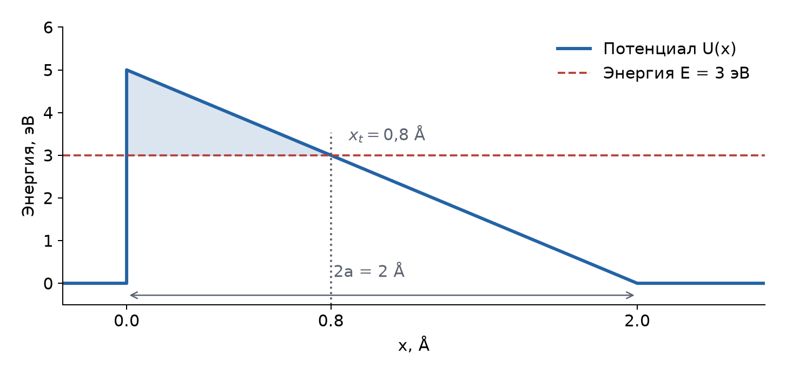
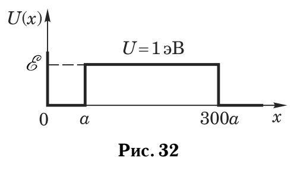
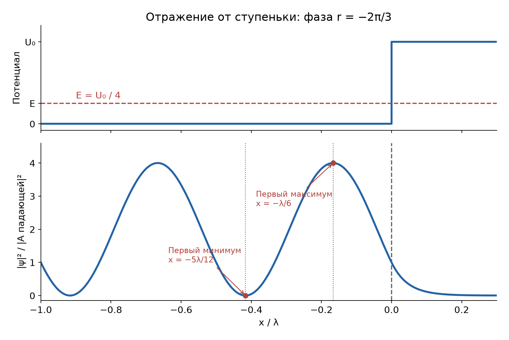
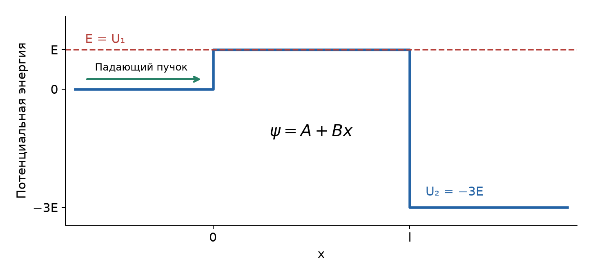

# Неделя 4 · 22–28 сентября

## Уравнение Шредингера. Потенциальные барьеры. Туннельный эффект

[Все недели](../README.md) · [Указатель задач](../TASKS.md) · [Теория](#theory) · [К задачам](#tasks) · [← Неделя 3](./week-03.md) · [Неделя 5 →](./week-05.md)

<a name="tasks"></a>

**Задачи:** [0-4-1](#task-0-4-1) · [0-4-2](#task-0-4-2) · [3.35](#task-3-35) · [3.53](#task-3-53) · [Т4.1](#task-t4-1) · [3.45](#task-3-45) · [Т4.2](#task-t4-2) · [Т4.3](#task-t4-3) · [3.64](#task-3-64)

<a name="theory"></a>

## Теоретический минимум

### 1. Стационарные состояния и граничные условия

Состояние частицы задаётся волновой функцией $`\Psi(x,t)`$; $`|\Psi|^2dx`$ — вероятность обнаружить её в интервале $`dx`$. Уравнение Шредингера имеет вид


```math
i\hbar\frac{\partial\Psi}{\partial t}
=-\frac{\hbar^2}{2m}\frac{\partial^2\Psi}{\partial x^2}+U(x)\Psi.
```


Если потенциал не зависит от времени, ищем $`\Psi=\psi(x)e^{-iEt/\hbar}`$. Подстановка и сокращение общего множителя дают


```math
-\frac{\hbar^2}{2m}\psi''+U(x)\psi=E\psi,
\qquad \psi''+\frac{2m}{\hbar^2}(E-U)\psi=0.
```


В области постоянного потенциала возможны три случая:


```math
\begin{array}{ll}
E>U:&\psi=Ae^{ikx}+Be^{-ikx},\quad k=\sqrt{2m(E-U)}/\hbar;\\[2pt]
E<U:&\psi=Ae^{\kappa x}+Be^{-\kappa x},\quad \kappa=\sqrt{2m(U-E)}/\hbar;\\[2pt]
E=U:&\psi=A+Bx.
\end{array}
```


Первый случай описывает бегущие волны, второй — затухание и рост амплитуды. На конечном участке под барьером нужны обе экспоненты: растущую нельзя отбрасывать лишь потому, что она растёт внутри этого участка. На бесконечном запрещённом полупространстве оставляют только затухающую экспоненту.

На конечном скачке $`U`$, если масса постоянна, непрерывны $`\psi`$ и $`\psi'`$. Непрерывность производной следует из интегрирования уравнения по малому интервалу вокруг границы:


```math
\psi'(x_0+0)-\psi'(x_0-0)
=\lim_{\delta\to0}\frac{2m}{\hbar^2}
\int_{x_0-\delta}^{x_0+\delta}(U-E)\psi\,dx=0.
```


На непроницаемой стенке ставят $`\psi=0`$; непрерывности производной через бесконечную стенку не требуют.

### 2. Поток вероятности и отражение от ступеньки

Вычитая из уравнения Шредингера его комплексно-сопряжённое уравнение, умноженные соответственно на $`\Psi^*`$ и $`\Psi`$, получаем закон сохранения вероятности:


```math
\partial_t|\Psi|^2+\partial_xj=0,
\qquad j=\frac{\hbar}{2mi}(\Psi^*\partial_x\Psi-\Psi\partial_x\Psi^*).
```


Для $`Ae^{ikx}`$ имеем $`j=\hbar k|A|^2/m`$, для $`Be^{-ikx}`$ знак противоположен. Поэтому коэффициент прохождения — отношение **потоков**, а не просто квадрат амплитуды:


```math
R=|r|^2,\qquad D=\frac{k_2}{k_1}|t|^2,\qquad R+D=1.
```


Для одной ступеньки при $`E>U_1,U_2`$ положим слева $`\psi=e^{ik_1x}+re^{-ik_1x}`$, справа $`\psi=te^{ik_2x}`$. Сшивка в нуле даёт


```math
1+r=t,\qquad k_1(1-r)=k_2t.
```


Подставляя первое равенство во второе, находим


```math
r=\frac{k_1-k_2}{k_1+k_2},\qquad
t=\frac{2k_1}{k_1+k_2},\qquad
D=\frac{4k_1k_2}{(k_1+k_2)^2}.
```


Даже при энергии выше ступеньки возможно отражение. В частности, выход из глубокой ямы при малой внешней скорости затруднён из-за сильного различия волновых чисел.

### 3. Прямоугольный барьер: точная проницаемость

Пусть вне барьера $`U=0`$, внутри участка $`0<x<l`$ потенциал равен $`U_b`$. При $`E>U_b`$ обозначим $`k=\sqrt{2mE}/\hbar`$, $`q=\sqrt{2m(E-U_b)}/\hbar`$. Запишем справа $`\psi=t e^{ik(x-l)}`$. Тогда в точке $`l`$ значения равны $`t,ikt`$, а перенос решения к нулю даёт


```math
\psi(0)=t\left(\cos ql-i\frac{k}{q}\sin ql\right),
\qquad
\psi'(0)=t\left(q\sin ql+ik\cos ql\right).
```


Слева $`\psi(0)=1+r`$, $`\psi'(0)=ik(1-r)`$. Складывая $`\psi(0)`$ и $`\psi'(0)/(ik)`$, исключаем $`r`$:


```math
2=t\left[2\cos ql-i\left(\frac{k}{q}+\frac{q}{k}\right)\sin ql\right].
```


Внешние скорости одинаковы, поэтому $`D=|t|^2`$. После возведения знаменателя в квадрат:


```math
D^{-1}=\cos^2 ql+\frac14\left(\frac{k}{q}+\frac{q}{k}\right)^2\sin^2 ql
=1+\frac{(k^2-q^2)^2}{4k^2q^2}\sin^2 ql.
```


Окончательно


```math
\boxed{D(E>U_b)=\left[1+\frac{U_b^2}{4E(E-U_b)}\sin^2(ql)\right]^{-1}.}
```


Эта формула применима и к яме: достаточно взять $`U_b<0`$. Полная прозрачность возникает при $`ql=n\pi`$, то есть при целом числе полуволн внутри участка.

Для $`0<E<U_b`$ подставляем $`q=i\kappa`$, $`\sin(i\kappa l)=i\sinh(\kappa l)`$:


```math
\boxed{D(E<U_b)=\left[1+\frac{U_b^2}{4E(U_b-E)}\sinh^2(\kappa l)\right]^{-1}.}
```


При $`\kappa l\gg1`$ имеем $`\sinh^2(\kappa l)\simeq e^{2\kappa l}/4`$, откуда


```math
D\simeq\frac{16E(U_b-E)}{U_b^2}e^{-2\kappa l}.
```


В оценках часто сохраняют лишь экспоненту. Это даёт ведущую экспоненциальную зависимость, но не гарантирует точный численный коэффициент, особенно вблизи $`E=0`$ или $`E=U_b`$.

### 4. Произвольный барьер и время жизни

Если потенциал меняется медленно на масштабе локальной длины волны, под барьером амплитуда имеет вид $`\psi\propto\kappa^{-1/2}\exp[-\int\kappa(x)dx]`$. Для вероятности показатель удваивается:


```math
D\sim\exp\left[-\frac2\hbar\int_{x_1}^{x_2}\sqrt{2m(U(x)-E)}\,dx\right].
```


Это квазиклассическая, или ВКБ, оценка; $`x_1,x_2`$ ограничивают запрещённую область. В точке поворота локальная формула требует сшивки. Её применение к тонкому барьеру с малым показателем даёт только грубую оценку.

Если частица совершает $`f`$ попыток выхода в секунду, каждая с вероятностью $`D\ll1`$, вероятность остаться после времени $`t`$ равна


```math
P(t)=(1-D)^{ft}\simeq e^{-fDt}=e^{-t/\tau},\qquad
\tau\simeq\frac1{fD}.
```


При одной выходной стенке ямы шириной $`a`$ имеем $`f=v/(2a)`$; при двух одинаковых выходах — $`f=v/a`$. Энергетическая ширина соответствующего квазистационарного состояния оценивается как $`\Gamma\sim\hbar/\tau`$.

Численно используем $`\hbar=1{,}055\cdot10^{-34}`$ Дж·с, $`m_e=9{,}109\cdot10^{-31}`$ кг, $`r_{\mathrm Б}=0{,}5292`$ Å и $`1\ \text{эВ}=1{,}602\cdot10^{-19}`$ Дж.

## Группа 0

<a name="task-0-4-1"></a>

### Задача 0-4-1. Прозрачность прямоугольной ямы

**Условие.** Найти минимальную кинетическую энергию электрона, при которой он без отражения пройдёт над одномерной прямоугольной потенциальной ямой глубиной $`U=2{,}5`$ эВ размером $`a=2r_{\mathrm Б}`$, $`r_{\mathrm Б}`$ — боровский радиус.

**Краткая теория.** Отражения от двух границ интерферируют. При $`qa=n\pi`$ отражённые волны взаимно гасятся; $`q`$ нужно вычислять по кинетической энергии **внутри** ямы, равной $`E+U`$.

**Решение.** Выбираем нуль потенциала вне ямы. В формуле для прямоугольного участка заменяем $`U_b`$ на $`-U`$:


```math
D^{-1}=1+\frac{U^2}{4E(E+U)}\sin^2(qa),
\qquad q=\frac{\sqrt{2m_e(E+U)}}\hbar.
```


При $`D=1`$ второй член должен обратиться в нуль:


```math
qa=n\pi
\ \Rightarrow\ E+U=\frac{n^2\pi^2\hbar^2}{2m_ea^2}
\ \Rightarrow\ E_n=\frac{n^2\pi^2\hbar^2}{2m_ea^2}-U.
```


Выбираем наименьшее положительное $`E_n`$. Для $`n=1`$, учитывая $`\hbar^2/(2m_er_{\mathrm Б}^2)=13{,}606`$ эВ,


```math
E_1=\frac{\pi^2}{4}\,13{,}606-2{,}5=31{,}07\ \text{эВ}>0.
```


**Ответ:** $`\boxed{E_{\min}\simeq31{,}1\ \text{эВ}}`$.

<a name="task-0-4-2"></a>

### Задача 0-4-2. Треугольный барьер

**Условие.** Потенциальный барьер представляет собой прямоугольный треугольник с катетами $`2a=2`$ Å и $`U_0=5`$ эВ. Оценить вероятность туннелирования через такой барьер электрона с энергией $`E=3U_0/5`$.



*Запрещённый участок выделен цветом. Его ширина меньше полной ширины барьера $`2a`$.*

**Краткая теория.** В показателе ВКБ интегрируют $`\sqrt{U-E}`$ только там, где $`U>E`$. Отражение профиля слева направо не меняет этот интеграл.

**Решение.** Возьмём $`U(x)=U_0(1-x/(2a))`$ при $`0<x<2a`$. Правая граница запрещённой области определяется из $`U(x_t)=E`$:


```math
x_t=2a\left(1-\frac E{U_0}\right)=0{,}8\ \text{Å}.
```


Положим $`\Delta=U_0-E=2`$ эВ. В интеграле используем $`y=\Delta-U_0x/(2a)`$, $`dx=-(2a/U_0)dy`$:


```math
\int_0^{x_t}\sqrt{2m_e(U-E)}\,dx
=\sqrt{2m_e}\frac{2a}{U_0}\int_0^\Delta\sqrt y\,dy
=\frac{4a\sqrt{2m_e}}{3U_0}\Delta^{3/2}.
```


Поэтому


```math
D\sim\exp\left[-\frac{8a\sqrt{2m_e}}{3\hbar U_0}(U_0-E)^{3/2}\right]
=e^{-0{,}773}\simeq0{,}46.
```


**Ответ:** $`\boxed{D\sim0{,}46}`$. Показатель меньше единицы, поэтому это оценка по экспоненте, а не точная вероятность для тонкого барьера.

## Группа 1

<a name="task-3-35"></a>

### Задача 3.35. Время жизни частицы в яме

**Условие.** Электрон находится в одномерной потенциальной яме, изображенной на рисунке рис. 32. Энергия частицы равна $`\mathcal E=0{,}9999`$ эВ, а высота потенциального барьера $`U=1`$ эВ. Найти ширину ямы, если уровень с указанным значением энергии является первым. Оценить время жизни $`\tau`$ частицы в яме. Отражением волновой функции на задней границе потенциального барьера следует пренебречь.



*Рис. 32 книги. Яма занимает $`0<x<a`$, барьер — $`a<x<300a`$.*

**Краткая теория.** Ширину определяем по сшивке синусоиды в яме с затухающей экспонентой в барьере. Время жизни — обратная частота успешных попыток туннелирования, как в разборе прямоугольного барьера в «Допсеминарах».

**Решение.** Обозначим энергию через $`E=\mathcal E`$, а волновые числа через


```math
k=\frac{\sqrt{2m_eE}}\hbar,\qquad
\kappa=\frac{\sqrt{2m_e(U-E)}}\hbar.
```


Непроницаемая стенка требует $`\psi(0)=0`$, поэтому внутри ямы $`\psi=A\sin kx`$. Пренебрегая влиянием дальней границы на форму связанного состояния, справа пишем $`\psi=B e^{-\kappa(x-a)}`$. В точке $`a`$:


```math
A\sin ka=B,\qquad Ak\cos ka=-\kappa B,
\qquad k\cot ka=-\kappa.
```


У первого состояния внутри ямы нет узлов. Следовательно, нужно выбрать корень $`\pi/2<ka<\pi`$, а не прибавлять произвольное число $`\pi`$:


```math
ka=\frac\pi2+\arctan\frac\kappa k
=\frac\pi2+\arctan\sqrt{\frac{U-E}{E}}.
```


Численно $`k=0{,}5123`$ Å⁻¹, $`\kappa=0{,}005123`$ Å⁻¹, откуда $`a=3{,}086`$ Å. В приближении $`\kappa\ll k`$ достаточно $`a\simeq\pi/(2k)\simeq3`$ Å.

Ширина барьера равна $`300a-a=299a`$. По экспоненциальной оценке, используемой в ответе задачника,


```math
D\sim e^{-2\kappa\,299a}=e^{-598\kappa a}\simeq7{,}8\cdot10^{-5}.
```


Скорость в яме $`v=\hbar k/m_e\simeq5{,}93\cdot10^5`$ м/с. После неудачной попытки электрон проходит до левой стенки и обратно; время между попытками $`2a/v`$. Поэтому


```math
\tau\sim\frac{2a}{vD}\simeq1{,}3\cdot10^{-11}\ \text{с}.
```


**Ответ в принятой в книге оценке:** $`\boxed{a\simeq3\ \text{Å},\quad\tau\sim10^{-11}\ \text{с}}`$; в задачнике $`1{,}2\cdot10^{-11}`$ с. Оценка времени сохраняет только туннельную экспоненту. При столь малом $`U-E`$ предэкспоненциальный множитель может существенно менять время, поэтому этот результат не следует считать точным решением задачи о распаде.

<a name="task-3-53"></a>

### Задача 3.53. Стоячая волна перед потенциальной ступенькой

**Условие.** На одномерную прямоугольную потенциальную ступеньку высотой $`U_0>0`$, расположенную в точке $`x=0`$, из области $`x<0`$ падают микрочастицы с энергией $`\mathcal E=U_0/4`$ (рис. 37). На каком наименьшем расстоянии слева от ступеньки (в длинах волн де Бройля) плотность вероятности обнаружить частицу будет максимальна и на каком — минимальна?



**Краткая теория.** При $`\mathcal E<U_0`$ отражение полное, но его амплитуда имеет фазовый сдвиг. Именно этот сдвиг определяет положение узлов и пучностей интерференции падающей и отражённой волн.

**Решение.** Введём


```math
k=\frac{\sqrt{2m\mathcal E}}{\hbar},\qquad
\kappa=\frac{\sqrt{2m(U_0-\mathcal E)}}{\hbar},\qquad
\frac\kappa k=\sqrt3,\qquad\lambda=\frac{2\pi}{k}.
```


При единичной амплитуде падающей волны


```math
\psi(x)=\begin{cases}e^{ikx}+r e^{-ikx},&x<0,\\ t e^{-\kappa x},&x>0.\end{cases}
```


Непрерывность $`\psi`$ и $`\psi'`$ при $`x=0`$ даёт $`1+r=t`$, $`ik(1-r)=-\kappa t`$. Исключая $`t`$,


```math
r=\frac{k-i\kappa}{k+i\kappa}
=\frac{1-i\sqrt3}{1+i\sqrt3}=e^{-2\pi i/3}.
```


Поэтому слева от ступеньки


```math
\psi=e^{ikx}+e^{-2\pi i/3}e^{-ikx}
=2e^{-\pi i/3}\cos\left(kx+\frac\pi3\right),
```


```math
|\psi|^2=4\cos^2\left(kx+\frac\pi3\right).
```


При движении от $`x=0`$ влево аргумент косинуса убывает от $`\pi/3`$. Первый максимум возникает при аргументе $`0`$, первый минимум — при $`-\pi/2`$:


```math
kx_{\max}+\frac\pi3=0,\qquad kx_{\min}+\frac\pi3=-\frac\pi2.
```


Отсюда координаты и искомые расстояния


```math
\boxed{x_{\max}=-\frac\lambda6,\quad x_{\min}=-\frac{5\lambda}{12};\qquad
d_{\max}=\frac\lambda6,\quad d_{\min}=\frac{5\lambda}{12}.}
```


Нельзя ставить узел непосредственно на границе: такое условие применимо лишь к бесконечно высокой стенке. При конечной ступеньке волновая функция проникает в область $`x>0`$.


<a name="task-t4-1"></a>

### Задача Т4.1. Прохождение при энергии, равной вершине барьера

**Условие.** Какая доля электронов с энергией $`E=1`$ эВ, падающих слева на несимметричный прямоугольный барьер с параметрами $`U_1=E`$, $`U_2=-3E`$ и шириной $`l=7{,}8\cdot10^{-8}`$ см, сможет его преодолеть (см. рисунок)?



**Краткая теория.** Внутри барьера $`E-U_1=0`$, поэтому решение линейно. Справа скорость вдвое больше начальной; этот множитель обязательно входит в отношение потоков.

**Решение.** Положим $`k=\sqrt{2m_eE}/\hbar`$. Справа


```math
k_2=\frac{\sqrt{2m_e(E-U_2)}}\hbar=2k.
```


Выберем решения


```math
\psi_1=e^{ikx}+re^{-ikx},\quad
\psi_b=A+Bx,\quad
\psi_2=t e^{2ik(x-l)}.
```


Сшивка в точках $`0`$ и $`l`$ даёт четыре равенства:


```math
1+r=A,\qquad ik(1-r)=B,\qquad A+Bl=t,\qquad B=2ikt.
```


Из второго и четвёртого $`1-r=2t`$, то есть $`r=1-2t`$. Тогда $`A=2-2t`$, и третье равенство становится


```math
2-2t+2iklt=t
\ \Rightarrow\ t=\frac2{3-2ikl}.
```


Вычисляем отношение потоков:


```math
D=\frac{k_2}{k}|t|^2
=2\frac4{9+4k^2l^2}
=\frac8{9+4k^2l^2}.
```


Здесь $`kl\simeq4`$, поэтому


```math
\boxed{D\simeq\frac8{73}\simeq0{,}110.}
```


Около 11% электронов проходят барьер. При точных значениях констант $`D=0{,}10978`$; дробь $`8/73`$ соответствует округлению $`kl`$ до 4.

## Группа 2

<a name="task-3-45"></a>

### Задача 3.45. Минимальная ширина барьера

**Условие.** При прохождении нерелятивистской частицы с энергией $`\mathcal E`$ над прямоугольным барьером высотой $`U=(3/4)\mathcal E`$ коэффициент отражения по мощности оказался равным $`R=9/25`$. Определить минимально возможную ширину барьера в единицах соответствующей ему дебройлевской длины волны.

**Краткая теория.** Как и при разборе прохождения над ямой в «Допсеминарах», отражение зависит от фазы, накопленной между двумя границами. Точная формула учитывает все многократные отражения.

**Решение.** Обозначим $`E=\mathcal E`$. Вне барьера $`k=\sqrt{2mE}/\hbar`$, внутри $`q=\sqrt{2m(E-U)}/\hbar=k/2`$. Формула из теории даёт


```math
D^{-1}=1+\frac{U^2}{4E(E-U)}\sin^2(ql)
=1+\frac9{16}\sin^2(ql).
```


По сохранению потока $`D=1-R=16/25`$, следовательно,


```math
\frac{25}{16}=1+\frac9{16}\sin^2(ql)
\ \Rightarrow\ \sin^2(ql)=1.
```


Наименьшая положительная фаза $`ql=\pi/2`$. Если $`\lambda_b=2\pi/q`$ — длина волны **в области барьера**, то


```math
\boxed{l_{\min}=\frac\pi{2q}=\frac{\lambda_b}{4}.}
```


Снаружи $`\lambda_0=2\pi/k=\lambda_b/2`$, поэтому тот же ответ записывается как $`l_{\min}=\lambda_0/2`$. Это устраняет неоднозначность обозначения $`\lambda`$ в кратком книжном ответе.

<a name="task-t4-2"></a>

### Задача Т4.2. Электрон после поглощения фотона

**Условие.** Электрон находится в одномерной прямоугольной потенциальной яме шириной $`d=10`$ Å в основном состоянии. Энергия ионизации электрона $`E_0=20`$ эВ. Электрон поглощает фотон с энергией $`1.0001E_0`$, оценить время, которое электрон будет находиться над ямой. Процесс релаксации с испусканием фотона и возвратом в исходное состояние не рассматривать. Глубина ямы $`U=20.32`$ эВ. Сравнить уширение уровня с его энергией.

**Краткая теория.** Используем подход «Допсеминаров» к возбуждённому электрону над ямой: отражение от каждой выходной ступеньки, частота ударов и $`\tau\simeq1/(fD)`$. Энергию над ямой отсчитываем от порога выхода.

**Решение.** Исходная энергия относительно свободного электрона равна $`-E_0`$. После поглощения


```math
\varepsilon=-E_0+1{,}0001E_0=10^{-4}E_0=0{,}002\ \text{эВ}.
```


Внутри ямы кинетическая энергия $`U+\varepsilon`$, снаружи — $`\varepsilon`$. Вероятность выхода при одном ударе:


```math
D=\frac{4\sqrt{\varepsilon(U+\varepsilon)}}
{(\sqrt{U+\varepsilon}+\sqrt\varepsilon)^2}
\simeq4\sqrt{\frac\varepsilon U}\simeq0{,}040.
```


Выход возможен через обе стенки. Удары чередуются через время $`d/v`$, где $`v=\sqrt{2(U+\varepsilon)/m_e}`$. Тогда


```math
\tau\simeq\frac d{vD}
\simeq\frac d4\sqrt{\frac{m_e}{2U}}\sqrt{\frac U\varepsilon}
=\frac d4\sqrt{\frac{m_e}{2\varepsilon}}
\simeq9{,}4\cdot10^{-15}\ \text{с}.
```


Без приближения в формуле для $`D`$ получается $`9{,}6\cdot10^{-15}`$ с. Энергетическая ширина


```math
\Gamma\sim\frac\hbar\tau\simeq0{,}07\ \text{эВ},
\qquad \frac\Gamma\varepsilon\sim34\gg1.
```


**Ответ:** $`\boxed{\tau\sim10^{-14}\ \text{с},\quad\Gamma\sim0{,}06\text{–}0{,}07\ \text{эВ}\gg0{,}002\ \text{эВ}}`$. Сравнение показывает, что описание как узкого квазистационарного уровня здесь неприменимо; метод столкновений даёт характерное время выхода, а не точную форму спектрального резонанса.

<a name="task-t4-3"></a>

### Задача Т4.3. Увеличение высоты барьера

**Условие.** Электрон с энергией $`E=3`$ эВ проходит через прямоугольный потенциальный барьер высотой $`U=5`$ эВ и шириной $`l=3`$ Å. Определить, во сколько раз должна возрасти высота барьера, чтобы вероятность прохождения через барьер упала в 10 раз: а) при использовании приближенной формулы для проницаемости барьера; б) точной формулы для проницаемости прямоугольного барьера.

**Краткая теория.** В обоих случаях нужно вычислить отношение вероятностей при новой и старой высотах, используя в числителе и знаменателе одну и ту же формулу.

**Решение. а) Экспоненциальное приближение.** Пишем


```math
\frac{D(U_x)}{D(U)}
=\exp\left[-\frac{2l\sqrt{2m_e}}\hbar
(\sqrt{U_x-E}-\sqrt{U-E})\right]=\frac1{10}.
```


Логарифмируем и решаем относительно корня:


```math
\sqrt{U_x-E}=\sqrt{U-E}+\frac{\hbar\ln10}{2l\sqrt{2m_e}},
```


```math
U_x=E+\left(\sqrt{U-E}+\frac{\hbar\ln10}{2l\sqrt{2m_e}}\right)^2.
```


При подстановке в СИ либо при согласованном использовании эВ получаем


```math
\boxed{U_x=7{,}680\ \text{эВ},\qquad U_x/U=1{,}536\simeq1{,}54.}
```


**б) Точная формула.** Введём


```math
F(u)=\frac{u^2}{4E(u-E)}
\sinh^2\left(\frac{l\sqrt{2m_e(u-E)}}\hbar\right),
\qquad D(u)=\frac1{1+F(u)}.
```


Требование $`D(U_x)=D(U)/10`$ эквивалентно


```math
\frac{1+F(U)}{1+F(U_x)}=\frac1{10}
\ \Rightarrow\ F(U_x)=9+10F(U).
```


При $`U=5`$ эВ точная вероятность $`D(U)=0{,}0485394`$. Решая последнее уравнение численно, находим


```math
\boxed{U_x=7{,}697\ \text{эВ},\qquad U_x/U=1{,}539\simeq1{,}54.}
```


Проверка: $`D(7{,}697\ \text{эВ})=0{,}00485394=D(5\ \text{эВ})/10`$.

**Расхождение с приложенным ответом.** Для пункта б) на скриншоте указано $`8{,}51`$ эВ, или $`1{,}70`$ раза. Это значение не удовлетворяет точной формуле при данных $`E`$ и $`l`$. Поэтому в решении приведён проверяемый корень уравнения, а не перенесено это численное значение.

<a name="task-3-64"></a>

### Задача 3.64. Давление потока на потенциальную ступеньку

**Условие.** На потенциальную ступеньку высотой $`U_0`$ падает поток микрочастиц с энергией $`\mathcal E>U_0`$. Найти давление частиц на ступеньку, если концентрация частиц равна $`n_0`$.

**Краткая теория.** Давление равно переданному импульсу за единицу времени на единицу площади. Учитываются как отражённые частицы, так и прошедшие: последние теряют часть продольного импульса при подъёме на ступеньку.

**Решение.** Считаем поток падающим нормально из области $`U=0`$ в область $`U=U_0>0`$; $`n_0`$ — концентрация падающего пучка. Обозначим


```math
p_1=\sqrt{2m\mathcal E}=\hbar k_1,\qquad p_2=\sqrt{2m(\mathcal E-U_0)}=\hbar k_2.
```


Сшивание волн даёт амплитуду отражения $`r=(k_1-k_2)/(k_1+k_2)`$ и коэффициенты потоков


```math
R=r^2,\qquad D=\frac{4k_1k_2}{(k_1+k_2)^2}=1-R.
```


Падающий поток частиц $`j_0=n_0v_1=n_0p_1/m`$. Одна отражённая частица передаёт ступеньке импульс $`2p_1`$, а одна прошедшая — $`p_1-p_2`$. Следовательно,


```math
P=j_0\bigl[2p_1R+(p_1-p_2)D\bigr]
=\frac{n_0p_1}{m}\bigl[(p_1-p_2)+(p_1+p_2)R\bigr].
```


Подставляя $`R=(p_1-p_2)^2/(p_1+p_2)^2`$, упрощаем скобку:


```math
p_1-p_2+\frac{(p_1-p_2)^2}{p_1+p_2}
=\frac{2p_1(p_1-p_2)}{p_1+p_2}.
```


Искомое давление


```math
\boxed{P=4n_0\mathcal E\frac{k_1-k_2}{k_1+k_2}
=4n_0\mathcal E\frac{\sqrt{\mathcal E}-\sqrt{\mathcal E-U_0}}{\sqrt{\mathcal E}+\sqrt{\mathcal E-U_0}}.}
```


Сила направлена по падающему потоку. Проверки: при $`U_0\to0`$ давление исчезает ($`P\simeq n_0U_0`$), а при $`\mathcal E\to U_0+0`$ отражение становится полным и $`P\to2n_0p_1v_1=4n_0\mathcal E`$.


---

[Все недели](../README.md) · [Указатель задач](../TASKS.md) · [Теория](#theory) · [К задачам](#tasks) · [← Неделя 3](./week-03.md) · [Неделя 5 →](./week-05.md)

[Сообщить об ошибке в этой неделе](https://github.com/NeTotDEDD/FIZOS_Kvanty/issues/new?template=correction.yml)
