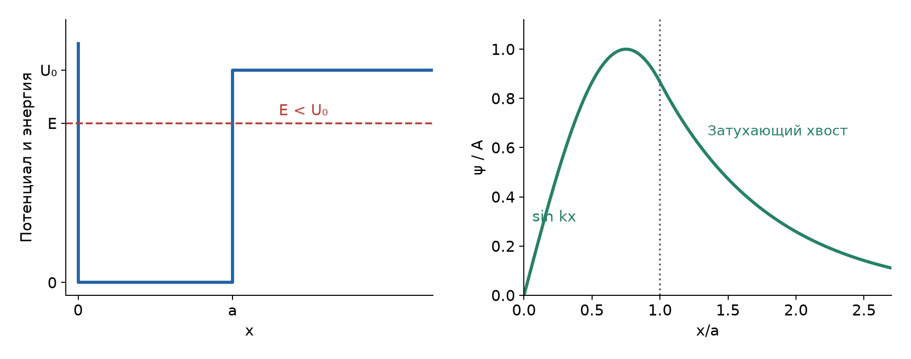
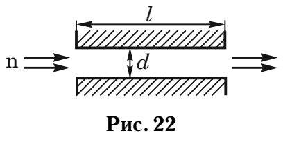
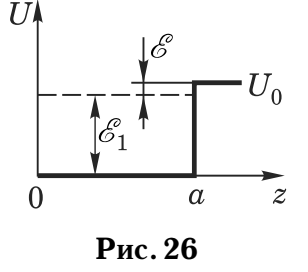
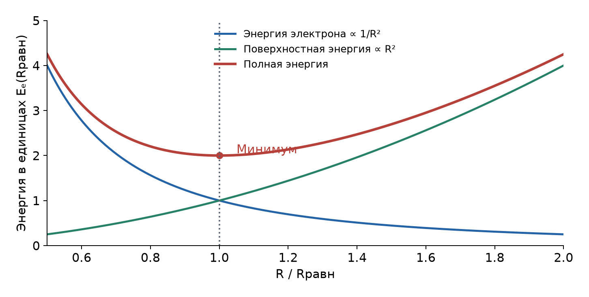

# Неделя 5 · 29 сентября – 5 октября

## Потенциальные ямы. Квазиклассическое приближение

[Все недели](../README.md) · [Указатель задач](../TASKS.md) · [Теория](#theory) · [К задачам](#tasks) · [← Неделя 4](./week-04.md) · [Неделя 6 →](./week-06.md)

<a name="tasks"></a>

**Задачи:** [0-5-1](#task-0-5-1) · [0-5-2](#task-0-5-2) · [3.5](#task-3-5) · [3.15](#task-3-15) · [3.21](#task-3-21) · [3.6](#task-3-6) · [3.23](#task-3-23) · [3.50](#task-3-50) · [3.28](#task-3-28)

<a name="theory"></a>

## Теоретический минимум

### 1. Ящик с непроницаемыми стенками

Для $`0<x<l`$ потенциал равен нулю, а вне этого интервала бесконечен. Внутри $`\psi''+k^2\psi=0`$, то есть $`\psi=A\sin kx+B\cos kx`$. Условия на стенках дают


```math
\psi(0)=0\Rightarrow B=0,\qquad
\psi(l)=0\Rightarrow\sin kl=0\Rightarrow k_n=\frac{n\pi}{l}.
```


Случай $`n=0`$ даёт тождественно нулевую функцию и не является состоянием. Нормировка $`\int_0^l|\psi_n|^2dx=1`$ приводит к


```math
\boxed{\psi_n(x)=\sqrt{\frac2l}\sin\frac{n\pi x}{l},\qquad
E_n=\frac{\pi^2\hbar^2n^2}{2ml^2},\quad n=1,2,\ldots.}
```


Если стенку перемещают достаточно медленно, чтобы переходы между уровнями были пренебрежимо малы, частица остаётся на ветви с тем же $`n`$. Работа внешних сил равна изменению $`E_n(l)`$; обобщённая сила частицы на подвижную стенку равна $`-\partial E_n/\partial l`$.

### 2. Конечная яма с одной непроницаемой стенкой

Возьмём $`U=0`$ при $`0<x<a`$, $`U=U_0`$ при $`x>a`$, слева — непроницаемая стенка. Связанное состояние имеет $`0<E<U_0`$. Решения, удовлетворяющие условиям на концах:


```math
\psi(x)=\begin{cases}
A\sin kx,&0<x<a,\\
A\sin(ka)e^{-\kappa(x-a)},&x>a,
\end{cases}
\qquad
k=\frac{\sqrt{2mE}}\hbar,\quad
\kappa=\frac{\sqrt{2m(U_0-E)}}\hbar.
```


Форма второго решения уже обеспечивает непрерывность функции. Непрерывность производной даёт спектральное уравнение


```math
\boxed{k\cot ka=-\kappa.}
```


Если ввести $`z=ka`$, $`\rho=a\sqrt{2mU_0}/\hbar`$, оно принимает вид


```math
z\cot z=-\sqrt{\rho^2-z^2}.
```


Для основного состояния $`\pi/2<z<\pi`$: функция имеет один максимум и не имеет внутренних узлов. При уменьшении $`U_0`$ связанный уровень подходит к порогу: $`E\to U_0`$, $`\kappa\to0`$, $`z\to\pi/2`$. Значит,


```math
U_{0,\mathrm{crit}}=\frac{\pi^2\hbar^2}{8ma^2}.
```


В самой точке порога внешняя функция перестаёт затухать и уже не нормируется: для существования связанного состояния нужна строго большая глубина. Это свойство ямы с одной бесконечной стенкой; его нельзя переносить на симметричную конечную яму на всей прямой, у которой есть связанное состояние при сколь угодно малой глубине.



*Слева показаны энергия и потенциал; справа — синусоидальный участок и экспоненциальный хвост одной волновой функции.*

### 3. Средние величины и вариационная оценка

Для ненормированной пробной функции $`\phi`$ среднее значение оператора вычисляют как отношение интегралов:


```math
\langle A\rangle=\frac{\int\phi^*\hat A\phi\,dx}{\int|\phi|^2dx}.
```


Для гамильтониана $`\hat H=-\hbar^2\partial_x^2/(2m)+U`$ интегрирование по частям, при исчезающем граничном члене, даёт


```math
E[\phi]=\frac{\dfrac{\hbar^2}{2m}\int|\phi'|^2dx+\int U|\phi|^2dx}
{\int|\phi|^2dx}.
```


Почему минимум этого выражения оценивает основное состояние? Разложим нормированную функцию по собственным состояниям: $`\phi=\sum c_n\psi_n`$, $`\sum|c_n|^2=1`$. Тогда $`\langle H\rangle=\sum|c_n|^2E_n\ge E_0`$. Минимизируя по параметрам пробной функции, получаем верхнюю оценку $`E_0`$, точную только если выбранное семейство содержит истинную основную функцию.

### 4. Квазиклассическое квантование

В разрешённой области локальный импульс $`p(x)=\sqrt{2m(E-U(x))}`$. По правилу Бора–Зоммерфельда полный набег фазы за классический период кратен $`2\pi`$:


```math
\oint p\,dx\simeq nh=2\pi\hbar n.
```


Интеграл по замкнутому движению равен удвоенному интегралу от одного конца траектории до другого: при обратном движении одновременно меняются знаки $`p`$ и $`dx`$. При $`n\gg1`$ фазовыми поправками порядка единицы можно пренебречь. Для одной жёсткой стенки и одной гладкой точки поворота уточнённое правило имеет вид


```math
\int_0^{x_t}p\,dx=\pi\hbar\left(n-\frac14\right),\qquad n=1,2,\ldots.
```


### 5. Поперечное квантование и сферическая полость

Для щели с отражающими стенками волновая функция разделяется на поперечную стоячую волну и продольную бегущую. Энергия имеет вид


```math
E=\frac{\pi^2\hbar^2n^2}{2md^2}+\frac{p_\parallel^2}{2m}.
```


Часть энергии расходуется на поперечное основное состояние; остаток задаёт продольную скорость. Скорость вдоль щели нельзя автоматически приравнивать скорости падающего нейтрона.

В сферически симметричном состоянии удобно ввести $`u(r)=r\psi(r)`$. При орбитальном моменте $`l=0`$ радиальное уравнение внутри полости сводится к $`u''+k^2u=0`$. Регулярность $`\psi`$ в центре требует $`u(0)=0`$, а непроницаемая поверхность — $`u(R)=0`$. Поэтому для нижнего уровня $`kR=\pi`$ и $`E_1=\pi^2\hbar^2/(2mR^2)`$.

## Группа 0

<a name="task-0-5-1"></a>

### Задача 0-5-1. Работа сжатия ящика

**Условие.** Частица массы $`m`$ заключена в одномерном потенциальном ящике шириной $`l`$ с непроницаемыми стенками. Найти работу, которую надо затратить на квазистатическое сжатие ящика вдвое, если частица находится в основном состоянии.

**Краткая теория.** При медленном сжатии сохраняется номер уровня. Работа внешних сил равна приросту энергии частицы.

**Решение.** Вначале $`E_i=\pi^2\hbar^2/(2ml^2)`$. В конце ширина $`l/2`$, поэтому


```math
E_f=\frac{\pi^2\hbar^2}{2m(l/2)^2}=4E_i,
\qquad W=E_f-E_i=3E_i.
```


Итак,


```math
\boxed{W=\frac{3\pi^2\hbar^2}{2ml^2}=\frac{3h^2}{8ml^2}.}
```


Знак положителен: локализация в меньшем объёме повышает кинетическую энергию, поэтому сжатие требует работы.

<a name="task-0-5-2"></a>

### Задача 0-5-2. Масса по расстоянию между уровнями

**Условие.** Частица массы $`m`$ заключена в одномерном потенциальном ящике с непроницаемыми стенками. Какова масса частицы, если при ширине ящика $`l=3`$ Å. расстояние между первым и третьим уровнями частицы в яме составляет $`\Delta E=5`$ эВ?

**Краткая теория.** Уровни пропорциональны $`n^2`$, поэтому разность первого и третьего уровней равна восьми энергиям основного состояния.

**Решение.**


```math
\Delta E=E_3-E_1=\frac{\pi^2\hbar^2}{2ml^2}(9-1)
=\frac{4\pi^2\hbar^2}{ml^2}.
```


Отсюда, переводя $`l`$ в метры, а $`\Delta E`$ в джоули,


```math
m=\frac{4\pi^2(1{,}05457\cdot10^{-34})^2}
{(3\cdot10^{-10})^2\,5\cdot1{,}60218\cdot10^{-19}}
=6{,}09\cdot10^{-30}\ \text{кг}.
```


**Ответ:** $`\boxed{m\simeq6{,}09\cdot10^{-30}\ \text{кг}\simeq6{,}69m_e}`$.

## Группа 1

<a name="task-3-5"></a>

### Задача 3.5. Вариационная оценка в линейном потенциале

**Условие.** Частица массой $`m`$ находится в одномерном потенциале


```math
\psi(x)=\begin{cases}\infty&\text{при }x<0,\\kx&\text{при }x>0.\end{cases}
```


Оценить энергию основного состояния частицы в этом потенциале, используя в качестве волновой функции $`\psi=x\exp(-ax)`$. В качестве оценки взять минимум среднего значения полной энергии частицы. Сравнить с задачей 2.39.

**Обозначение в условии.** В книге потенциал обозначен буквой $`\psi`$; далее обозначаем его $`U(x)`$, чтобы отличать от волновой функции.

**Краткая теория.** Параметр $`a>0`$ задаёт степень локализации. Увеличение $`a`$ повышает кинетическую энергию и понижает среднюю потенциальную. Искомый компромисс находим вариационным методом.

**Решение.** Здесь $`k>0`$ — наклон потенциала, а не волновое число. Для интегралов используем


```math
I_n=\int_0^\infty x^ne^{-2ax}dx=\frac{n!}{(2a)^{n+1}}.
```


Норма $`I_2=1/(4a^3)`$. Производная пробной функции равна $`(1-ax)e^{-ax}`$, поэтому


```math
\int_0^\infty|\psi'|^2dx
=I_0-2aI_1+a^2I_2
=\frac1{2a}-\frac1{2a}+\frac1{4a}=\frac1{4a}.
```


Следовательно,


```math
\langle T\rangle=\frac{\hbar^2}{2m}\frac{1/(4a)}{1/(4a^3)}
=\frac{\hbar^2a^2}{2m},\qquad
\langle U\rangle=k\frac{I_3}{I_2}=\frac{3k}{2a}.
```


Минимизируем сумму:


```math
E(a)=\frac{\hbar^2a^2}{2m}+\frac{3k}{2a},\qquad
\frac{dE}{da}=\frac{\hbar^2a}{m}-\frac{3k}{2a^2}=0
\ \Rightarrow\ a_*^3=\frac{3mk}{2\hbar^2}.
```


Вторая производная $`\hbar^2/m+3k/a^3>0`$, так что это минимум. В точке минимума $`\langle U\rangle=2\langle T\rangle`$, откуда


```math
\boxed{E_{\mathrm{var}}=\frac{3\hbar^2a_*^2}{2m}
=\left(\frac{243\hbar^2k^2}{32m}\right)^{1/3}
=1{,}966\left(\frac{\hbar^2k^2}{m}\right)^{1/3}.}
```


Оценка по неопределённости, используемая в задаче 2.39, даёт тот же масштаб: из $`E\sim\hbar^2/(2mx^2)+kx`$ следуют $`x\sim(\hbar^2/(mk))^{1/3}`$ и $`E\sim(\hbar^2k^2/m)^{1/3}`$.

Для проверки качества можно свести точное уравнение к уравнению Эйри: при $`b=(\hbar^2/(2mk))^{1/3}`$ и $`y=x/b-E/(kb)`$ оно имеет вид $`\psi_{yy}=y\psi`$. Затухающее решение $`\operatorname{Ai}(y)`$ обращается в нуль на стенке, когда $`E/(kb)=2{,}3381`$. Поэтому $`E_0=1{,}856(\hbar^2k^2/m)^{1/3}`$: вариационный результат выше на 5,9%.

**Замечание к ответу книги.** Напечатанные там $`a_*=(3mk/(2\hbar^2))^{1/3}`$ и оценка ошибки 6% согласуются с полученным результатом. В напечатанном выражении для энергии пропущен множитель $`3/2`$: одна только величина $`(9\hbar^2k^2/(4m))^{1/3}`$ не равна минимуму $`E(a)`$.

<a name="task-3-15"></a>

### Задача 3.15. Время прохождения нейтрона через щель

**Условие.** Поток нейтронов, летящих со скоростью $`V_0=25`$ см/с, падает на широкую щель с абсолютно отражающими стенками (рис. 22). Длина щели $`l=1`$ см, высота $`d=10^{-4}`$ см. Сколько времени нейтрон будет находиться внутри щели, если он в нее попадет?



**Краткая теория.** Как в разборе нейтронного волновода в «Допсеминарах», поперечное движение квантуется. После выбора доступного поперечного уровня продольную скорость определяет закон сохранения энергии.

**Решение.** Порог скорости для первого поперечного уровня:


```math
\frac{m_nV_c^2}{2}=\frac{\pi^2\hbar^2}{2m_nd^2}
\ \Rightarrow\ V_c=\frac{\pi\hbar}{m_nd}=19{,}78\ \text{см/с}.
```


Второй уровень требует $`V_0\ge2V_c=39{,}56`$ см/с. При $`V_0=25`$ см/с доступен только первый уровень. Тогда


```math
\frac{m_nV_0^2}{2}
=\frac{m_nV_c^2}{2}+\frac{m_nv_\parallel^2}{2}
\ \Rightarrow\ v_\parallel=\sqrt{V_0^2-V_c^2}
=15{,}29\ \text{см/с}.
```


**Ответ:**


```math
\boxed{t=\frac l{v_\parallel}=\frac{1\ \text{см}}{15{,}29\ \text{см/с}}
\simeq0{,}0654\ \text{с}.}
```


Это время пролёта прошедшего нейтрона; условие «если он в нее попадет» позволяет не рассчитывать отражение на входе.

<a name="task-3-21"></a>

### Задача 3.21. Адсорбированный атом водорода

**Условие.** Энергия взаимодействия $`U(z)`$ атома водорода с твердой стенкой аппроксимируется прямоугольной потенциальной ямой глубиной $`U_0`$, шириной $`a=6`$ Å и $`U(z=0)=+\infty`$ (рис. 26). Энергия адсорбции — это разность наинизших уровней свободного и прилипшего к стенке атома $`\mathcal E=U_0-\mathcal E_1=1`$ К. Найти величину $`U_0`$ и среднее значение координаты $`\langle z\rangle`$ адсорбированных атомов.

**Указание.** $`\varphi\operatorname{ctg}\varphi=-1{,}21`$ при $`\varphi=2\pi/3`$.



**Краткая теория.** Используем сшивку в яме с одной непроницаемой стенкой. Среднее положение определяется интегралом по всей волновой функции, включая хвост вне ямы; положение её максимума не равно среднему.

**Решение. 1. Глубина ямы.** Запись энергии в кельвинах означает $`\varepsilon=\mathcal E=k_{\mathrm Б}\cdot1\ \text{К}`$. Нуль потенциала расположен на дне ямы. Пусть $`m\simeq m_p`$, $`k=\sqrt{2m\mathcal E_1}/\hbar`$, $`\kappa=\sqrt{2m\varepsilon}/\hbar`$. Тогда


```math
ka\cot(ka)=-\kappa a,
\qquad \kappa a=\frac{a\sqrt{2mk_{\mathrm Б}\cdot1\ \text{К}}}\hbar\simeq1{,}223.
```


Указание позволяет принять $`ka\simeq2\pi/3`$. Поскольку $`\cot(2\pi/3)=-1/\sqrt3`$, из $`k\cot ka=-\kappa`$ следует $`k\simeq\sqrt3\kappa`$. Поэтому


```math
\mathcal E_1=\frac{\hbar^2k^2}{2m}\simeq3\frac{\hbar^2\kappa^2}{2m}=3\varepsilon,
\qquad U_0=\mathcal E_1+\varepsilon\simeq4\varepsilon.
```


**2. Средняя координата.** Берём


```math
\psi(z)=A\begin{cases}\sin kz,&0<z<a,\\
\sin(ka)e^{-\kappa(z-a)},&z>a.\end{cases}
```


Общий коэффициент $`A`$ сократится. Введём интегралы нормы и первого момента внутри ямы:


```math
I_0=\int_0^a\sin^2(kz)dz=\frac a2-\frac{\sin2ka}{4k},
```


```math
I_1=\int_0^az\sin^2(kz)dz
=\frac{a^2}{4}-\frac{a\sin2ka}{4k}-\frac{\cos2ka-1}{8k^2}.
```


Здесь использована тождественная замена $`\sin^2(kz)=(1-\cos2kz)/2`$ и интегрирование $`z\cos2kz`$ по частям. Для внешней области подстановка $`s=z-a`$ даёт


```math
J_0=\sin^2(ka)\int_0^\infty e^{-2\kappa s}ds=\frac{\sin^2(ka)}{2\kappa},
```


```math
J_1=\sin^2(ka)\int_0^\infty(a+s)e^{-2\kappa s}ds
=\sin^2(ka)\left(\frac a{2\kappa}+\frac1{4\kappa^2}\right).
```


Следовательно, $`\langle z\rangle=(I_1+J_1)/(I_0+J_0)`$. Численное решение спектрального уравнения даёт $`ka=2{,}0984`$, $`U_0/k_{\mathrm Б}=3{,}945`$ К и


```math
\boxed{U_0\simeq4\ \text{К},\qquad\langle z\rangle\simeq5{,}45\ \text{Å}.}
```


Книга также приводит точное среднее около $`5{,}4`$ Å. Оценка «положение максимума плюс длина хвоста» даёт около 7 Å, но не заменяет вычисление среднего: значительная часть вероятности остаётся внутри ямы.

## Группа 2

<a name="task-3-6"></a>

### Задача 3.6. Квантование в линейном потенциале

**Условие.** Используя правило квантования Бора–Зоммерфельда, найти закон квантования энергии частицы массой $`m`$ при больших значениях главного квантового числа $`n`$ (в квазиклассическом приближении) в одномерном потенциале


```math
\psi(x)=\begin{cases}\infty&\text{при }x<0,\\kx&\text{при }x>0.\end{cases}
```


**Указание.** Правило квантования Бора—Зоммерфельда: $`\oint p\,dl=nh`$.

**Обозначение в условии.** В книге потенциал обозначен буквой $`\psi`$; далее обозначаем его $`U(x)`$, чтобы отличать от волновой функции.

**Краткая теория.** Вычисляем действие за полный период между жёсткой стенкой и точкой остановки. Это тот же интеграл, который в «Допсеминарах» используется для нейтрона над отражающей пластинкой в поле тяжести, с заменой $`mg`$ на $`k`$.

**Решение.** Из $`p^2/(2m)+kx=E`$ получаем $`p=\sqrt{2m(E-kx)}`$, а из $`p(x_t)=0`$ — $`x_t=E/k`$. Полный интеграл:


```math
\oint p\,dx=2\int_0^{E/k}\sqrt{2m(E-kx)}dx.
```


Подставим $`y=E-kx`$, $`dx=-dy/k`$:


```math
\oint p\,dx=\frac{2\sqrt{2m}}k\int_0^E\sqrt y\,dy
=\frac{4\sqrt{2m}}{3k}E^{3/2}=nh.
```


Отсюда


```math
\boxed{E_n\simeq\left(\frac{3knh}{4\sqrt{2m}}\right)^{2/3}
=\frac32\left(\frac{\pi^2\hbar^2k^2}{3m}\right)^{1/3}n^{2/3},\quad n\gg1.}
```


Если учитывать фазовую поправку стенки и точки поворота, нужно заменить $`n`$ на $`n-1/4`$. Уровни сближаются с ростом $`n`$: $`E_{n+1}-E_n\propto n^{-1/3}`$, в отличие от равноотстоящих уровней гармонического осциллятора.

<a name="task-3-23"></a>

### Задача 3.23. Глубина ямы по отношению амплитуд

**Условие.** Найти глубину ямы и энергию ионизации $`\mathcal E`$ электрона (в эВ), находящегося в основном состоянии в одномерной яме шириной $`a=2`$ Å с потенциалом $`U_0=\infty`$, $`U=-U_0`$ при $`0<x<a`$ и $`U=0`$ при $`x>a`$, если известно, что отношение волновой функции на границе ямы ($`x=a`$) к ее максимальному значению в яме равно $`\alpha=\sqrt3/2`$.

**Опечатка в условии.** Напечатанное $`U_0=\infty`$ следует читать как $`U(0)=\infty`$: левая стенка непроницаема, а глубина $`U_0`$ конечна и подлежит определению.

**Краткая теория.** Энергия уровня относительно внешнего нуля равна $`-\mathcal E`$. Внутри ямы кинетическая энергия $`U_0-\mathcal E`$; сшивка определяет и фазу синусоиды, и соотношение этих энергий.

**Решение.** Пишем $`\psi=A\sin kx`$ внутри и $`\psi=B e^{-\kappa(x-a)}`$ снаружи, где


```math
k^2=\frac{2m_e(U_0-\mathcal E)}{\hbar^2},\qquad
\kappa^2=\frac{2m_e\mathcal E}{\hbar^2},\qquad
k\cot ka=-\kappa.
```


У основного состояния $`\pi/2<ka<\pi`$, так что максимум внутри равен $`A`$. Условие даёт $`\sin ka=\sqrt3/2`$. Корень $`ka=\pi/3`$ не подходит, поскольку имел бы положительную производную на выходе вместо отрицательной. Поэтому


```math
ka=\frac{2\pi}{3},\qquad\cot ka=-\frac1{\sqrt3},\qquad\kappa=\frac k{\sqrt3}.
```


Следовательно,


```math
\frac{\mathcal E}{U_0-\mathcal E}=\frac{\kappa^2}{k^2}=\frac13
\Rightarrow\mathcal E=\frac{U_0}{4}.
```


Кроме того,


```math
\frac{3U_0}{4}=\frac{\hbar^2}{2m_e}\left(\frac{2\pi}{3a}\right)^2
\Rightarrow\boxed{U_0=\frac{8\pi^2\hbar^2}{27m_ea^2}\simeq5{,}57\ \text{эВ},\quad
\mathcal E\simeq1{,}39\ \text{эВ}.}
```


При округлениях задачника получаются $`5{,}53`$ и $`1{,}38`$ эВ соответственно.

<a name="task-3-50"></a>

### Задача 3.50. Освобождение частицы при понижении стенки

**Условие.** Микрочастица находится в одномерной потенциальной яме заданной ширины. Одна ее стенка бесконечно высокая, а вторая — конечной высоты $`U_0`$. Энергия частицы в яме $`\mathcal E=U_0/2`$. Во сколько раз надо квазистатически изменить высоту ямы при неизменной ширине, чтобы частица стала свободной?

**Краткая теория.** При медленном изменении стенки отслеживаем одну ветвь спектра. Освобождение происходит при достижении внешнего порога: $`\kappa\to0`$. Этот метод применяется в «Допсеминарах» к аналогичному изменению ширины ямы.

**Решение для нижнего уровня, подразумеваемого книжным ответом.** Пусть ширина $`a`$, нуль энергии — дно ямы. Первоначально $`\mathcal E=U_0/2`$, поэтому $`k=\kappa`$. Уравнение сшивки принимает вид


```math
\cot(ka)=-1\Rightarrow ka=\frac{3\pi}{4}.
```


Выбрана ветвь $`\pi/2<ka<\pi`$. Так как $`k^2=mU_0/\hbar^2`$,


```math
U_0=\frac{9\pi^2\hbar^2}{16ma^2}.
```


При достижении порога $`\mathcal E'=U_0'`$, $`\kappa'=0`$, и $`k'a=\pi/2`$. Теперь $`k'^2=2mU_0'/\hbar^2`$, откуда


```math
U_0'=\frac{\pi^2\hbar^2}{8ma^2},\qquad
\boxed{\frac{U_0}{U_0'}=\frac92=4{,}5.}
```


Стенку нужно **понизить в 4,5 раза**. Энергию самой частицы в процессе нельзя держать постоянной: меняется спектр ямы.

В условии номер исходного уровня явно не указан. Для $`n`$-й ветви вместо $`3\pi/4`$ и $`\pi/2`$ берутся $`(n-1/4)\pi`$ и $`(n-1/2)\pi`$, так что общий результат $`U_0/U_0'=2[(n-1/4)/(n-1/2)]^2`$. Значение 4,5 соответствует $`n=1`$.

<a name="task-3-28"></a>

### Задача 3.28. Электронный пузырёк в жидком гелии

**Условие.** Электрон, введенный в жидкий гелий, расталкивает атомы жидкости и образует в ней сферическую вакуумную полость, которая является для электрона потенциальной ямой с практически бесконечно высокой стенкой. Вычислить радиус полости, если поверхностное натяжение жидкого гелия равно 0,35 дин/см, а электрон занимает в полости наинизший квантовый уровень. Внешнее давление считать равным нулю. (См. также задачу 2.38.)



**Краткая теория.** Расширение полости уменьшает энергию локализации электрона, но увеличивает площадь поверхности. Равновесный радиус минимизирует сумму этих энергий.

**Решение.** Для сферического основного состояния $`u(r)=r\psi(r)=A\sin kr`$, а условия $`u(0)=u(R)=0`$ дают $`kR=\pi`$. Значит,


```math
E_e(R)=\frac{\pi^2\hbar^2}{2m_eR^2}.
```


Поверхностная энергия равна $`E_\sigma=4\pi\sigma R^2`$. Члена $`p(4\pi R^3/3)`$ нет, поскольку по условию внешнее давление равно нулю. Минимизируем


```math
E(R)=\frac{\pi^2\hbar^2}{2m_eR^2}+4\pi\sigma R^2,
```


```math
\frac{dE}{dR}=-\frac{\pi^2\hbar^2}{m_eR^3}+8\pi\sigma R=0
\Rightarrow R^4=\frac{\pi\hbar^2}{8m_e\sigma}.
```


Вторая производная положительна: $`3\pi^2\hbar^2/(m_eR^4)+8\pi\sigma>0`$. Переводим поверхностное натяжение: $`1`$ дин/см $`=10^{-3}`$ Н/м, следовательно $`\sigma=3{,}5\cdot10^{-4}`$ Н/м.


```math
\boxed{R=\left(\frac{\pi\hbar^2}{8m_e\sigma}\right)^{1/4}
\simeq1{,}92\cdot10^{-9}\ \text{м}\simeq20\ \text{Å}.}
```


При найденном радиусе $`E_e=E_\sigma`$, что непосредственно проверяется из условия минимума.

---

[Все недели](../README.md) · [Указатель задач](../TASKS.md) · [Теория](#theory) · [К задачам](#tasks) · [← Неделя 4](./week-04.md) · [Неделя 6 →](./week-06.md)

[Сообщить об ошибке в этой неделе](https://github.com/NeTotDEDD/FIZOS_Kvanty/issues/new?template=correction.yml)
