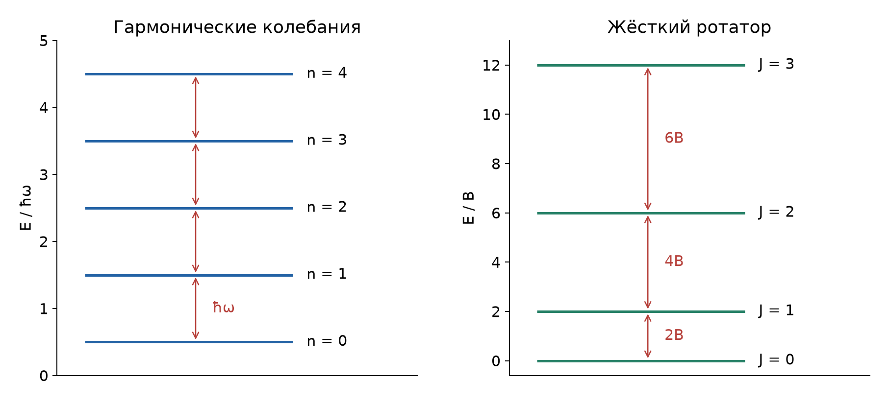
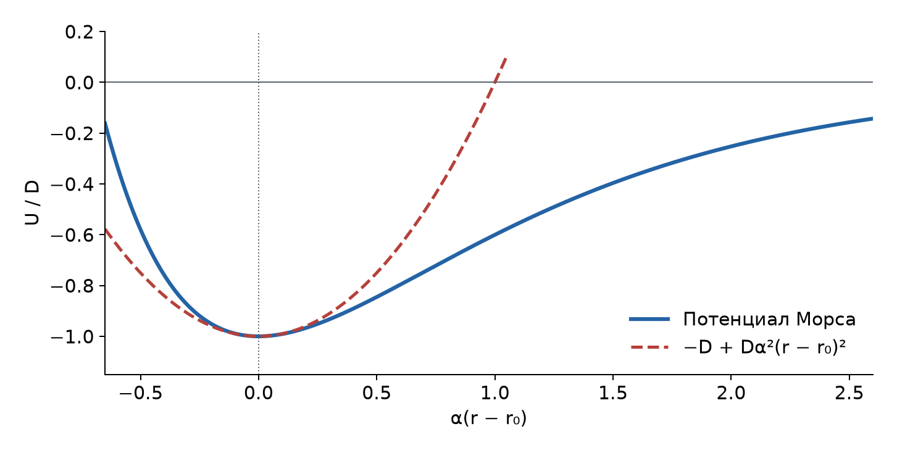

# Неделя 6 · 6–12 октября

## Колебательные и вращательные уровни. Водородоподобные атомы

[Все недели](../README.md) · [Указатель задач](../TASKS.md) · [Теория](#theory) · [К задачам](#tasks) · [← Неделя 5](./week-05.md) · [Неделя 7 →](./week-07.md)

<a name="tasks"></a>

**Задачи:** [0-6-1](#task-0-6-1) · [0-6-2](#task-0-6-2) · [4.32](#task-4-32) · [5.16](#task-5-16) · [5.25](#task-5-25) · [4.38](#task-4-38) · [4.45](#task-4-45) · [5.50](#task-5-50) · [5.33](#task-5-33)

<a name="theory"></a>

## Теоретический минимум

### 1. Разделение движения и приведённая масса

Для двух частиц с массами $`m_1,m_2`$ вводят координаты центра масс $`\mathbf R`$ и относительного положения $`\mathbf r=\mathbf r_1-\mathbf r_2`$. Подстановка скоростей в кинетическую энергию даёт


```math
T=\frac{M\dot{\mathbf R}^{\,2}}2+\frac{\mu\dot{\mathbf r}^{\,2}}2,
\qquad M=m_1+m_2,\qquad\mu=\frac{m_1m_2}{m_1+m_2}.
```


Первое слагаемое описывает движение всей молекулы или атома, второе — внутреннее движение. Во внутренних колебательных, вращательных и кулоновских задачах используется **приведённая масса** $`\mu`$. Если частицы одинаковы, $`\mu=m_1/2`$; если одна намного тяжелее, $`\mu`$ близка к массе лёгкой частицы.

Для численных оценок: $`m_{\mathrm u}=1{,}66054\cdot10^{-27}`$ кг, $`k_{\mathrm Б}=1{,}38065\cdot10^{-23}`$ Дж/К, $`hc=1{,}23984`$ эВ·мкм, $`\hbar=1{,}05457\cdot10^{-34}`$ Дж·с, $`\mathrm{Ry}\simeq13{,}6`$ эВ.

### 2. Жёсткий ротатор

Если межъядерное расстояние $`d`$ фиксировано, момент инерции молекулы относительно центра масс равен


```math
I=m_1r_1^2+m_2r_2^2=\mu d^2.
```


Здесь $`r_1+r_2=d`$ и $`m_1r_1=m_2r_2`$. Классическая энергия $`L^2/(2I)`$ становится оператором $`\hat L^2/(2I)`$. Собственные значения квадрата момента и его проекции:


```math
L^2=\hbar^2J(J+1),\qquad L_z=\hbar m_J,
\qquad m_J=-J,-J+1,\ldots,J.
```


Следовательно,


```math
\boxed{E_J=BJ(J+1),\qquad B=\frac{\hbar^2}{2I},\qquad J=0,1,2,\ldots.}
```


При электрическом дипольном переходе в полярной двухатомной молекуле $`\Delta J=\pm1`$. Тогда


```math
E_{J+1}-E_J=2B(J+1)=\frac{\hbar^2}{I}(J+1).
```


Вращательные уровни не равноотстоящие, но линии переходов между соседними уровнями равноотстоят по частоте и волновому числу $`\widetilde\nu=1/\lambda`$:


```math
\widetilde\nu_J=\frac{\hbar}{2\pi cI}(J+1),\qquad
\Delta\widetilde\nu=\frac{\hbar}{2\pi cI}.
```


У молекул без постоянного дипольного момента правила оптического возбуждения отличаются. Энергетический масштаб жёсткого ротатора можно использовать и для них, отдельно оговаривая, что спиновая структура и ограничения симметрии в такой модели не учитываются.

### 3. Колебания около равновесного расстояния

Пусть $`r_0`$ — минимум межатомного потенциала. При $`x=r-r_0`$ разложение до второго порядка даёт


```math
U(r)=U(r_0)+\frac12U''(r_0)x^2+O(x^3),
\qquad \omega=\sqrt{\frac{U''(r_0)}\mu}.
```


Линейный член исчезает, поскольку $`U'(r_0)=0`$. Для гармонического осциллятора


```math
H-U(r_0)=\frac{p^2}{2\mu}+\frac{\mu\omega^2x^2}{2}
=\hbar\omega\left(a^\dagger a+\frac12\right),
```


где $`a=\sqrt{\mu\omega/(2\hbar)}\,x+ip/\sqrt{2\mu\hbar\omega}`$, $`[a,a^\dagger]=1`$. Оператор $`a^\dagger a`$ неотрицателен, а операторы $`a,a^\dagger`$ понижают и повышают его собственное значение на единицу. Нижнее состояние удовлетворяет $`a\psi_0=0`$; от него строится ряд $`n=0,1,2,\ldots`$. Поэтому


```math
E_n=U(r_0)+\hbar\omega(n+1/2),\qquad \Delta E=\hbar\omega.
```


Нулевые колебания означают, что даже при $`T=0`$ энергия относительно минимума равна $`\hbar\omega/2`$. Равенство средних кинетической и потенциальной энергий даёт


```math
\frac{\mu\omega^2\langle x^2\rangle_0}{2}=\frac{\hbar\omega}{4},
\qquad x_{\mathrm{rms}}=\sqrt{\frac{\hbar}{2\mu\omega}}.
```


В «Допсеминарах» под амплитудой $`A_0`$ понимается амплитуда классического колебания с той же энергией, для которого $`\langle x^2\rangle=A_0^2/2`$. Значит, $`A_0=\sqrt{\hbar/(\mu\omega)}=\sqrt2\,x_{\mathrm{rms}}`$.



*Слева — равные колебательные интервалы в гармоническом приближении; справа — растущие интервалы ротатора. Масштабы двух схем независимы.*

### 4. Водородоподобный атом

Для частицы заряда $`-e`$ в поле ядра $`Ze`$ относительное движение определяется потенциалом $`-Ze^2/(4\pi\epsilon_0r)`$. После разделения $`\psi=(u(r)/r)Y_{lm}`$ радиальное уравнение имеет вид


```math
-\frac{\hbar^2}{2\mu}u''+
\left[\frac{\hbar^2l(l+1)}{2\mu r^2}-\frac{Ze^2}{4\pi\epsilon_0r}\right]u=Eu.
```


У связанного решения есть экспоненциальное затухание на бесконечности и множитель $`r^{l+1}`$ у нуля. После их выделения оставшаяся степенная серия должна обрываться, иначе решение растёт на бесконечности. Это условие даёт главное квантовое число $`n=n_r+l+1`$ и спектр


```math
\boxed{E_n=-\frac{\mu}{m_e}\frac{Z^2\mathrm{Ry}}{n^2},\qquad
n=1,2,\ldots,\quad l=0,\ldots,n-1.}
```


Характерный боровский масштаб радиуса равен $`a_Z=a_0m_e/(\mu Z)`$, где $`a_0=0{,}5292`$ Å. Энергия фотона перехода $`n_i\to n_f\lt n_i`$, если отдачей пренебречь,


```math
h\nu_0=E_{n_i}-E_{n_f}
=\frac\mu{m_e}Z^2\mathrm{Ry}\left(\frac1{n_f^2}-\frac1{n_i^2}\right).
```


Для оценки внутренних оболочек многоэлектронного атома часто заменяют $`Z`$ на $`Z-\sigma`$, где $`\sigma`$ описывает экранирование. Это модель эффективного заряда; её параметры нужно определять из данных задачи.

### 5. Отдача при испускании

Если исходный атом покоился, после испускания его импульс равен по модулю $`p=h\nu/c`$. Энергия перехода распределяется между фотоном и кинетической энергией атома:


```math
h\nu_0=h\nu+\frac{(h\nu)^2}{2Mc^2}.
```


Если $`h\nu_0\ll Mc^2`$, во втором, уже малом слагаемом можно заменить $`\nu`$ на $`\nu_0`$:


```math
\frac{\nu-\nu_0}{\nu_0}\simeq-\frac{h\nu_0}{2Mc^2},
\qquad v\simeq\frac{h\nu_0}{Mc}.
```


## Группа 0

<a name="task-0-6-1"></a>

### Задача 0-6-1. Температурный масштаб вращения кислорода

**Условие.** При какой температуре средняя энергия поступательного движения молекулы $`\mathrm O_2`$ равна энергии, необходимой для возбуждения ее на первый вращательный уровень? Межъядерное расстояние в молекуле равно $`d=1{,}2`$ Å.

**Краткая теория.** Средняя поступательная энергия равна $`3k_{\mathrm Б}T/2`$, а интервал $`J=0\to1`$ жёсткого ротатора — $`\hbar^2/I`$. Здесь применяется модель ротатора без спиновой структуры молекулы.

**Решение.** Масса каждого атома кислорода приблизительно $`16m_{\mathrm u}`$, поэтому $`\mu=8m_{\mathrm u}`$ и


```math
I=\mu d^2=8\cdot1{,}66054\cdot10^{-27}(1{,}2\cdot10^{-10})^2
=1{,}913\cdot10^{-46}\ \text{кг}\cdot\text{м}^2.
```


Приравниваем две энергии:


```math
\frac32k_{\mathrm Б}T=E_1-E_0
=\frac{\hbar^2}{2I}[1\cdot2-0]=\frac{\hbar^2}{I}.
```


**Ответ:** $`\boxed{T=2\hbar^2/(3Ik_{\mathrm Б})\simeq2{,}8\ \text{К}}`$. Это заданное в условии равенство энергий, а не утверждение о резком начале вращательного возбуждения при одной температуре.

<a name="task-0-6-2"></a>

### Задача 0-6-2. Неупругое столкновение с водородом

**Условие.** Электрон с энергией $`E=12{,}5`$ эВ сталкивается с неподвижным атомом водорода, находящимся в основном состоянии. Найдите минимально возможную энергию рассеянного электрона. Энергию отдачи атома не учитывать.

**Краткая теория.** Электрон может передать атому только разрешённую энергию возбуждения. Для минимальной остаточной энергии нужно найти самый высокий доступный уровень, а не вычитать произвольную величину из начальной энергии.

**Решение.** Возбуждение с $`n=1`$ на $`n`$ требует


```math
\Delta E_n=13{,}6\left(1-\frac1{n^2}\right)\ \text{эВ}.
```


Проверим ближайшие уровни:


```math
\Delta E_2=10{,}2\ \text{эВ},\qquad
\Delta E_3=12{,}089\ \text{эВ},\qquad
\Delta E_4=12{,}75\ \text{эВ}.
```


Уровень $`n=3`$ доступен, $`n=4`$ уже недоступен. Ионизация также невозможна: для неё нужны 13,6 эВ. Без отдачи закон сохранения энергии даёт


```math
E'=E-\Delta E_3=12{,}5-12{,}089\simeq0{,}411\ \text{эВ}.
```


**Ответ:** $`\boxed{E'_{\min}\simeq0{,}41\ \text{эВ}}`$.

## Группа 1

<a name="task-4-32"></a>

### Задача 4.32. Отдача при испускании линии Лаймана

**Условие.** Атом водорода, вначале находившийся в неподвижном состоянии, излучил квант света, соответствующий головной (наиболее длинноволновой) линии серии Лаймана. Определить относительное изменение частоты фотона $`\Delta\nu/\nu_0`$ из-за отдачи. Какую скорость приобрел атом за счет энергии отдачи?

**Краткая теория.** Самая длинная волна соответствует минимальной энергии перехода в серии: для Лаймана это $`2\to1`$. Часть энергии перехода уходит в движение атома.

**Решение.** Серия Лаймана заканчивается на $`n=1`$. Поэтому


```math
h\nu_0=\mathrm{Ry}\left(1-\frac14\right)=10{,}2\ \text{эВ}.
```


По импульсу $`Mv=h\nu/c`$. По энергии


```math
h\nu_0=h\nu+\frac{Mv^2}{2}
=h\nu+\frac{(h\nu)^2}{2Mc^2}.
```


Выбираем $`\Delta\nu=\nu-\nu_0`$; тогда


```math
\frac{\Delta\nu}{\nu_0}
=-\frac{h\nu^2}{2Mc^2\nu_0}
\simeq-\frac{h\nu_0}{2Mc^2}
=-\frac{10{,}2}{2\cdot938\cdot10^6}
\simeq-5{,}44\cdot10^{-9}.
```


Скорость атома


```math
v\simeq\frac{h\nu_0}{Mc}
=c\frac{10{,}2}{938\cdot10^6}\simeq3{,}26\ \text{м/с}.
```


**Ответ:** $`\boxed{\Delta\nu/\nu_0\simeq-5{,}44\cdot10^{-9},\quad v\simeq3{,}26\ \text{м/с}}`$. Частота уменьшается; в задачнике приведён положительный модуль $`(\nu_0-\nu)/\nu_0`$.

<a name="task-5-16"></a>

### Задача 5.16. Межъядерное расстояние HBr

**Условие.** Дальний инфракрасный спектр молекулы HBr, обусловленный переходами между соседними вращательными уровнями молекул, состоит из ряда линий, отстоящих друг от друга на расстояние $`\Delta=1/\lambda=17`$ см⁻¹. Найти расстояние между ядрами в молекуле HBr.

**Обозначение в условии.** Расстояние между линиями означает разность волновых чисел $`\Delta(1/\lambda)`$, а не волновое число одной линии.

**Краткая теория.** Интервал между линиями соседних вращательных переходов равен $`\hbar/(2\pi cI)`$. По нему находим $`I`$, затем используем $`I=\mu d^2`$.

**Решение.** Энергия перехода $`J+1\to J`$ равна $`\hbar^2(J+1)/I`$, поэтому


```math
\frac1{\lambda_J}=\frac{\hbar^2}{hcI}(J+1)
=\frac{\hbar}{2\pi cI}(J+1).
```


При увеличении $`J`$ на единицу разность равна $`\Delta=\hbar/(2\pi cI)`$. Отсюда


```math
I=\frac{\hbar}{2\pi c\Delta},\qquad
\boxed{d=\sqrt{\frac{\hbar}{2\pi c\mu\Delta}}.}
```


Для HBr $`\mu\simeq(80/81)m_{\mathrm u}`$, а $`17`$ см⁻¹ $`=1700`$ м⁻¹. Подстановка даёт


```math
d\simeq1{,}42\cdot10^{-10}\ \text{м}\simeq1{,}4\ \text{Å}.
```


Изотопное уточнение массы брома меняет результат слабее точности исходного интервала.

<a name="task-5-25"></a>

### Задача 5.25. Нулевые колебания CO

**Условие.** В угарном газе CO из-за возбуждения колебаний молекул наблюдается пик поглощения инфракрасного излучения на длине волны $`\lambda=4{,}61`$ мкм. Определить амплитуду $`A_0`$ нулевых колебаний молекулы CO. Оценить также температуру, при которой возбуждаются колебательные уровни с $`n=1`$.

**Краткая теория.** Используем разбор этой задачи в «Допсеминарах»: энергию основного колебательного состояния приравниваем энергии классического осциллятора с амплитудой $`A_0`$. Это амплитуда относительной координаты ядер.

**Решение.** Поглощаемый фотон возбуждает один колебательный квант:


```math
\hbar\omega=\frac{hc}{\lambda}\simeq0{,}269\ \text{эВ},\qquad
\mu=\frac{12\cdot16}{12+16}m_{\mathrm u}=1{,}139\cdot10^{-26}\ \text{кг}.
```


Приравниваем $`\mu\omega^2A_0^2/2`$ и $`\hbar\omega/2`$:


```math
A_0^2=\frac{\hbar}{\mu\omega}
=\frac{\hbar\lambda}{2\pi c\mu},
\qquad \boxed{A_0\simeq4{,}76\cdot10^{-12}\ \text{м}=0{,}0476\ \text{Å}.}
```


Среднеквадратичное отклонение меньше в $`\sqrt2`$ раза: $`x_{\mathrm{rms}}=0{,}0337`$ Å. Если нужны амплитуды каждого ядра относительно центра масс, то $`A_{\mathrm C}=(16/28)A_0`$, $`A_{\mathrm O}=(12/28)A_0`$.

Для заметного теплового возбуждения энергия $`k_{\mathrm Б}T`$ должна быть порядка колебательного кванта:


```math
\boxed{T\sim\frac{\hbar\omega}{k_{\mathrm Б}}=\frac{hc}{\lambda k_{\mathrm Б}}
\simeq3{,}1\cdot10^3\ \text{К}.}
```


Для гармонического осциллятора $`P_1/P_0=\exp[-\hbar\omega/(k_{\mathrm Б}T)]`$. При найденной температуре это отношение порядка $`e^{-1}`$: первый возбуждённый уровень уже заметно заселён. Строгого температурного порога нет — при любой $`T\gt 0`$ его населённость ненулевая.

## Группа 2

<a name="task-4-38"></a>

### Задача 4.38. Фотоэлектроны из K-оболочки цинка

**Условие.** Считая, что поправка на экранирование заряда ядра электронами на $`K`$-оболочке одинакова для атомов с $`Z\lt 50`$, найти кинетическую энергию $`T_e`$ фотоэлектронов, вылетающих из $`K`$-оболочки атомов $`{}_{30}\mathrm{Zn}`$ под действием $`K_\alpha`$-излучения серебра $`{}_{47}\mathrm{Ag}`$ с энергией 21,6 кэВ.

**Краткая теория.** Сначала по известной энергии линии серебра определяем эффективный заряд. Затем с той же поправкой вычисляем энергию удаления $`K`$-электрона цинка и применяем уравнение фотоэффекта.

**Решение.** В модели Мозли линия $`K_\alpha`$ соответствует переходу $`n=2\to1`$:


```math
E_\gamma=\mathrm{Ry}(Z_{\mathrm{Ag}}-\sigma)^2\left(1-\frac14\right)
=\frac34\mathrm{Ry}(47-\sigma)^2.
```


Следовательно,


```math
\sigma=47-\sqrt{\frac{4E_\gamma}{3\mathrm{Ry}}}
=47-\sqrt{\frac{4\cdot21600}{3\cdot13{,}6}}\simeq0{,}98\simeq1.
```


Энергия ионизации $`K`$-электрона Zn — интервал от $`n=1`$ до свободного состояния:


```math
I_K=\mathrm{Ry}(30-\sigma)^2\simeq13{,}6\cdot29^2\ \text{эВ}
\simeq11{,}4\ \text{кэВ}.
```


Из $`E_\gamma=I_K+T_e`$ получаем


```math
\boxed{T_e\simeq21{,}6-11{,}4=10{,}2\ \text{кэВ}.}
```


При сохранении $`\sigma=0{,}9821`$ получается $`10{,}15`$ кэВ; точность модели эффективного заряда не требует такого числа значащих цифр.

<a name="task-4-45"></a>

### Задача 4.45. Электронный переход в мюонном атоме гелия

**Условие.** В атоме гелия один из электронов замещен мюоном. Оценить энергию электронного $`(3p–2s)`$-перехода в таком атоме.

**Краткая теория.** В «Допсеминарах» задача решается через различие масштабов электронного и мюонного движения. Тяжёлый отрицательный мюон образует компактную внутреннюю оболочку и экранирует единицу положительного заряда ядра.

**Решение.** Мюон имеет заряд $`-e`$ и массу $`m_\mu\simeq207m_e`$. Его характерный радиус около ядра гелия:


```math
r_\mu\sim\frac{a_0m_e}{2m_\mu}\simeq\frac{0{,}529\ \text{Å}}{414}
\simeq1{,}28\cdot10^{-3}\ \text{Å}.
```


Электронные размеры порядка $`a_0n^2`$ намного больше. Поэтому почти во всей области электронного движения заряд компактной системы «ядро $`+2e`$ и мюон $`-e`$» равен $`+e`$. Электрон приближённо движется в водородоподобном поле с $`Z_{\mathrm{eff}}=1`$:


```math
E_n\simeq-\frac{\mathrm{Ry}}{n^2}.
```


Энергия перехода $`3p\to2s`$:


```math
\boxed{\Delta E=\mathrm{Ry}\left(\frac1{2^2}-\frac1{3^2}\right)
=\frac5{36}\cdot13{,}6\simeq1{,}89\ \text{эВ}.}
```


Соответствующая длина волны $`\lambda=hc/\Delta E\simeq656`$ нм. Результат предполагает, как и книжная оценка, что мюон находится в компактном низком состоянии.

<a name="task-5-50"></a>

### Задача 5.50. Изотопическое расщепление спектра CO

**Условие.** С какой относительной точностью $`\Delta\lambda/\lambda`$ надо измерить длинноволновую часть вращательного спектра CO, чтобы увидеть изотопическое расщепление спектра, появляющееся при наличии примеси $`{}^{12}\mathrm C{}^{17}\mathrm O`$ в обычном $`{}^{12}\mathrm C{}^{16}\mathrm O`$? Чему равна наибольшая длина волны вращательного кванта у молекул CO? Расстояние между ядрами C и O $`d=1{,}13`$ Å.

**Краткая теория.** При замене изотопа межъядерное расстояние в этой оценке сохраняется, а момент инерции меняется вместе с приведённой массой. Поэтому энергия вращательного кванта пропорциональна $`1/\mu`$, длина волны — $`\mu`$.

**Решение.** Приведённые массы:


```math
\mu_{16}=\frac{12\cdot16}{28}m_{\mathrm u},\qquad
\mu_{17}=\frac{12\cdot17}{29}m_{\mathrm u}.
```


Для одного и того же перехода $`J+1\to J`$ имеем $`\lambda\propto I=\mu d^2`$. Следовательно,


```math
\frac{\lambda_{17}-\lambda_{16}}{\lambda_{16}}
=\frac{\mu_{17}}{\mu_{16}}-1
=\frac{17\cdot28}{16\cdot29}-1
=\frac3{116}\simeq0{,}0259.
```


Чтобы разрешить эти линии, приборный относительный интервал должен быть не больше их разделения:


```math
\boxed{\frac{\Delta\lambda_{\mathrm{instr}}}{\lambda}\lesssim2{,}6\cdot10^{-2},
\qquad \mathcal R=\frac\lambda{\Delta\lambda_{\mathrm{instr}}}\gtrsim39.}
```


Наибольшая длина волны соответствует наименьшей энергии $`J=1\to0`$:


```math
\Delta E_{10}=\frac{\hbar^2}{\mu_{16}d^2},\qquad
\lambda_{\max}=\frac{hc\mu_{16}d^2}{\hbar^2}
=\frac{2\pi c\mu_{16}d^2}{\hbar}.
```


**Ответ:** $`\boxed{\lambda_{\max}\simeq2{,}60\ \text{мм}}`$ для обычного CO; книжное округление — 2,65 мм. У более тяжёлого изотопа эта длина волны на 2,6% больше.

<a name="task-5-33"></a>

### Задача 5.33. Колебательный квант в потенциале Морса

**Условие.** Потенциал взаимодействия атомов в двухатомной молекуле можно с достаточной точностью аппроксимировать потенциалом Морса


```math
U(r)=D[\exp(-2\alpha(r-r_0))-2\exp(-\alpha(r-r_0))].
```


У молекулы азота постоянная $`\alpha=4\cdot10^8`$ см⁻¹, а коэффициент $`D=7{,}4`$ эВ. Найти в этой модели расстояние между колебательными уровнями молекулы азота.



**Краткая теория.** Квант малых колебаний определяется кривизной потенциала в минимуме: $`\Delta E\simeq\hbar\sqrt{U''(r_0)/\mu}`$. Уровни реального потенциала Морса при больших возбуждениях уже не равноотстоят.

**Решение.** Положим $`x=r-r_0`$. Разложим обе экспоненты:


```math
e^{-2\alpha x}=1-2\alpha x+2\alpha^2x^2+O(x^3),
```


```math
2e^{-\alpha x}=2-2\alpha x+\alpha^2x^2+O(x^3).
```


При вычитании линейные члены сокращаются:


```math
U(x)=-D+D\alpha^2x^2+O(x^3)
=-D+\frac{\mu\omega^2x^2}{2}+O(x^3).
```


Значит, $`\mu\omega^2=2D\alpha^2`$. Для двух одинаковых атомов азота массой $`m\simeq14m_{\mathrm u}`$ приведённая масса $`\mu=m/2=7m_{\mathrm u}`$. Получаем


```math
\boxed{\Delta E\simeq\hbar\omega
=\hbar\alpha\sqrt{\frac{2D}{\mu}}
=\hbar\alpha\sqrt{\frac{4D}{m}}.}
```


Переводим $`\alpha=4\cdot10^{10}`$ м⁻¹, $`D=7{,}4\cdot1{,}60218\cdot10^{-19}`$ Дж. Тогда


```math
\Delta E\simeq6{,}02\cdot10^{-20}\ \text{Дж}\simeq0{,}376\ \text{эВ}.
```


В модели Морса расстояние зависит от номера уровня. Квазиклассическое действие $`\oint p\,dr`$ можно вычислить заменой $`y=e^{-\alpha(r-r_0)}`$: для энергии $`E=-\varepsilon\lt 0`$ оно равно


```math
\oint p\,dr=\frac{2\pi\sqrt{2\mu}}{\alpha}(\sqrt D-\sqrt\varepsilon).
```


Здесь использовано $`U=D[(y-1)^2-1]`$, $`dr=-dy/(\alpha y)`$ и интеграл $`\int_{y_-}^{y_+}\sqrt{(y-y_-)(y_+-y)}\,dy/y=\pi[(y_-+y_+)/2-\sqrt{y_-y_+}]`$. Условие двух гладких поворотных точек $`\oint p\,dr=2\pi\hbar(n+1/2)`$ даёт


```math
E_n=-D+\hbar\omega\left(n+\frac12\right)-\frac{(\hbar\omega)^2}{4D}\left(n+\frac12\right)^2,
```


```math
\boxed{E_{n+1}-E_n=\hbar\omega-\frac{(\hbar\omega)^2}{2D}(n+1).}
```


Для стандартного потенциала Морса на всей оси это также точный спектр; для молекулы он применяется к уровням, локализованным вблизи $`r_0`$. В частности, $`E_1-E_0\simeq0{,}366`$ эВ; вдали от порога диссоциации поправка к гармонической оценке мала.

**Ответ:** $`\boxed{\Delta E\simeq0{,}38\ \text{эВ}}`$ для нижних уровней в гармоническом приближении. Формула и численное значение совпадают с ответом задачника.

---

[Все недели](../README.md) · [Указатель задач](../TASKS.md) · [Теория](#theory) · [К задачам](#tasks) · [← Неделя 5](./week-05.md) · [Неделя 7 →](./week-07.md)

[Сообщить об ошибке в этой неделе](https://github.com/NeTotDEDD/FIZOS_Kvanty/issues/new?template=correction.yml)
