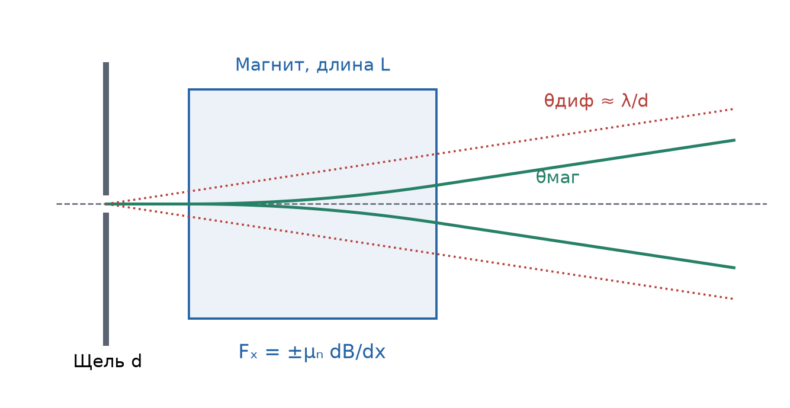
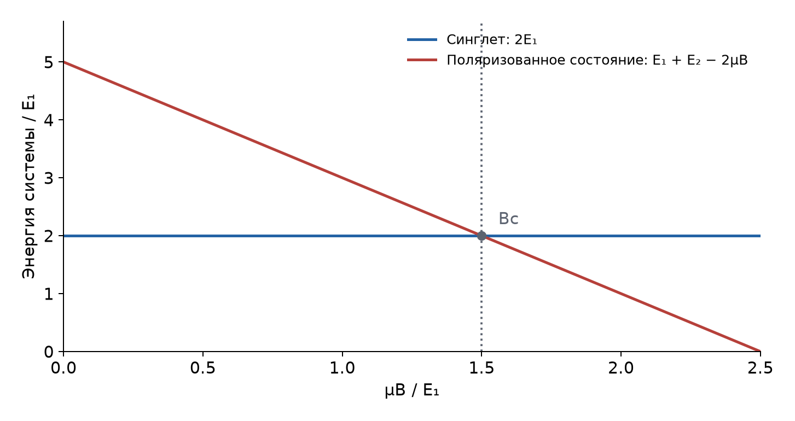

# Неделя 7 · 13–19 октября

## Магнитный момент. Спин. Обменное взаимодействие

[Все недели](../README.md) · [Указатель задач](../TASKS.md) · [Теория](#theory) · [К задачам](#tasks) · [← Неделя 6](./week-06.md) · [Неделя 9 →](./week-09.md)

<a name="tasks"></a>

**Задачи:** [0-7-1](#task-0-7-1) · [0-7-2](#task-0-7-2) · [6.8](#task-6-8) · [6.10](#task-6-10) · [6.15](#task-6-15) · [6.46](#task-6-46) · [6.68](#task-6-68) · [6.78](#task-6-78) · [6.52](#task-6-52)

<a name="theory"></a>

## Теоретический минимум

### 1. Механический и магнитный моменты

Для орбитального движения частицы заряда $`q`$ и массы $`m`$ связь магнитного и механического моментов в СИ имеет вид $`\boldsymbol\mu=q\mathbf L/(2m)`$. Её можно получить для круговой орбиты: ток $`qv/(2\pi r)`$, площадь $`\pi r^2`$, поэтому $`\mu=qvr/2=(q/(2m))L`$.

У электрона заряд отрицателен; его магнитный момент направлен противоположно механическому. Для орбитального и спинового вкладов


```math
\boldsymbol\mu_L=-\mu_{\mathrm Б}\frac{\mathbf L}{\hbar},\qquad
\boldsymbol\mu_S=-g_s\mu_{\mathrm Б}\frac{\mathbf S}{\hbar},\qquad
g_s\simeq2,
```


```math
\mu_{\mathrm Б}=\frac{e\hbar}{2m_e}=9{,}274\cdot10^{-24}\ \text{Дж/Тл}.
```


Спин — собственный момент импульса, а не буквальное вращение шарика. Для электрона $`s=1/2`$, поэтому


```math
S^2=\hbar^2s(s+1)=\frac34\hbar^2,\qquad S_z=\pm\frac\hbar2,
\qquad \mu_{Sz}=\mp\mu_{\mathrm Б}.
```


Ядерный магнетон $`\mu_{\mathrm N}=e\hbar/(2m_p)=5{,}051\cdot10^{-27}`$ Дж/Тл; магнитный момент протона $`\mu_p=2{,}793\mu_{\mathrm N}`$. Положительные числа $`\mu_{\mathrm Б},\mu_p`$ обозначают модули максимальных проекций.

### 2. Сложение двух спинов

Для двух моментов $`\mathbf J_1,\mathbf J_2`$ полный момент $`\mathbf F=\mathbf J_1+\mathbf J_2`$ может иметь числа $`F=|j_1-j_2|,\ldots,j_1+j_2`$. При $`j_1=j_2=1/2`$ получаем $`F=0`$ и $`F=1`$. Число состояний равно $`2F+1`$.

В базисе проекций на одну ось:


```math
\begin{aligned}
|1,1\rangle&=|\uparrow\uparrow\rangle,\\
|1,0\rangle&=(|\uparrow\downarrow\rangle+|\downarrow\uparrow\rangle)/\sqrt2,\\
|1,-1\rangle&=|\downarrow\downarrow\rangle,\\
|0,0\rangle&=(|\uparrow\downarrow\rangle-|\downarrow\uparrow\rangle)/\sqrt2.
\end{aligned}
```


Первые три состояния составляют триплет, последнее — синглет. Поэтому запись $`|\uparrow\downarrow\rangle`$ сама по себе ещё не означает определённый полный спин.

Скалярное произведение моментов находим без представления о классическом угле между ними:


```math
\mathbf J_1\cdot\mathbf J_2
=\frac12(F^2-J_1^2-J_2^2).
```


Для безразмерных спинов $`\mathbf s_i=\mathbf J_i/\hbar`$ это даёт


```math
\langle\mathbf s_1\cdot\mathbf s_2\rangle
=\frac12\left[F(F+1)-\frac32\right]
=\begin{cases}1/4,&F=1,\\-3/4,&F=0.\end{cases}
```


### 3. Магнитное поле: энергия, сила и населённости

Энергия магнитного диполя $`U_B=-\boldsymbol\mu\cdot\mathbf B`$. Для спина $`1/2`$ с магнитными проекциями $`\pm\mu`$ уровни равны $`\mp\mu B`$, а расстояние между ними $`2\mu B`$.

В неоднородном поле, при сохранении соответствующей проекции,


```math
F_x=-\frac{\partial U_B}{\partial x}=\mu_z\frac{\partial B}{\partial x}.
```


За время пролёта $`L/v`$ частица приобретает поперечный импульс $`\Delta p_x=\mu_z B'L/v`$. Поэтому малый угол отклонения в опыте Штерна–Герлаха


```math
\theta_{\mathrm{mag}}\simeq\frac{\Delta p_x}{mv}
=\frac{\mu_zB'L}{mv^2}.
```


Равновесные населённости двух уровней с одинаковыми статистическими весами связаны законом Больцмана:


```math
\frac{N_{\mathrm{high}}}{N_{\mathrm{low}}}
=\exp\left(-\frac{2\mu B}{k_{\mathrm Б}T}\right).
```


В опыте Эйнштейна–де Гааза используют сохранение полного механического момента: изменение внутреннего момента образца компенсируется вращением его корпуса. При полном перевороте одинаковых атомных моментов величиной $`j_{\mathrm{at}}`$ модуль переданного момента равен $`2Nj_{\mathrm{at}}`$.

### 4. Спин-спиновое магнитное взаимодействие

Поле точечного диполя вне точки его расположения равно


```math
\mathbf B_1(\mathbf r)=\frac{\mu_0}{4\pi r^3}
\left[3(\boldsymbol\mu_1\cdot\hat{\mathbf r})\hat{\mathbf r}-\boldsymbol\mu_1\right].
```


Подставляя его в $`U=-\boldsymbol\mu_2\cdot\mathbf B_1`$, получаем


```math
U_{dd}=\frac{\mu_0}{4\pi r^3}
\left[\boldsymbol\mu_1\cdot\boldsymbol\mu_2
-3(\boldsymbol\mu_1\cdot\hat{\mathbf r})(\boldsymbol\mu_2\cdot\hat{\mathbf r})\right].
```


Отсюда масштаб энергии $`\mu_0\mu_1\mu_2/(4\pi r^3)`$. Геометрия и усреднение по пространственному состоянию определяют коэффициент и знак. Подстановка одного характерного $`r`$ даёт оценку, но не точную структуру всех подуровней. Для $`s`$-состояний при точном расчёте также нужен контактный член поля диполя.

### 5. Тождественные фермионы и обмен

Полная волновая функция двух тождественных фермионов меняет знак при перестановке частиц. Поэтому симметричному спиновому триплету соответствует антисимметричная пространственная часть, а антисимметричному синглету — симметричная.

Если две одночастичные орбитали $`u,v`$ ортогональны, пространственные комбинации имеют вид


```math
\Phi_\pm(1,2)=\frac{u(1)v(2)\pm v(1)u(2)}{\sqrt2}.
```


Средние значения кулоновского отталкивания в них равны $`J\pm K`$: прямой интеграл $`J`$ одинаков, а обменный интеграл $`K`$ входит с разными знаками. Это объясняет зависимость энергии от полного спина даже для кулоновского взаимодействия, которое само по себе не содержит спиновых операторов. В задачах об обмене магнитное дипольное взаимодействие не нужно подменять обменной энергией.

## Группа 0

<a name="task-0-7-1"></a>

### Задача 0-7-1. Полный спин атома водорода

**Условие.** Найти возможные значения полного спина атома водорода в основном состоянии с учетом спина ядра.

**Краткая теория.** В основном электронном состоянии $`1s`$ орбитальный момент равен нулю. Нужно сложить спин электрона $`s=1/2`$ и спин протона $`I=1/2`$.

**Решение.** Поскольку $`l=0`$, полный электронный момент $`j=s=1/2`$. Для всего атома $`\mathbf F=\mathbf j+\mathbf I`$. Правило сложения даёт


```math
F=|j-I|,|j-I|+1,\ldots,j+I\ \Rightarrow\ F=0,1.
```


**Ответ:** $`\boxed{F=0\ \text{(синглет)},\qquad F=1\ \text{(триплет)}}`$. Соответствующие модули полного момента — $`0`$ и $`\sqrt2\hbar`$; проекции в триплете равны $`-\hbar,0,+\hbar`$. Всего $`1+3=4`$ состояния, как и у двух независимых спинов $`1/2`$ до учёта взаимодействия.

<a name="task-0-7-2"></a>

### Задача 0-7-2. Магнитное расщепление основного состояния водорода

**Условие.** Оценить энергетическое расщепление состояний, найденных в предыдущей задаче, при учете магнитного взаимодействия протона и электрона, рассматриваемых, как точечные магнитные диполи.

**Краткая теория.** Магнитное поле одного диполя на характерном расстоянии $`r`$ имеет масштаб $`\mu_0\mu/(4\pi r^3)`$. Энергетический интервал двух противоположных проекций другого диполя имеет масштаб удвоенной энергии $`\mu B`$.

**Решение по порядку величины.** Для $`1s`$-электрона характерное расстояние $`r\sim a_0`$, магнитные моменты $`\mu_e\simeq\mu_{\mathrm Б}`$ и $`\mu_p=2{,}793\mu_{\mathrm N}`$. Поэтому


```math
\Delta E\sim2\frac{\mu_0}{4\pi}\frac{\mu_{\mathrm Б}\mu_p}{a_0^3}.
```


При $`\mu_0/(4\pi)\simeq10^{-7}`$ в СИ:


```math
\Delta E\sim
\frac{2\cdot10^{-7}\cdot9{,}274\cdot10^{-24}\cdot1{,}411\cdot10^{-26}}
{(5{,}292\cdot10^{-11})^3}
=1{,}77\cdot10^{-25}\ \text{Дж}
\simeq1{,}1\cdot10^{-6}\ \text{эВ}.
```


**Ответ по порядку величины:** $`\boxed{\Delta E\sim10^{-6}\ \text{эВ}}`$.

**Что нужно для точного коэффициента.** Нельзя буквально усреднить только $`r^{-3}`$-часть классического поля по сферическому $`1s`$-состоянию и получить точное расщепление: её угловое среднее вне начала координат равно нулю. Контактный член поля точечного диполя даёт


```math
H_{\mathrm{hf}}=A\,\mathbf s\cdot\mathbf I,\qquad
A=\frac{2\mu_0}{3}g_e g_p\mu_{\mathrm Б}\mu_{\mathrm N}|\psi_{1s}(0)|^2,
\qquad |\psi_{1s}(0)|^2=\frac1{\pi a_0^3}.
```


Здесь спины безразмерны, $`g_e\simeq2`$, $`g_p\simeq5{,}586`$. По результату сложения спинов $`E_{F=1}=A/4`$, $`E_{F=0}=-3A/4`$, так что $`E_1-E_0=A\simeq5{,}9\cdot10^{-6}`$ эВ. Этот расчёт уточняет коэффициент и показывает, что триплет выше синглета; оценка на расстоянии $`a_0`$ правильно передаёт масштаб.

## Группа 1

<a name="task-6-8"></a>

### Задача 6.8. Сила и момент от поляризованного электронного пучка

**Условие.** Пучок продольно поляризованных по спину электронов с током 100 А и кинетической энергией 100 кэВ поглощается цилиндром Фарадея. Определить силу и крутящий момент, действующие на цилиндр. Пучок электронов направлен параллельно оси цилиндра.

**Краткая теория.** При полном поглощении цилиндру передаются поступательный импульс и спин каждого электрона. Сила и момент равны соответствующим потокам импульса и момента импульса.

**Решение.** Обозначим модуль тока через $`I=100`$ А, кинетическую энергию через $`T=100`$ кэВ. За секунду поглощается $`\dot N=I/e`$ электронов. Для $`T`$ заметной относительно $`m_ec^2=511`$ кэВ используем релятивистский импульс:


```math
(T+m_ec^2)^2=p^2c^2+m_e^2c^4
\Rightarrow p=\frac{\sqrt{T(T+2m_ec^2)}}c.
```


Численно $`pc=\sqrt{100(100+1022)}=335`$ кэВ, $`p=1{,}790\cdot10^{-22}`$ кг·м/с. Тогда


```math
\boxed{F=\dot Np=\frac Ie p\simeq0{,}112\ \text{Н}.}
```


При полной продольной поляризации каждый электрон несёт проекцию спина $`\pm\hbar/2`$ вдоль оси. Модуль осевого крутящего момента


```math
\boxed{M=\dot N\frac\hbar2=\frac{I\hbar}{2e}
\simeq3{,}29\cdot10^{-14}\ \text{Н}\cdot\text{м}.}
```


Сила направлена по движению пучка, осевой момент — по переносимому спину. В единицах книги $`F\simeq1{,}12\cdot10^4`$ дин, $`M\simeq3{,}3\cdot10^{-7}`$ дин·см. При поляризации степени $`P<1`$ спиновый момент уменьшается в $`P`$ раз.

<a name="task-6-10"></a>

### Задача 6.10. Угловая скорость в опыте Эйнштейна–де Гааза

**Условие.** Какое значение для $`\omega`$ следует ожидать в упрощенном опыте Эйнштейна—де Гааза (предыдущая задача), если длина цилиндра $`L=1`$ см, его масса $`m=1`$ г, цилиндр сделан из железа и если предположить, что момент импульса каждого атома равен таковому для электрона на первой боровской орбите? Спин электрона не учитывать.

**Краткая теория.** Ссылка на предыдущую задачу означает полный переворот намагниченности при обращении внешнего поля. По условной модели каждого атома его механический момент равен $`\hbar`$; поэтому корпус получает момент по модулю $`2N\hbar`$.

**Решение.** Пусть радиус цилиндра $`r`$, момент инерции относительно его оси $`\mathcal I=mr^2/2`$. Закон сохранения полного момента даёт


```math
\mathcal I\omega=2N\hbar
\Rightarrow\omega=\frac{4N\hbar}{mr^2}.
```


Число атомов $`N=m/(A m_{\mathrm u})`$, где для железа $`A\simeq55{,}85`$. Радиус находим из массы и плотности: $`m=\rho\pi r^2L`$, то есть $`r^2=m/(\rho\pi L)`$. Подстановка исключает неизвестный радиус:


```math
\omega=\frac{4\hbar}{A m_{\mathrm u}r^2}
=\frac{4\pi\hbar\rho L}{A m_{\mathrm u}m}.
```


Для $`\rho\simeq7{,}87\cdot10^3`$ кг/м³, $`L=10^{-2}`$ м, $`m=10^{-3}`$ кг:


```math
\boxed{\omega\simeq1{,}12\cdot10^{-3}\ \text{рад/с}.}
```


Получено именно значение для заданной упрощённой модели атомных моментов; в ней не требуется подставлять реальный магнитный момент атома железа.

<a name="task-6-15"></a>

### Задача 6.15. Магнитное отклонение и дифракционное уширение

**Условие.** Параллельный пучок нейтронов с энергией $`T=0{,}025`$ эВ проходит через коллимирующую щель шириной $`d=0{,}1`$ мм и затем через зазор в магните Штерна—Герлаха длиной $`L=1`$ м. Оценить значение градиента поля $`dB/dx`$, при котором угол магнитного отклонения компонент пучка равен углу дифракционного уширения. Магнитный момент нейтрона $`\mu_{\mathrm n}=9{,}66\cdot10^{-24}`$ эрг/Гс.



**Краткая теория.** Следуем разбору этой задачи в «Допсеминарах»: приравниваем угол отклонения одной компоненты углу первого дифракционного минимума $`\lambda/d`$.

**Решение.** Положим $`G=|dB/dx|`$, $`v=\sqrt{2T/m_n}`$. Сила $`F_x=\pm\mu_nG`$, время в магните $`t=L/v`$, поэтому


```math
\Delta p_x=F_xt=\pm\frac{\mu_nGL}{v},\qquad
|\theta_{\mathrm{mag}}|\simeq\frac{|\Delta p_x|}{m_nv}
=\frac{\mu_nGL}{m_nv^2}=\frac{\mu_nGL}{2T}.
```


Длина волны $`\lambda=h/(m_nv)=h/\sqrt{2m_nT}`$. Условие задачи:


```math
\frac{\mu_nGL}{2T}=\frac h{d\sqrt{2m_nT}}.
```


Разрешая его относительно $`G`$, получаем


```math
\boxed{G=\frac h{\mu_nLd}\sqrt{\frac{2T}{m_n}}.}
```


Переводим $`\mu_n=9{,}66\cdot10^{-27}`$ Дж/Тл и $`d=10^{-4}`$ м. Тогда $`v\simeq2187`$ м/с и


```math
G\simeq1{,}50\ \text{Тл/м}=150\ \text{Гс/см}.
```


**Ответ:** $`\boxed{|dB/dx|\simeq150\ \text{Гс/см}}`$. Угол между центрами двух компонент равен $`2|\theta_{\mathrm{mag}}|`$; в расчёте использован угол каждой компоненты относительно исходной оси, поэтому лишнего множителя два нет.

## Группа 2

<a name="task-6-46"></a>

### Задача 6.46. Спиновое магнитное расщепление 2p-состояния позитрония

**Условие.** Оценить величину расщепления $`2p`$-состояния позитрония, вызванного взаимодействием спиновых магнитных моментов позитрона и электрона.

**Краткая теория.** Позитроний — кулоновская система электрона и позитрона с приведённой массой $`m_e/2`$. Сначала определяем масштаб расстояния между частицами, затем — дипольную энергию $`\propto r^{-3}`$.

**Решение.** Боровский масштаб относительной координаты позитрония вдвое больше водородного:


```math
a_{\mathrm{Ps}}=a_0\frac{m_e}{m_e/2}=2a_0.
```


Для уровня $`n=2`$ характерное межчастичное расстояние $`r\sim n^2a_{\mathrm{Ps}}=8a_0`$. Это расстояние между электроном и позитроном, а не радиус движения одной частицы относительно центра масс. Оба спиновых магнитных момента имеют модуль максимальной проекции $`\mu_{\mathrm Б}`$.

В той же дипольной оценке, что и в задаче 0-7-2,


```math
\Delta E\sim2\frac{\mu_0}{4\pi}\frac{\mu_{\mathrm Б}^2}{(8a_0)^3}.
```


Выразим её через $`\alpha=e^2/(4\pi\epsilon_0\hbar c)`$ и $`a_0=\hbar/(m_ec\alpha)`$. Поскольку


```math
\frac{\mu_0}{4\pi}\frac{\mu_{\mathrm Б}^2}{a_0^3}
=\frac{e^2}{4\pi\epsilon_0c^2}\frac{\hbar^2}{4m_e^2a_0^3}
=\frac{m_ec^2\alpha^4}{4},
```


получаем


```math
\boxed{\Delta E\sim\frac{m_ec^2\alpha^4}{1024}
\simeq1{,}4\cdot10^{-6}\ \text{эВ}.}
```


Это книжная оценка масштаба спин-спинового расщепления. Чтобы определить отдельные подуровни $`2p`$, нужно усреднить тензорное дипольное взаимодействие по угловым и радиальным функциям; такая детализация не следует из подстановки одного характерного радиуса.

<a name="task-6-68"></a>

### Задача 6.68. Деполяризация атомарного водорода

**Условие.** Образование молекул водорода происходит только в том случае, если спины двух сталкивающихся атомов антипараллельны. В настоящее время предпринимаются попытки хранения атомарного водорода при низких температурах в сильных магнитных полях. Оценить степень деполяризации $`\alpha`$ атомарного водорода, определяемую отношением числа атомов с антипараллельными спинами к их полному числу, при температуре $`T=1`$ К в магнитном поле $`B=10`$ Тл.

**Краткая теория.** В сильном поле электронные спиновые проекции разделены энергией $`2\mu_{\mathrm Б}B`$. В книжном определении деполяризации считают оба атома, входящие в пары с противоположными спинами.

**Решение.** Обозначим населённости нижнего и верхнего зеемановских уровней через $`N_-`$ и $`N_+`$. Знаки относятся к энергии. Для электрона спин нижнего уровня направлен против поля, а его магнитный момент — по полю. Отношение населённостей:


```math
q=\frac{N_+}{N_-}=e^{-2\mu_{\mathrm Б}B/(k_{\mathrm Б}T)}.
```


Число атомов $`N=N_-+N_+=N_-(1+q)`$, откуда доля меньшей спиновой компоненты


```math
f_+=\frac{N_+}{N}=\frac q{1+q}.
```


Каждому атому меньшей компоненты можно сопоставить один атом большей, поэтому число атомов, составляющих такие противоположные пары, равно $`2N_+`$. В обозначениях ответа книги


```math
\alpha=\frac{2N_+}{N}=\frac{2q}{1+q}.
```


Численно


```math
\frac{2\mu_{\mathrm Б}B}{k_{\mathrm Б}T}
=\frac{2\cdot9{,}274\cdot10^{-24}\cdot10}{1{,}38065\cdot10^{-23}}
=13{,}434,
\quad q=1{,}464\cdot10^{-6}.
```


**Ответ:** $`\boxed{\alpha\simeq2{,}93\cdot10^{-6}\simeq3\cdot10^{-6}}`$.

Если под долей «неправильно ориентированных» атомов понимать только населённость верхнего уровня, она равна $`f_+\simeq1{,}46\cdot10^{-6}`$. Разница в два раза связана с определением величины, а не с изменением энергии зеемановского расщепления.

<a name="task-6-78"></a>

### Задача 6.78. Обменная энергия орто- и парагелия

**Условие.** Возбужденное состояние атома гелия $`1s^12s^1`$ может иметь полный спин электронной оболочки $`\mathbf S`$ как 1 (ортогелий), так и 0 (парагелий). Энергии полной ионизации этих состояний $`W_{\mathrm{орто}}=59{,}2`$ эВ и $`W_{\mathrm{пара}}=58{,}4`$ эВ. Кроме энергии взаимодействия с ядром, в эти энергии вносят вклад не зависящая от полного спина часть энергии кулоновского отталкивания электронов $`\mathcal E_{\mathrm к}`$ и зависящая от полного спина часть, называемая энергией обменного взаимодействия, $`V=-\dfrac A2(1+4\langle\mathbf s_1\mathbf s_2\rangle)`$, где $`A`$ — константа, $`\mathbf s_1`$, $`\mathbf s_2`$ — спины электронов ($`\mathbf S=\mathbf s_1+\mathbf s_2`$), а угловые скобки означают усреднение по направлениям спинов. Найти $`A`$ и $`\mathcal E_{\mathrm к}`$ считая, что оба электрона находятся в поле ядра с $`Z=2`$, т. е. не учитывая экранировку поля ядра электронами.

**Краткая теория.** Следуем решению этой задачи в «Допсеминарах»: находим среднее скалярное произведение спинов через $`S(S+1)`$ и составляем две энергетические суммы. Полная энергия связанного состояния равна **минус** положительная работа его полной ионизации.

**Решение.** Спины в формуле условия измеряются в единицах $`\hbar`$. Из $`\mathbf S^2=(\mathbf s_1+\mathbf s_2)^2`$:


```math
\langle\mathbf s_1\cdot\mathbf s_2\rangle
=\frac12\left[S(S+1)-\frac34-\frac34\right].
```


Подставляем в $`V`$:


```math
V=-\frac A2\left[1+2S(S+1)-3\right]
=-A[S(S+1)-1]
=\begin{cases}-A,&S=1,\\+A,&S=0.\end{cases}
```


Энергия двух невзаимодействующих электронов в поле ядра $`Z=2`$, один из которых на $`n=1`$, другой на $`n=2`$:


```math
E_{\mathrm{base}}=-\mathrm{Ry}Z^2\left(1+\frac14\right)
=-13{,}6\cdot4\cdot\frac54=-68\ \text{эВ}.
```


Поэтому


```math
-59{,}2=-68+\mathcal E_{\mathrm к}-A,\qquad
-58{,}4=-68+\mathcal E_{\mathrm к}+A.
```


Вычитая первое уравнение из второго, получаем $`0{,}8=2A`$. Складывая и деля на два, получаем $`-58{,}8=-68+\mathcal E_{\mathrm к}`$. Следовательно,


```math
\boxed{A=0{,}4\ \text{эВ},\qquad\mathcal E_{\mathrm к}=+9{,}2\ \text{эВ}.}
```


Положительный знак прямой кулоновской энергии соответствует отталкиванию. Ортогелий имеет обменный вклад $`-A`$ и лежит ниже парагелия на $`2A=0{,}8`$ эВ. В «Допсеминарах» в итоговой строке для $`\mathcal E_{\mathrm к}`$ стоит ошибочный минус; уравнения и ответ задачника дают плюс.

<a name="task-6-52"></a>

### Задача 6.52. Поле для намагничивания двух фермионов

**Условие.** Система из двух тождественных нейтральных частиц со спином $`1/2`$ находится в основном состоянии в одномерной потенциальной яме шириной $`d`$ с бесконечно высокими стенками. Каждая частица обладает массой $`m`$ и магнитным моментом $`\mu`$, направленным параллельно механическому моменту. Определить величину магнитного поля, которое необходимо приложить для намагничивания такой системы. Дипольным взаимодействием частиц пренебречь.



**Краткая теория.** Нейтральность устраняет орбитальное действие поля в данной модели, но сохраняет зеемановскую энергию магнитного момента. Принцип Паули требует, чтобы при одинаковых спинах частицы занимали разные пространственные уровни.

**Решение.** Уровни одной частицы в яме:


```math
E_n=\frac{\pi^2\hbar^2n^2}{2md^2},\qquad E_2=4E_1.
```


При малом поле обе частицы занимают $`n=1`$ с противоположными спинами. Пространственная функция симметрична, спиновая — синглет; суммарная магнитная проекция равна нулю. Поэтому


```math
E_{\mathrm{singlet}}=(E_1-\mu B)+(E_1+\mu B)=2E_1.
```


Чтобы получить намагниченное основное состояние, оба магнитных момента нужно направить по полю. Две частицы не могут тогда находиться на одной орбитали: одну переводим на $`n=2`$. Энергия такого состояния


```math
E_{\mathrm{pol}}=(E_1-\mu B)+(E_2-\mu B)
=E_1+E_2-2\mu B.
```


Поляризованное состояние становится выгоднее при


```math
E_1+E_2-2\mu B<2E_1
\Rightarrow 2\mu B>E_2-E_1=\frac{3\pi^2\hbar^2}{2md^2}.
```


**Ответ:** пороговое поле


```math
\boxed{B_c=\frac{3\pi^2\hbar^2}{4\mu md^2}.}
```


При $`B>B_c`$ основное состояние имеет магнитный момент $`2\mu`$ вдоль поля. При $`B=B_c`$ два состояния вырождены, поэтому равенство определяет порог, а не обязательную поляризацию. Этот вывод относится к основному состоянию; реальному переходу при изменении поля нужен механизм релаксации спина.

---

[Все недели](../README.md) · [Указатель задач](../TASKS.md) · [Теория](#theory) · [К задачам](#tasks) · [← Неделя 6](./week-06.md) · [Неделя 9 →](./week-09.md)

[Сообщить об ошибке в этой неделе](https://github.com/NeTotDEDD/FIZOS_Kvanty/issues/new?template=correction.yml)
