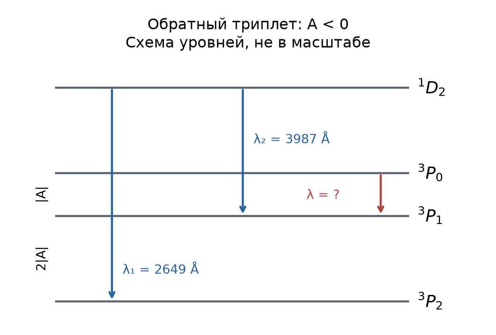

# Неделя 9 · 27 октября – 2 ноября

## Сложные атомы. Тонкая и сверхтонкая структуры. Излучение, правила отбора

[Все недели](../README.md) · [Указатель задач](../TASKS.md) · [Теория](#theory) · [К задачам](#tasks) · [← Неделя 7](./week-07.md) · [Неделя 10 →](./week-10.md)

<a name="tasks"></a>

**Задачи:** [0-9-1](#task-0-9-1) · [0-9-2](#task-0-9-2) · [6.20](#task-6-20) · [6.75](#task-6-75) · [Т9.1](#task-t9-1) · [6.77](#task-6-77) · [6.80](#task-6-80) · [6.89](#task-6-89) · [6.48](#task-6-48)

<a name="theory"></a>

## Теоретический минимум

### 1. Сложение моментов и обозначения термов

В центральном поле $`l=0,1,\ldots,n-1`$, а спин электрона $`s=1/2`$. Для суммы двух моментов возможны значения $`j=|l-s|,|l-s|+1,\ldots,l+s`$. Квадрат момента и его проекция — разные наблюдаемые:


```math
\hat J^2=\hbar^2j(j+1),\qquad J_z=\hbar m_j,\quad m_j=-j,-j+1,\ldots,j.
```


В многоэлектронном атоме при $`LS`$-связи сначала складывают орбитальные моменты в $`L`$ и спины в $`S`$, затем $`\mathbf J=\mathbf L+\mathbf S`$. Терм записывают как $`{}^{2S+1}L_J`$, где $`L=0,1,2,3,\ldots`$ обозначают буквами $`S,P,D,F,\ldots`$. Число $`2S+1`$ — мультиплетность. Заполненная подоболочка имеет $`L=S=0`$.

Принцип Паули требует антисимметрии полной электронной волновой функции. Поэтому формально возможные результаты сложения моментов нужно дополнительно отбирать по симметрии. В основном состоянии одной конфигурации правила Хунда сначала максимизируют $`S`$, затем $`L`$; при заполнении менее половины подоболочки минимален $`J=|L-S|`$, более половины — $`J=L+S`$.

### 2. Тонкая и сверхтонкая структуры

Далее операторы $`\mathbf L,\mathbf S,\mathbf I,\mathbf J`$ в скалярных произведениях считаются **безразмерными**, то есть физические моменты поделены на $`\hbar`$. Константы $`A`$ имеют размерность энергии. Из тождества $`\mathbf J^2=(\mathbf L+\mathbf S)^2`$ следует


```math
\langle\mathbf L\cdot\mathbf S\rangle
=\frac{J(J+1)-L(L+1)-S(S+1)}2.
```


Поэтому спин-орбитальная поправка и интервалы внутри мультиплета равны


```math
E_J=E_{LS}+\frac A2[J(J+1)-L(L+1)-S(S+1)],
\qquad E_J-E_{J-1}=AJ.
```


При $`A>0`$ выше уровни с большим $`J`$, при $`A<0`$ порядок обратный. Это правило интервалов Ланде, используемое в «Допсеминарах».

При учёте ядра складывают $`\mathbf F=\mathbf J+\mathbf I`$. Для взаимодействия $`H_{\rm hfs}=A_{\rm hfs}\mathbf I\cdot\mathbf J`$:


```math
E_F=\frac{A_{\rm hfs}}2[F(F+1)-I(I+1)-J(J+1)].
```


Тонкая структура связана с электронной оболочкой, сверхтонкая — с взаимодействием оболочки и ядра.

### 3. Магнитный момент и правила отбора

Магнитный момент электрона направлен противоположно спину. При $`LS`$-связи средняя проекция момента оболочки на $`\mathbf J`$ определяется фактором Ланде:


```math
\boldsymbol\mu_J=-g_J\mu_B\mathbf J,\qquad
g_J=1+\frac{J(J+1)+S(S+1)-L(L+1)}{2J(J+1)},
\quad\mu_B=\frac{e\hbar}{2m_e}.
```


В слабом неоднородном поле имеется $`2J+1`$ возможных проекций и, если $`g_J\ne0`$, столько же компонент пучка. Величина магнитного момента, приводимая в атомных задачах, обычно означает $`g_J\mu_BJ`$, а не $`g_J\mu_B\sqrt{J(J+1)}`$.

Для электрического дипольного перехода E1 меняется чётность, $`\Delta S=0`$, $`\Delta L=0,\pm1`$ (кроме $`0\leftrightarrow0`$), $`\Delta J=0,\pm1`$ (кроме $`0\leftrightarrow0`$), $`\Delta m_J=0,\pm1`$. Для одноэлектронного перехода $`\Delta l=\pm1`$. Запрет E1 не запрещает более слабые магнитные или многопольные переходы. Для фотона мультипольности $`k\ge1`$:


```math
|J_i-J_f|\le k\le J_i+J_f,\qquad
P_iP_f=\begin{cases}(-1)^k,&Ek,\\(-1)^{k+1},&Mk.\end{cases}
```


## Группа 0

<a name="task-0-9-1"></a>

### Задача 0-9-1. Полный момент электрона при n = 3

**Условие.** Определить возможные значения полного углового момента электрона и его проекции на выделенную ось в атоме водорода, находящемся в возбужденном состоянии с главным квантовым числом $`n=3`$.

**Краткая теория.** Применяем сложение $`\mathbf j=\mathbf l+\mathbf s`$ при $`s=1/2`$; затем для каждого $`j`$ выписываем все $`m_j`$.

**Решение.** При $`n=3`$ допустимы $`l=0,1,2`$:

| $`l`$ | Допустимые $`j`$ | Состояния |
|---|---|---|
| 0 | $`1/2`$ | $`3s_{1/2}`$ |
| 1 | $`1/2,3/2`$ | $`3p_{1/2},3p_{3/2}`$ |
| 2 | $`3/2,5/2`$ | $`3d_{3/2},3d_{5/2}`$ |

Отсюда три различных модуля полного момента:


```math
\boxed{|\mathbf J|=\frac{\hbar\sqrt3}{2},\quad
\frac{\hbar\sqrt{15}}2,\quad\frac{\hbar\sqrt{35}}2.}
```


Их проекции соответственно равны


```math
\begin{aligned}
j=\tfrac12:&\quad J_z=\pm\tfrac\hbar2;\\
j=\tfrac32:&\quad J_z=\pm\tfrac\hbar2,\ \pm\tfrac{3\hbar}2;\\
j=\tfrac52:&\quad J_z=\pm\tfrac\hbar2,\ \pm\tfrac{3\hbar}2,\ \pm\tfrac{5\hbar}2.
\end{aligned}
```


Проверка числа состояний: $`2+(2+4)+(4+6)=18=2n^2`$. Совпадающие значения $`j`$ при разных $`l`$ не означают совпадения самих состояний.

<a name="task-0-9-2"></a>

### Задача 0-9-2. Полный момент атома с учётом ядра

**Условие.** Атом водорода находится в $`2p`$-состоянии. Определить возможные значения полного момента количества движения атома с учетом спина протона.

**Краткая теория.** Сначала складываем $`l`$ и спин электрона, затем полученный $`j`$ и спин протона $`I=1/2`$.

**Решение.** Для $`2p`$ имеем $`l=1`$, поэтому $`j=1/2`$ или $`3/2`$. Далее


```math
j=\tfrac12\Rightarrow F=0,1,\qquad
j=\tfrac32\Rightarrow F=1,2.
```


**Ответ:** $`\boxed{F=0,1,2}`$, то есть физический модуль момента равен $`\boxed{0,\sqrt2\hbar,\sqrt6\hbar}`$. Состояние $`F=1`$ встречается в двух разных электронных мультиплетах. Проверка: $`(1+3)+(3+5)=12=(2l+1)(2s+1)(2I+1)`$.

## Группа 1

<a name="task-6-20"></a>

### Задача 6.20. Жёлтый дублет натрия

**Условие.** Желтый дублет Na возникает при переходе электронов $`3{}^2P\to3{}^2S`$ и соответствует длинам волн $`\lambda_1=5896`$ Å и $`\lambda_2=5890`$ Å. Найти энергетическое расстояние $`\Delta\mathcal E`$ между соответствующими подуровнями терма $`3{}^2P`$ (мультиплетное расщепление). Оценить среднюю величину эффективного магнитного поля $`B`$, действующего на «оптический» электрон.

**Краткая теория.** Оба фотона заканчивают переход на одном уровне $`3{}^2S_{1/2}`$, поэтому разность их энергий равна расстоянию между верхними уровнями. Поле оцениваем, как в «Допсеминарах», по энергии переориентации спина $`2\mu_BB`$.

**Решение.** Вычитание равенств $`hc/\lambda_i=E_i-E_S`$ устраняет $`E_S`$:


```math
\Delta\mathcal E=hc\left(\frac1{\lambda_2}-\frac1{\lambda_1}\right)
=hc\frac{\lambda_1-\lambda_2}{\lambda_1\lambda_2}.
```


При $`hc=1239{,}842\ \text{эВ}\cdot\text{нм}`$ получаем


```math
\Delta\mathcal E=\frac{1239{,}842\cdot0{,}6}{589{,}6\cdot589{,}0}
=2{,}142\cdot10^{-3}\ \text{эВ}.
```


Энергия спина в заданном поле принимает значения $`\pm\mu_BB`$, откуда


```math
\boxed{B\sim\frac{\Delta\mathcal E}{2\mu_B}
=18{,}5\ \text{Тл}=1{,}85\cdot10^5\ \text{Гс}.}
```


Это эффективная оценка внутреннего поля. Точное спин-орбитальное взаимодействие описывается оператором $`A\mathbf L\cdot\mathbf S`$, а не однородным внешним полем.

<a name="task-6-75"></a>

### Задача 6.75. Определение состояния по радиальному узлу

**Условие.** Атом водорода находится в состоянии с энергией $`\mathcal E=-3{,}4`$ эВ, и при этом радиальная часть волновой функции один раз обращается в нуль на интервале $`0<r<\infty`$. На сколько линий расщепится данный уровень энергии в слабом и сильном магнитных полях?

**Краткая теория.** Для водорода $`E_n=-13{,}6/n^2`$ эВ, число радиальных узлов равно $`n-l-1`$. После определения $`l`$ выбираем формулу зеемановской энергии.

**Решение.** Из $`13{,}6/n^2=3{,}4`$ следует $`n=2`$. Тогда $`n-l-1=1`$ даёт $`l=0`$: это $`2s`$-состояние. При $`l=0`$ орбитального момента нет, поэтому спин-орбитальная энергия обращается в нуль и $`j=s=1/2`$, $`g_j=2`$.

В слабом поле $`\Delta E=2\mu_BBm_j=\pm\mu_BB`$. В сильном поле $`\Delta E=\mu_BB(m_l+2m_s)`$, но $`m_l=0`$, $`m_s=\pm1/2`$, поэтому результат тот же.

**Ответ:** $`\boxed{2\text{ подуровня в обоих случаях},\quad\Delta E_{\rm между}=2\mu_BB}`$. Здесь, как и в ответе книги, не учитываются спин ядра и квадратичное диамагнитное действие очень сильного поля. Речь идёт о расщеплении уровня; число спектральных линий перехода потребовало бы указать второй уровень.

<a name="task-t9-1"></a>

### Задача Т9.1. Термы конфигурации 2p²

**Условие.** Найти все термы невозбужденного атома углерода, на внешней $`2p`$ оболочке которого находятся два электрона (электронная конфигурация $`1s^22s^22p^2`$).

**Краткая теория.** Заполненные оболочки не вносят суммарного момента. Для двух эквивалентных $`p`$-электронов нужно совместить сложение моментов с принципом Паули.

**Решение.** При $`l_1=l_2=1`$ возможны $`L=0,1,2`$; при $`s_1=s_2=1/2`$ — $`S=0,1`$. Радиальная часть одинакова и симметрична. Орбитальное состояние с данным $`L`$ при перестановке электронов приобретает множитель $`(-1)^{2l-L}=(-1)^L`$.

Синглет $`S=0`$ антисимметричен по спинам, следовательно, ему нужна симметричная орбитальная часть: $`L=0,2`$. Триплет $`S=1`$ симметричен по спинам, следовательно, ему нужен нечётный $`L=1`$.


```math
\boxed{{}^1S_0,\qquad{}^1D_2,\qquad{}^3P_{0,1,2}.}
```


Проверка полноты: число способов занять два из шести одноэлектронных состояний равно $`\binom62=15`$. Найденные термы содержат $`1+5+(1+3+5)=15`$ состояний.

По правилам Хунда самый низкий терм — $`{}^3P`$, а поскольку $`p`$-оболочка заполнена менее чем наполовину, основной уровень — $`{}^3P_0`$. Слова «невозбужденного атома» в условии задают конфигурацию: остальные найденные термы этой конфигурации выше основного по энергии.

## Группа 2

<a name="task-6-77"></a>

### Задача 6.77. Обратный мультиплет иона железа

**Условие.** В спектрах солнечной короны наблюдаются линии, которые долго не могли приписать ни одному из известных элементов, поэтому их приписывали гипотетическому элементу «коронию». Впоследствии выяснилось, что это — в основном линии ионов железа и никеля. Среди наблюдаемых линий «корония» есть линии, соответствующие переходам $`{}^1D_2\to{}^3P_2`$ ($`\lambda_1=2649`$ Å) и $`{}^1D_2\to{}^3P_1`$ ($`\lambda_2=3987`$ Å) иона железа $`\mathrm{Fe}^{10+}`$. Найти длину волны линии перехода $`{}^3P_0\to{}^3P_1`$ в схеме Рассела—Саундерса ($`LS`$-схема).

**Указание.** Энергия спин-орбитального взаимодействия есть $`\mathcal E_{SL}=A\langle(\mathbf L,\mathbf S)\rangle`$, где $`A`$ — константа (для иона $`\mathrm{Fe}^{10+}`$ константа $`A<0`$), а угловые скобки означают усреднение по направлению векторов орбитального момента $`\mathbf L`$ и спина $`\mathbf S`$.



**Краткая теория.** Повторяем метод «Допсеминаров»: из двух переходов с общим верхним уровнем находим интервал $`P_1-P_2`$, затем используем правило интервалов Ланде.

**Решение.** В терме $`{}^3P`$ имеем $`L=S=1`$, поэтому


```math
E_J=E_P+\frac A2[J(J+1)-4],\qquad
E_0=E_P-2A,\quad E_1=E_P-A,\quad E_2=E_P+A.
```


Поскольку $`A<0`$, $`E_0>E_1>E_2`$. Два данных перехода дают


```math
\frac{hc}{\lambda_1}=E_D-E_2,\qquad
\frac{hc}{\lambda_2}=E_D-E_1,
```


```math
E_1-E_2=hc\left(\frac1{\lambda_1}-\frac1{\lambda_2}\right)=-2A.
```


Следовательно,


```math
\frac{hc}{\lambda}=E_0-E_1=-A
=\frac{hc}2\left(\frac1{\lambda_1}-\frac1{\lambda_2}\right),
```


```math
\boxed{\lambda=\frac{2\lambda_1\lambda_2}{\lambda_2-\lambda_1}
=15787\ \text{Å}\simeq1{,}579\ \text{мкм}.}
```


Переход между $`{}^3P_0`$ и $`{}^3P_1`$ сохраняет чётность: это не E1, но M1 разрешён. Исходные межкомбинационные линии также не являются разрешёнными E1-переходами в чистой $`LS`$-схеме; их слабая интенсивность не мешает пользоваться измеренными энергиями.

<a name="task-6-80"></a>

### Задача 6.80. Орбитальный момент по расщеплению пучка

**Условие.** Пучок атомов, находящихся в основном состоянии, расщепляется в эксперименте типа Штерна—Герлаха на 9 компонент. Магнитный момент атома в этом состоянии равен $`2{,}4\mu_{\rm Б}`$. Найти орбитальный момент атома, если мультиплетность данного состояния равна 5. 

**Указание.** Моментом в атомной физике называется величина его максимальной проекции.

**Краткая теория.** Число компонент определяет $`J`$, мультиплетность — $`S`$, а магнитный момент — $`g_J`$. Оставшийся $`L`$ находим из формулы Ланде.

**Решение.** Последовательно получаем


```math
2J+1=9\Rightarrow J=4,\qquad 2S+1=5\Rightarrow S=2,
\qquad g_JJ\mu_B=2{,}4\mu_B\Rightarrow g_J=0{,}6.
```


Подставляем в $`g_J=3/2+[S(S+1)-L(L+1)]/[2J(J+1)]`$:


```math
0{,}6=\frac32+\frac{6-L(L+1)}{40}
\Rightarrow L(L+1)=42
\Rightarrow(L-6)(L+7)=0.
```


Отрицательный корень не является квантовым числом. **Ответ:** $`\boxed{L=6}`$, или $`\boxed{L_{z,\max}=6\hbar}`$ в принятом условием смысле. Физический модуль орбитального момента равен $`\sqrt{42}\hbar`$. Проверка: $`J=|L-S|=4`$ допустим.

<a name="task-6-89"></a>

### Задача 6.89. Зелёная линия полярного сияния

**Условие.** В спектре полярных сияний самая интенсивная желто-зеленая линия с $`\lambda=5577`$ Å (aurora borealis) соответствует переходу между состояниями $`{}^1S_0`$ и $`{}^1D_2`$ нейтрального атома кислорода. Определить тип перехода и оценить время жизни возбужденного состояния, считая, что размер атома кислорода равен $`a=1{,}25`$ Å, а время электрических дипольных переходов составляет порядка $`\tau_1\sim10^{-7}`$ с.

**Краткая теория.** Для фотона мультипольности $`K`$ выполняется $`|J_i-J_f|\le K\le J_i+J_f`$. Электрический переход EK меняет чётность на множитель $`(-1)^K`$, магнитный MK — на $`(-1)^{K+1}`$. Высшие мультиполи подавлены степенями малого параметра $`ka=2\pi a/\lambda`$.

**Решение.** У исходного состояния $`J_i=0`$, у конечного $`J_f=2`$, поэтому возможен только $`K=2`$. В частности, ни E1, ни M1 не удовлетворяют правилу треугольника.

Оба терма принадлежат конфигурации кислорода $`2p^4`$ и имеют одинаковую чётность $`(-1)^{4\cdot1}=+1`$. Для $`K=2`$ чётность сохраняет E2, тогда как M2 её меняет. Следовательно, переход **электрический квадрупольный, E2**.

В длинноволновом разложении взаимодействия следующая электрическая мультипольная амплитуда содержит дополнительный множитель $`ka`$. Поэтому для характерных атомных матричных элементов при сравнимой частоте


```math
\frac{W_{E2}}{W_{E1}}\sim(ka)^2,\qquad
\tau_{E2}\sim\frac{\tau_1}{(ka)^2}
=\tau_1\left(\frac{\lambda}{2\pi a}\right)^2.
```


Численно $`ka=2\pi\cdot1{,}25/5577\simeq1{,}41\cdot10^{-3}`$, и


```math
\boxed{\tau_{E2}\sim10^{-7}\left(\frac{5577}{2\pi\cdot1{,}25}\right)^2\ \text{с}
\simeq5{,}0\cdot10^{-2}\ \text{с}.}
```


Это оценка масштаба, а не точное время жизни: она не вычисляет конкретный квадрупольный матричный элемент. В ответе задачника для более точного расчёта приведено около $`0{,}7`$ с.


<a name="task-6-48"></a>

### Задача 6.48. Сверхтонкая линия водорода

**Условие.** Взаимодействие магнитных моментов протона и электрона в атоме водорода приводит к расщеплению энергетических уровней и возникновению сверхтонкой структуры. Излучение межзвездного атомарного водорода, находящегося в основном состоянии, вызвано переориентацией электронного спина, т. е. переходами между компонентами сверхтонкой структуры. Оценить длину волны $`\lambda`$ этого излучения. Для оценки заменить истинное распределение плотности спинового магнитного момента электрона таким, которое дает однородно намагниченный шар радиусом $`r_{\rm Б}`$. Размагничивающий фактор шара $`\beta=4\pi/3`$.

**Указание.** Магнитное поле внутри шара $`\mathbf H=-\beta\mathbf M`$, где $`\mathbf M`$ — намагниченность. Магнитный момент покоящегося протона равен $`\boldsymbol\mu_p=g_{sp}\mu_{\rm яд}\mathbf s_p`$, где $`g_{sp}=5{,}58`$ — спиновый $`g`$-фактор протона, $`\mathbf s_p`$ — его спин, $`\mu_{\rm яд}`$ — ядерный магнетон Бора.

**Краткая теория.** Указание дано в СГС: $`\mathbf B=\mathbf H+4\pi\mathbf M`$. Найдём поле распределённого электронного момента, затем энергии связанных спинов $`F=0,1`$; классической смены знака одной проекции недостаточно для правильного коэффициента.

**Решение.** Обозначим $`r_{\rm Б}=a_0`$. В СГС


```math
\mathbf M=\frac{\boldsymbol\mu_e}{4\pi a_0^3/3},\qquad
\mathbf B=\frac{8\pi}{3}\mathbf M=\frac{2\boldsymbol\mu_e}{a_0^3}.
```


Эквивалентная формула в СИ: $`\mathbf B=\mu_0\boldsymbol\mu_e/(2\pi a_0^3)`$. Используя $`\boldsymbol\mu_e=-g_s\mu_B\mathbf s_e`$, $`g_s=2`$, получаем


```math
H=-\boldsymbol\mu_p\cdot\mathbf B
=A\mathbf s_e\cdot\mathbf s_p,\qquad
A=\frac{\mu_0g_sg_{sp}\mu_B\mu_N}{2\pi a_0^3}>0.
```


Оба спина равны $`1/2`$. Поэтому


```math
\langle\mathbf s_e\cdot\mathbf s_p\rangle
=\frac{F(F+1)-3/2}{2}
=\begin{cases}1/4,&F=1,\\-3/4,&F=0.\end{cases}
```


Разность энергий равна $`A`$, а не $`A/2`$. При $`a_0=5{,}292\cdot10^{-11}`$ м, $`\mu_N=5{,}051\cdot10^{-27}`$ Дж/Тл:


```math
\Delta E=A\simeq4{,}4\cdot10^{-6}\ \text{эВ},\qquad
\boxed{\lambda=\frac{hc}{\Delta E}\simeq0{,}281\ \text{м}=28{,}1\ \text{см}.}
```


Это ответ модели однородного шара. Более точное распределение плотности состояния $`1s`$ даёт известную линию около 21 см. Переход $`F=1\to0`$ имеет магнитно-дипольный характер M1.

---

[Все недели](../README.md) · [Указатель задач](../TASKS.md) · [Теория](#theory) · [К задачам](#tasks) · [← Неделя 7](./week-07.md) · [Неделя 10 →](./week-10.md)

[Сообщить об ошибке в этой неделе](https://github.com/NeTotDEDD/FIZOS_Kvanty/issues/new?template=correction.yml)
