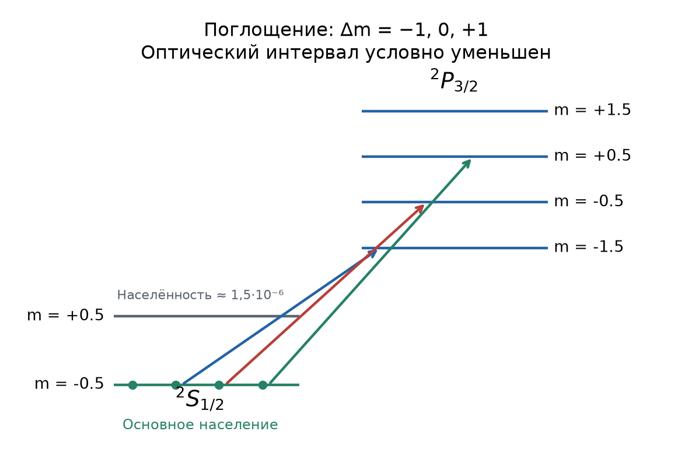
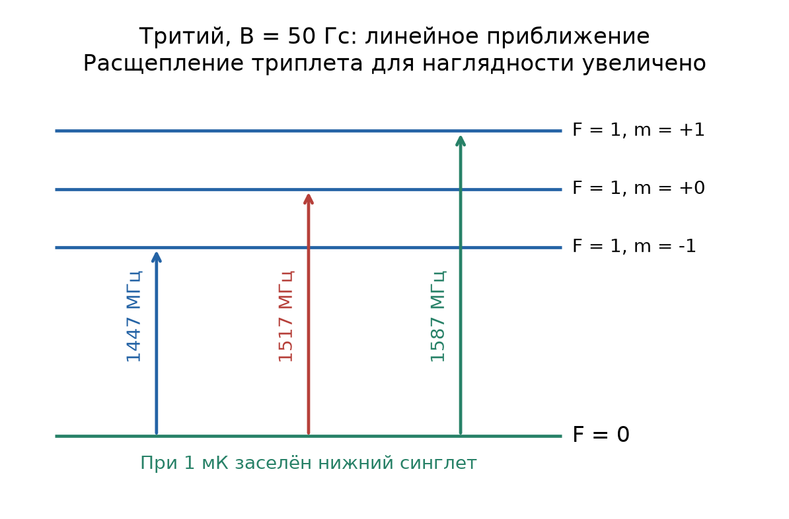
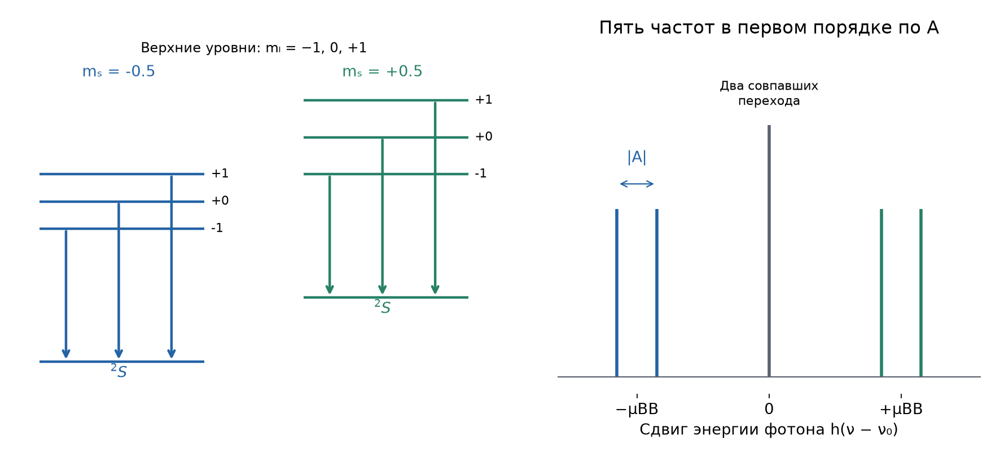

# Неделя 10 · 3–9 ноября

## Эффект Зеемана. ЭПР

[Все недели](../README.md) · [Указатель задач](../TASKS.md) · [Теория](#theory) · [К задачам](#tasks) · [← Неделя 9](./week-09.md) · [Неделя 11 →](./week-11.md)

<a name="tasks"></a>

**Задачи:** [0-10-1](#task-0-10-1) · [0-10-2](#task-0-10-2) · [6.21](#task-6-21) · [6.88](#task-6-88) · [7.39](#task-7-39) · [6.35](#task-6-35) · [6.56](#task-6-56) · [11.57](#task-11-57) · [6.64](#task-6-64)

<a name="theory"></a>

## Теоретический минимум

### 1. Слабое и сильное магнитные поля

Следуя «Допсеминарам», сначала сравниваем магнитную энергию $`\mu_BB`$ с интервалом тонкой структуры $`\Delta E_{LS}`$, а затем — с тепловой энергией $`k_BT`$. Это два независимых сравнения: первое выбирает квантовые числа, второе определяет населённости.

При $`\mu_BB\ll\Delta E_{LS}`$ связь $`\mathbf J=\mathbf L+\mathbf S`$ сохраняется:


```math
\Delta E=\mu_BBg_Jm_J,\qquad
g_J=\frac32+\frac{S(S+1)-L(L+1)}{2J(J+1)}.
```


Энергия фотона перехода между двумя подуровнями равна


```math
h\nu=h\nu_0+\mu_BB(g_um_u-g_lm_l).
```


Нужно перечислить только разрешённые переходы $`\Delta m=0,\pm1`$, затем объединить совпадающие частоты. Число переходов не всегда равно числу различных линий.

При $`\mu_BB\gg\Delta E_{LS}`$, но ещё малом влиянии поля на пространственные орбитали, реализуется режим Пашена—Бака. Хорошими квантовыми числами становятся $`m_L,m_S`$:


```math
\Delta E_B=\mu_BB(m_L+2m_S),\qquad
\Delta E_{LS}^{(1)}=A m_Lm_S.
```


Последнее равенство следует из $`\mathbf L\cdot\mathbf S=L_zS_z+(L_+S_-+L_-S_+)/2`$: диагональные средние лестничных членов в состоянии $`|m_L,m_S\rangle`$ равны нулю. Для E1-перехода $`\Delta m_S=0`$, поэтому без малой поправки $`A`$ остаются три сдвига: $`0,\pm\mu_BB`$.

Нормальный эффект Зеемана возникает также при $`S=0`$ в слабом поле. Поэтому «сильное поле» и «нормальный эффект» не являются синонимами. Вдоль поля наблюдаются только $`\sigma`$-компоненты ($`\Delta m=\pm1`$); поперёк поля видны также $`\pi`$-компоненты ($`\Delta m=0`$).

### 2. Населённости и магнитный резонанс

Для двух уровней $`E_\pm=\mp\mu B`$ распределение Больцмана даёт


```math
\frac{N_{\rm high}}{N_{\rm low}}=e^{-2\mu B/(k_BT)},\qquad
\frac{N_{\rm low}-N_{\rm high}}{N_{\rm low}+N_{\rm high}}
=\tanh\frac{\mu B}{k_BT}.
```


При малом аргументе $`\tanh x\simeq x`$. В электронном парамагнитном резонансе (ЭПР) переменное поле вызывает переходы между соседними зеемановскими подуровнями:


```math
h\nu_{\rm EPR}=|g_J|\mu_BB.
```


Для ядерного магнитного резонанса вместо $`\mu_B`$ используется $`\mu_N=e\hbar/(2m_p)`$ и ядерный $`g`$-фактор. Насыщение означает, что все моменты заняли нижний магнитный подуровень: $`M_{\rm sat}=n|g_J|\mu_BJ`$.

### 3. Излучение и ширина линии

Вероятности спонтанного и индуцированного испускания за единицу времени имеют вид $`W_{\rm sp}=A_{21}`$, $`W_{\rm ind}=B_{21}\rho_\nu`$. В равновесном планковском поле


```math
\frac{W_{\rm ind}}{W_{\rm sp}}
=\frac1{e^{h\nu/(k_BT)}-1}=\bar n_\nu.
```


Период полураспада и среднее время жизни различаются: для ширины уровня $`\Gamma=\hbar/\tau`$ используется именно среднее время жизни $`\tau`$. Наблюдаемая ширина может включать естественную, доплеровскую и аппаратную составляющие.

Для двух невырожденных уровней равенство коэффициентов поглощения и вынужденного испускания даёт коэффициент ослабления слабого пробного света $`\kappa\propto n_1-n_2`$. При одинаковых населённостях эти два процесса компенсируют друг друга.

### 4. Сверхтонкая структура в слабом поле

При связи электронного момента $`\mathbf J`$ с ядерным $`\mathbf I`$ сохраняется полный момент $`\mathbf F=\mathbf I+\mathbf J`$. Для $`H_{\rm hf}=A\mathbf I\cdot\mathbf J`$ и моментов в единицах $`\hbar`$


```math
E_F=\frac A2[F(F+1)-I(I+1)-J(J+1)].
```


Если магнитная энергия мала относительно сверхтонкого интервала, поправку находят усреднением зеемановского оператора в состояниях $`|F,m_F\rangle`$. При $`I=J=1/2`$ нижний уровень для $`A>0`$ — синглет $`F=0`$, верхний — триплет $`F=1`$. Их населённость при охлаждении определяется сверхтонким интервалом, а не одной лишь энергией свободного электронного спина в поле.

## Группа 0

<a name="task-0-10-1"></a>

### Задача 0-10-1. Поляризация тепловых нейтронов

**Условие.** Для получения тепловых нейтронов (с максвелловским распределением скоростей, отвечающим температуре $`T=300`$ К) поток нейтронов из реактора направляют в сосуд с тяжёлой водой (модератор), размер которого много больше длины пробега нейтрона в воде. Избавляясь от избытка энергии в столкновениях с ядрами дейтерия, нейтроны термализуются после нескольких десятков столкновений. Найти, чему будет равна относительная разность чисел тепловых нейтронов, магнитные моменты которых направлены по полю или против поля, если модератор поместить в магнитное поле индукцией $`B=10`$ Тл. $`g`$-фактор нейтрона равен $`-3{,}8`$.

**Краткая теория.** При тепловом равновесии спиновых подуровней их населённости подчиняются распределению Больцмана. Отрицательный $`g`$ означает противоположность спина и магнитного момента, но меньшую энергию по-прежнему имеет момент, направленный по полю.

**Решение.** Нейтрон имеет $`s=1/2`$, поэтому модуль максимальной проекции момента


```math
\mu=|g|\mu_Ns=1{,}9\mu_N=9{,}60\cdot10^{-27}\ \text{Дж/Тл}.
```


Обозначим $`N_\parallel`$ и $`N_\mathrm{anti}`$ числа нейтронов с магнитными моментами по полю и против него. Тогда


```math
E_\parallel=-\mu B,\quad E_\mathrm{anti}=+\mu B,\quad
\frac{N_\mathrm{anti}}{N_\parallel}=e^{-2\mu B/(k_BT)}.
```


Подставляя это отношение в определение поляризации, получаем


```math
P=\frac{N_\parallel-N_\mathrm{anti}}{N_\parallel+N_\mathrm{anti}}
=\frac{1-e^{-2x}}{1+e^{-2x}}=\tanh x,
\quad x=\frac{\mu B}{k_BT}=2{,}32\cdot10^{-5}.
```


**Ответ:** $`\boxed{P\simeq2{,}32\cdot10^{-5}=0{,}00232\%}`$. Предполагается также спиновая релаксация в модераторе: одно лишь установление максвелловского распределения скоростей без переворотов спина не обеспечило бы эту поляризацию.

<a name="task-0-10-2"></a>

### Задача 0-10-2. Когда индуцированное испускание сильнее спонтанного

**Условие.** Возбужденный атом находится в поле излучения абсолютно черного тела. При какой температуре излучения вероятность индуцированного испускания атомом фотона видимой области спектра превосходит вероятность спонтанного?

**Краткая теория.** Отношение вероятностей равно среднему планковскому числу фотонов в моде данной частоты. Сравниваются скорости переходов одного и того же возбуждённого атома.

**Решение.** Условие $`W_{\rm ind}>W_{\rm sp}`$ означает


```math
\frac1{e^{h\nu/(k_BT)}-1}>1
\Rightarrow e^{h\nu/(k_BT)}<2
\Rightarrow\boxed{T>\frac{h\nu}{k_B\ln2}=\frac{hc}{\lambda k_B\ln2}.}
```


Одной численной температуры без длины волны получить нельзя. Для видимого диапазона $`\lambda\simeq400`$–$`700`$ нм порог меняется от $`5{,}19\cdot10^4`$ до $`2{,}97\cdot10^4`$ К; при $`\lambda=550`$ нм он равен $`3{,}77\cdot10^4`$ К. Для преобладания во всём этом диапазоне требуется $`T>5{,}2\cdot10^4`$ К.

## Группа 1

<a name="task-6-21"></a>

### Задача 6.21. Спектр поглощения при низкой температуре

**Условие.** При переходе $`P\to S`$ из возбужденного состояния атома в основное испускается дублет $`\lambda_1=455{,}1`$ нм и $`\lambda_2=458{,}9`$ нм. Какие линии, соответствующие переходу $`{}^2S_{1/2}\to{}^2P_{3/2}`$, будут наблюдаться в спектре поглощения сильно разреженного газа, состоящего из таких атомов, при наложении магнитного поля 50 кГс при температуре $`T=0{,}5`$ К?



**Краткая теория.** Как в «Допсеминарах», определяем режим поля, затем заселённый начальный подуровень и только после этого разрешённые переходы.

**Решение.** При $`B=5`$ Тл:


```math
\Delta E_{LS}=hc\left(\frac1{455{,}1\ \text{нм}}-\frac1{458{,}9\ \text{нм}}\right)
\simeq0{,}0226\ \text{эВ},
```


```math
\mu_BB=2{,}894\cdot10^{-4}\ \text{эВ}\ll\Delta E_{LS},\qquad
k_BT=4{,}309\cdot10^{-5}\ \text{эВ}.
```


Поле слабое относительно тонкой структуры. Формула Ланде даёт $`g_S=2`$, $`g_P=4/3`$. Нижний подуровень $`S_{1/2}`$ имеет $`m=-1/2`$; отношение населённостей верхнего и нижнего равно $`e^{-2\mu_BB/(k_BT)}\simeq1{,}46\cdot10^{-6}`$. Поэтому заметны главным образом переходы из $`m=-1/2`$.

Правило $`\Delta m=0,\pm1`$ разрешает конечные $`m'=-3/2,-1/2,+1/2`$:

| $`m'`$ | $`\Delta m`$ | $`(h\nu-h\nu_0)/(\mu_BB)=\frac43m'-2(-\frac12)`$ |
|---|---|---|
| $`-3/2`$ | $`-1`$ | $`-1`$ |
| $`-1/2`$ | $`0`$ | $`1/3`$ |
| $`+1/2`$ | $`+1`$ | $`5/3`$ |

**Ответ:** три основные линии


```math
\boxed{h\nu=h\nu_0+\mu_BB\{-1,\ 1/3,\ 5/3\}.}
```


При обычном порядке дублета $`\lambda_0=455{,}1`$ нм; сдвиги длин волн находятся из $`\delta\lambda\simeq-\lambda_0^2\delta E/(hc)`$ и равны приблизительно $`+0{,}0483,-0{,}0161,-0{,}0806`$ нм. Эти три компоненты видны при геометрии, допускающей обе поляризации; при наблюдении вдоль поля $`\pi`$-компонента отсутствует. При конечной температуре ещё три линии имеют крайне малую, а не строго нулевую интенсивность.

<a name="task-6-88"></a>

### Задача 6.88. Свободный ион меди и ЭПР в кристалле

**Условие.** Ион меди $`\mathrm{Cu}^{2+}`$, входящий в состав многих магнитных солей, имеет электронную конфигурацию внешней заполненной оболочки $`3d^9`$. 1) Определить, пользуясь правилами Хунда, квантовые числа свободного иона меди $`\mathrm{Cu}^{2+}`$; записать его спектроскопический символ и вычислить $`g`$-фактор. 2) В ионных кристаллах магнитный ион взаимодействует с электрическим полем своих соседей, поэтому его более нельзя считать свободным, и формула Ландэ становится неприменимой. В соли $`\mathrm{CuGeO}_3`$ (магнитным моментом в этом соединении обладает только ион $`\mathrm{Cu}^{2+}`$) в одной из ориентаций магнитного поля относительно кристалла резонансное поглощение наблюдается на частоте $`\nu=36{,}5`$ ГГц в поле $`H=11{,}48`$ кЭ. Определить по этим данным эффективный $`g`$-фактор иона меди в этом кристалле.

**Краткая теория.** Заполненная оболочка $`d^{10}`$ имеет $`L=S=0`$. Оболочка $`d^9`$ эквивалентна одной дырке с $`l=2`$, $`s=1/2`$; третье правило Хунда для более чем наполовину заполненной оболочки выбирает $`J=L+S`$. Резонанс определяется интервалом зеемановского расщепления $`h\nu=g\mu_BB`$.

**Решение.** **1. Свободный ион.** В $`d`$-оболочке десять одноэлектронных состояний. Девять электронов оставляют одну вакансию, поэтому $`L=2`$, $`S=1/2`$, а для основного терма


```math
J=L+S=\frac52,\qquad\boxed{{}^{2S+1}L_J={}^2D_{5/2}.}
```


Фактор Ланде при $`g_s\simeq2`$ равен


```math
g_J=1+\frac{J(J+1)+S(S+1)-L(L+1)}{2J(J+1)}
=1+\frac{35/4+3/4-6}{2\cdot35/4}
=\boxed{\frac65}.
```


**2. Ион в кристалле.** В используемых единицах внешнему полю $`11{,}48`$ кЭ соответствует $`B\simeq1{,}148`$ Тл (поправками на внутреннее поле в этой оценке пренебрегаем). Поэтому


```math
\boxed{g_{\rm eff}=\frac{h\nu}{\mu_BB}
=\frac{36{,}5\ \text{ГГц}}{13{,}996\ \text{ГГц/Тл}\cdot1{,}148\ \text{Тл}}
\simeq2{,}27.}
```


Кристаллическое поле изменяет орбитальные состояния и их вклад в магнитный момент. Поэтому измеренный эффективный фактор для данной ориентации не обязан совпадать с $`g_J=1{,}2`$ свободного иона. Формулировка «заполненной оболочки $`3d^9`$» в условии неточна: полностью заполнена $`3d^{10}`$, а здесь оболочка почти заполнена.


<a name="task-7-39"></a>

### Задача 7.39. Сверхтонкие переходы трития в магнитном поле

**Условие.** Известно, что при сверхнизких температурах (около 1 мК) достаточно небольшого магнитного поля, чтобы полностью поляризовать атомарный водород или его изотопы по спину. При этом вещество остается в состоянии сильно разреженного атомарного газа. В отсутствие магнитного поля в спектре поглощения атомарного трития наблюдается переход между подуровнями сверхтонкой структуры на частоте $`f_0=1517`$ МГц. Какими будут частоты переходов, если поместить газ в постоянное и однородное поле $`B_0=50`$ Гс? Полный угловой момент ядра трития $`I=1/2`$. Энергия магнитного поля сверхтонкого взаимодействия имеет вид $`A\langle\mathbf I\cdot\mathbf J\rangle`$, где $`A>0`$ — постоянная, $`\mathbf I`$ и $`\mathbf J`$ — векторы полных угловых моментов ядра и электронной оболочки.

**Указание.** Энергией взаимодействия магнитного момента ядра с внешним полем можно пренебречь.

**Краткая теория.** В основном электронном состоянии $`J=1/2`$. Сложение $`I=J=1/2`$ даёт $`F=0,1`$; сверхтонкое взаимодействие разделяет синглет и триплет. В поле, слабом относительно этого интервала, сначала находим зеемановский сдвиг каждого $`|F,m_F\rangle`$.



**Решение.** Будем измерять угловые моменты в единицах $`\hbar`$. Без поля


```math
E_F=\frac A2\left[F(F+1)-I(I+1)-J(J+1)\right],
```


```math
E_{F=0}=-\frac{3A}{4},\qquad E_{F=1}=\frac A4,\qquad A=hf_0.
```


Поскольку электронный магнитный момент противоположен $`\mathbf J`$, зеемановский член $`H_B=2\mu_BB_0J_z`$. В триплете два равных момента в среднем дают $`\langle J_z\rangle=m_F/2`$, а в синглете $`\langle J_z\rangle=0`$. Поэтому в первом порядке


```math
\Delta E_{1,m_F}=\mu_BB_0m_F,\qquad\Delta E_{0,0}=0.
```


Проверим режим: $`B_0=5\cdot10^{-3}`$ Тл,


```math
\delta f=\frac{\mu_BB_0}{h}=13{,}996\cdot10^9\cdot0{,}005\ \text{Гц}
\simeq70{,}0\ \text{МГц}\ll f_0.
```


Тепловая энергия при 1 мК соответствует $`k_BT/h\simeq20{,}8`$ МГц, что намного меньше $`f_0`$. Поэтому заселён практически только нижний синглет. Магнитно-дипольные переходы из него разрешены на три состояния $`F=1`$, $`m_F=-1,0,+1`$:


```math
\boxed{f=f_0+m_F\delta f\simeq1447;\ 1517;\ 1587\ \text{МГц}.}
```


Это ответ в линейном по полю приближении. Компонента $`\Delta m_F=0`$ возбуждается переменным магнитным полем, параллельным постоянному; компоненты $`\Delta m_F=\pm1`$ — поперечным.

**Точность приближения.** Если нужны поправки второго порядка, в подпространстве $`m_F=0`$ необходимо диагонализовать матрицу


```math
H_{m_F=0}=\begin{pmatrix}-A/4+\mu_BB_0&A/2\\ A/2&-A/4-\mu_BB_0\end{pmatrix}.
```


Её собственные энергии $`-A/4\pm\tfrac12\sqrt{A^2+4\mu_B^2B_0^2}`$. Частоты равны


```math
f_{\pm}=\frac{f_0+\sqrt{f_0^2+4\delta f^2}}2\pm\delta f,\qquad
f_{0\to0}=\sqrt{f_0^2+4\delta f^2},
```


то есть приблизительно $`1450{,}2`$, $`1523{,}4`$, $`1590{,}2`$ МГц. При $`50`$ Гс основное состояние близко к синглету: фраза о полной поляризации во вводной части условия не означает, что именно это поле уже преодолевает сверхтонкую связь.


## Группа 2

<a name="task-6-35"></a>

### Задача 6.35. Расстояние между зеркалами Фабри—Перо

**Условие.** Определить верхний предел расстояния $`L_{\max}`$ между зеркалами интерферометра Фабри—Перо, чтобы с его помощью можно было исследовать (без перекрытия спектров разных порядков) простой эффект Зеемана в магнитном поле $`B=1`$ Тл.

**Краткая теория.** Свободный спектральный интервал интерферометра должен превышать полный размах зеемановского триплета, то есть расстояние между двумя крайними линиями.

**Решение.** При нормальном падении в воздухе условие максимума $`2L=m\lambda`$ эквивалентно $`\nu_m=mc/(2L)`$. Следовательно, расстояние между соседними порядками равно $`c/(2L)`$.

Компоненты нормального триплета имеют частоты $`\nu_0`$ и $`\nu_0\pm\mu_BB/h`$. Их полный размах $`2\mu_BB/h`$. Поэтому


```math
\frac c{2L}>\frac{2\mu_BB}{h}
\Rightarrow L<\frac{hc}{4\mu_BB}.
```


**Ответ:** $`\boxed{L_{\max}=hc/(4\mu_BB)\simeq1{,}07\ \text{см}}`$. Это ограничение на перекрытие порядков; достаточная отражательная способность зеркал дополнительно нужна для разрешения самих компонент.

<a name="task-6-56"></a>

### Задача 6.56. Остаточная тонкая структура в сильном поле

**Условие.** Известно, что в сильных магнитных полях, когда магнитное расщепление $`\mu B`$ превышает расстояние между линиями тонкой структуры $`\Delta\mathcal E_{SL}`$, в оптических спектрах, соответствующих $`n{}^2P\to n{}^2S`$-переходам, наблюдаются три линии. Однако при измерениях с высокой разрешающей способностью видно большее число линий спектра. Их наличие обусловлено спин-орбитальным взаимодействием. Вклад этого взаимодействия в энергию атома можно рассматривать как малую добавку и считать его равным $`A\langle(\mathbf S,\mathbf L)\rangle`$, где $`A`$ — константа, $`\mathbf S,\mathbf L`$ — спиновый и орбитальный моменты атома, а угловые скобки означают усреднение по направлению векторов $`\mathbf S`$ и $`\mathbf L`$. Нарисовать истинную картину расщепления атомных уровней и результирующую структуру спектра при учете спин-орбитального взаимодействия. Чему равна величина тонкого расщепления спектра?



**Краткая теория.** Рассматриваем дублетные термы $`{}^2P\to{}^2S`$; в сильном поле сохраняются $`m_L,m_S`$, а первый порядок по $`A`$ даёт $`A m_Lm_S`$. Дипольный оператор не действует на спин, поэтому $`\Delta m_S=0`$.

**Решение.** Для верхнего терма $`L=1`$, $`S=1/2`$, для нижнего $`L=0`$, $`S=1/2`$:


```math
E_P=E_P^{(0)}+\mu_BB(m_L+2m_S)+A m_Lm_S,
\qquad E_S=E_S^{(0)}+2\mu_BBm_S.
```


При вычитании энергий спиновые зеемановские сдвиги сокращаются:


```math
h\nu=h\nu_0+\mu_BBm_L+A m_Lm_S.
```


Теперь перебираем все шесть пар $`(m_L,m_S)`$:

| $`m_L`$ | $`m_S`$ | $`h(\nu-\nu_0)`$ |
|---|---|---|
| $`-1`$ | $`\pm1/2`$ | $`-\mu_BB\mp A/2`$ |
| $`0`$ | $`\pm1/2`$ | $`0`$ |
| $`+1`$ | $`\pm1/2`$ | $`+\mu_BB\pm A/2`$ |

Два перехода при $`m_L=0`$ совпадают по частоте, а каждое боковое семейство содержит дублет. **Ответ:** $`\boxed{5\text{ различных линий}}`$ в первом порядке по $`A`$, с расстоянием внутри каждого бокового дублета


```math
\boxed{\Delta E=|A|,\qquad\Delta\nu=|A|/h,\qquad\Delta\omega=|A|/\hbar.}
```


Нулевая поправка центральной линии объясняется именно $`m_L=0`$ и сохранением $`m_S`$. Её отсутствие расщепления относится к принятому первому порядку; поправки порядка $`A^2/(\mu_BB)`$ здесь отброшены.

<a name="task-11-57"></a>

### Задача 11.57. Поглощение света двухуровневой системой

**Условие.** Система, состоящая из атомов, имеющих два невырожденных уровня энергии $`E_1`$, и $`E_2>E_1`$, находится в тепловом равновесии. Выразить коэффициент поглощения света $`\kappa(T,\omega)`$ этой системой на частоте $`\omega=(E_2-E_1)/\hbar`$ через его значение $`\kappa_0`$ при $`T=0`$. Рассмотреть два предельных случая: 1) $`k_{\mathrm Б}T\gg\hbar\omega`$ и 2) $`k_{\mathrm Б}T\ll\hbar\omega`$.

**Краткая теория.** В тепловом равновесии населённости подчиняются распределению Больцмана. Для двух невырожденных уровней коэффициенты Эйнштейна поглощения и вынужденного излучения одинаковы. Поэтому ослабление пробного пучка определяется разностью населённостей, а не только числом атомов на нижнем уровне.

**Решение.** При неизменной полной концентрации $`n=n_1+n_2`$ имеем


```math
\frac{n_2}{n_1}=e^{-x},\qquad x=\frac{\hbar\omega}{k_{\mathrm Б}T},\qquad
n_1=\frac{n}{1+e^{-x}},\quad n_2=\frac{ne^{-x}}{1+e^{-x}}.
```


Каждый вынужденно испущенный фотон добавляется в ту же моду, из которой поглощение убирает фотон. При одинаковом сечении $`\sigma`$ этих процессов


```math
\kappa=\sigma(n_1-n_2),\qquad\kappa_0=\sigma n.
```


Отсюда


```math
\boxed{\kappa(T,\omega)=\kappa_0\frac{1-e^{-x}}{1+e^{-x}}
=\kappa_0\tanh\frac{\hbar\omega}{2k_{\mathrm Б}T}.}
```


При $`x\ll1`$ используем $`\tanh(x/2)=x/2+O(x^3)`$:


```math
\boxed{\kappa\simeq\kappa_0\frac{\hbar\omega}{2k_{\mathrm Б}T}\quad(k_{\mathrm Б}T\gg\hbar\omega).}
```


При $`x\gg1`$, обозначив $`q=e^{-x}\ll1`$, разлагаем $`(1-q)/(1+q)=1-2q+O(q^2)`$:


```math
\boxed{\kappa\simeq\kappa_0\left[1-2e^{-\hbar\omega/(k_{\mathrm Б}T)}\right]\quad(k_{\mathrm Б}T\ll\hbar\omega).}
```


Расчёт относится к слабому пробному свету, не меняющему равновесные населённости. Спонтанное излучение создаёт отдельный источник света и не входит в коэффициент, умножающий интенсивность пробного пучка.


<a name="task-6-64"></a>

### Задача 6.64. Намагниченность насыщения и ЭПР эрбия

**Условие.** Определить намагниченность насыщения $`M_0`$ образца металлического эрбия (плотность $`\rho=9{,}07`$ г/см$`^3`$) при температуре, близкой к абсолютному нулю, если известно, что электронная конфигурация иона $`\mathrm{Er}^{3+}`$ представляет собой полностью заполненную оболочку $`\mathrm{Xe}+4f^{11}`$. На какой частоте $`\nu`$ наблюдается электронный парамагнитный резонанс на ионах эрбия в магнитном поле $`B=1000`$ Гс?

**Краткая теория.** Правила Хунда дают основной терм открытой $`f`$-оболочки. Затем используем $`M_0=ng_J\mu_BJ`$ и $`h\nu=g_J\mu_BB`$ в модели свободных ионных моментов.

**Решение.** В $`f`$-подоболочке $`l=3`$, семь орбиталей. Для $`f^{11}`$ сначала семь электронов занимают их с одинаковым спином, затем ещё четыре — с противоположным. Поэтому


```math
S=\frac{7-4}{2}=\frac32.
```


Сумма $`m_l`$ первых семи электронов равна нулю. Для оставшихся четырёх максимальная сумма $`3+2+1+0=6`$, значит $`L=6`$. Оболочка заполнена более чем наполовину, поэтому $`J=L+S=15/2`$, терм $`{}^4I_{15/2}`$.


```math
g_J=1+\frac{(15/2)(17/2)+(3/2)(5/2)-6\cdot7}{2(15/2)(17/2)}
=\frac65,\qquad g_JJ=9.
```


При молярной массе эрбия $`\mathcal M=167{,}26`$ г/моль концентрация $`n=\rho N_A/\mathcal M=3{,}27\cdot10^{22}`$ см$`^{-3}`$. Следовательно,


```math
\boxed{M_0=n\,9\mu_B\simeq2{,}72\cdot10^6\ \text{А/м}
=2{,}72\cdot10^3\ \text{эрг}/(\text{Гс}\cdot\text{см}^3).}
```


В книге последнее значение обозначено как 2723 Гс в системе СГС. В СИ $`M`$ измеряется в А/м. При $`B=0{,}1`$ Тл


```math
\boxed{\nu=\frac{(6/5)\mu_BB}{h}\simeq1{,}68\ \text{ГГц}.}
```


Это оценка без кристаллического поля и межионного обмена; температура, близкая к нулю, сама по себе не заменяет условие полного магнитного насыщения.

---

[Все недели](../README.md) · [Указатель задач](../TASKS.md) · [Теория](#theory) · [К задачам](#tasks) · [← Неделя 9](./week-09.md) · [Неделя 11 →](./week-11.md)

[Сообщить об ошибке в этой неделе](https://github.com/NeTotDEDD/FIZOS_Kvanty/issues/new?template=correction.yml)
