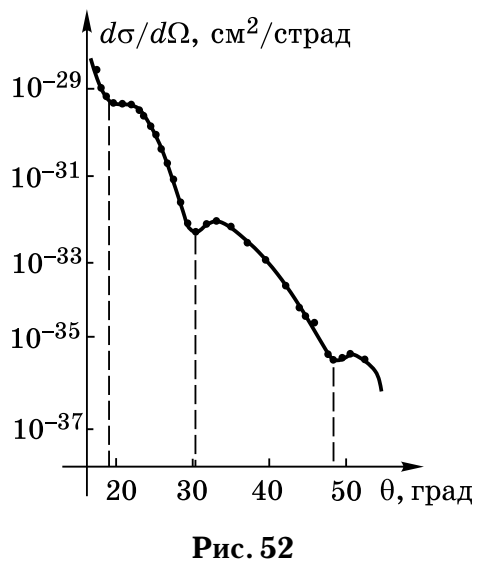

# Неделя 11 · 10–16 ноября

## Ядерные модели. ЯМР

[Все недели](../README.md) · [Указатель задач](../TASKS.md) · [Теория](#theory) · [К задачам](#tasks) · [← Неделя 10](./week-10.md) · [Неделя 12 →](./week-12.md)

<a name="tasks"></a>

**Задачи:** [0-11-1](#task-0-11-1) · [0-11-2](#task-0-11-2) · [7.5](#task-7-5) · [7.16](#task-7-16) · [7.64](#task-7-64) · [7.18](#task-7-18) · [7.36](#task-7-36) · [Т11.1](#task-t11-1) · [7.65](#task-7-65)

<a name="theory"></a>

## Теоретический минимум

### 1. Размер, масса и энергия связи ядра

Ядро $`{}^A_ZX`$ содержит $`Z`$ протонов и $`N=A-Z`$ нейтронов. В используемой в «Допсеминарах» оценке


```math
R=r_0A^{1/3},\qquad r_0\simeq1{,}3\ \text{фм},\qquad
1\ \text{фм}=10^{-15}\ \text{м}.
```


Энергия связи $`B\gt 0`$ — энергия, необходимая для разборки ядра на свободные нуклоны:


```math
B=[Zm_p+(A-Z)m_n-M_{\rm nuc}]c^2.
```


При использовании атомных масс вместо $`m_p`$ берут массу атома водорода; малые электронные энергии связи в ядерных оценках обычно отбрасывают. Полезны $`\hbar c=197{,}327\ \text{МэВ}\cdot\text{фм}`$, $`m_Nc^2\simeq939`$ МэВ, $`uc^2=931{,}494`$ МэВ, $`e^2/(4\pi\epsilon_0)=1{,}440\ \text{МэВ}\cdot\text{фм}`$.

### 2. Капельная модель

Формула Вайцзеккера приближённо описывает положительную энергию связи:


```math
B(A,Z)=a_vA-a_sA^{2/3}-a_c\frac{Z^2}{A^{1/3}}
-a_a\frac{(A-2Z)^2}{A}+\delta a_pA^{-3/4}.
```


В «Допсеминарах» используются коэффициенты в МэВ: $`a_v=15{,}75`$, $`a_s=17{,}8`$, $`a_c=0{,}71`$, $`a_a=23{,}7`$, $`a_p=34`$. Здесь $`\delta=+1`$ для чётно-чётного ядра, $`-1`$ для нечётно-нечётного, $`0`$ при нечётном $`A`$.

Объёмный член отражает насыщение ядерных сил; поверхностный уменьшает связь нуклонов на границе; кулоновский учитывает отталкивание протонов; симметрийный штрафует отличие $`N`$ от $`Z`$; последний член описывает спаривание. Коэффициенты эмпирические, поэтому лишние десятичные знаки не делают оценку точнее.

Энергия равномерно заряженного шара $`E_C=3Z^2e^2/(20\pi\epsilon_0R)`$. Замена $`Z^2`$ на $`Z(Z-1)`$ приближённо исключает взаимодействие протона с самим собой; обе версии встречаются в оценках, смешивать их в одном вычислении нельзя.

### 3. Оболочечная модель и спин-орбитальная связь

Протоны и нейтроны независимо заполняют одночастичные уровни. Для сферического осциллятора


```math
U(r)=U_0+\frac12m_N\omega^2r^2,\quad
E_N=U_0+\hbar\omega(N+3/2),\quad N=n_x+n_y+n_z.
```


Число пространственных состояний при данном $`N`$ равно $`(N+1)(N+2)/2`$. С учётом двух спинов ёмкости оболочек для каждого сорта нуклонов равны $`2,6,12,\ldots`$; накопленные числа — $`2,8,20,\ldots`$.

В сферических обозначениях $`N=2n_r+l`$. Спин-орбитальный член $`H_{ls}=a\mathbf l\cdot\mathbf s`$ (моменты здесь в единицах $`\hbar`$) даёт


```math
\Delta E_j=\frac a2[j(j+1)-l(l+1)-s(s+1)].
```


В ядрах обычно ниже уровень $`j=l+1/2`$, что соответствует $`a\lt 0`$ в этой записи. Чётность однонуклонного состояния равна $`(-1)^l`$; правила для фотонов $`Ek,Mk`$ приведены в [теории недели 9](./week-09.md).

### 4. Ядерный момент и резонанс

Ядерный магнетон $`\mu_N=e\hbar/(2m_p)=5{,}051\cdot10^{-27}`$ Дж/Тл. Для протона $`g_l=1`$, $`g_s\simeq5{,}58`$; для нейтрона $`g_l=0`$, $`g_s\simeq-3{,}82`$. В однонуклонной модели


```math
g_j=g_l+(g_s-g_l)\frac{j(j+1)+s(s+1)-l(l+1)}{2j(j+1)},
\qquad\mu=g_j\mu_Nj.
```


Здесь магнитный момент — его проекция в состоянии $`m_j=j`$; он может быть отрицательным. Замкнутые оболочки имеют нулевой суммарный момент. Соседние подуровни ядра в поле разделены энергией $`|g_I|\mu_NB`$, поэтому $`h\nu=|g_I|\mu_NB`$. Частота определяет модуль момента; знак требует дополнительной информации.

## Группа 0

<a name="task-0-11-1"></a>

### Задача 0-11-1. Зеркальные ядра

**Условие.** Оценить в капельной модели разность энергий связи зеркальных ядер $`{}^{27}_{13}\mathrm{Al}`$ и $`{}^{27}_{14}\mathrm{Si}`$, и сравнить ее с экспериментальным значением $`\Delta=4{,}812`$ МэВ.

**Краткая теория.** У зеркальных ядер одинаково $`A`$, а $`N`$ и $`Z`$ меняются местами. В формуле Вайцзеккера все члены, кроме кулоновского, поэтому совпадают.

**Решение.** Для обоих ядер $`A^{1/3}=3`$, $`(A-2Z)^2=1`$, а спаривание отсутствует, поскольку $`A`$ нечётно. Кремний сильнее расталкивается электрически, поэтому $`B_{\rm Al}\gt B_{\rm Si}`$:


```math
\Delta B=B(27,13)-B(27,14)
=\frac{a_c}{3}(14^2-13^2)
=\frac{0{,}71}{3}\cdot27
=6{,}39\ \text{МэВ}.
```


**Ответ в параметризации «Допсеминаров»:** $`\boxed{\Delta B\simeq6{,}4\ \text{МэВ}}`$. Превышение экспериментального значения составляет $`1{,}58`$ МэВ, или около 33%.

Если вычислять кулоновский член непосредственно как энергию шара с $`r_0=1{,}3`$ фм и $`Z(Z-1)`$, то


```math
\Delta B\simeq\frac35\frac{1{,}440}{1{,}3\cdot3}
[14\cdot13-13\cdot12]=5{,}76\ \text{МэВ}.
```


Такой вариант завышает результат примерно на 20%. Разница показывает точность грубой капельной оценки для лёгких ядер; подгонять $`r_0`$ под известный ответ здесь не требуется.

<a name="task-0-11-2"></a>

### Задача 0-11-2. Спин-орбитальное расщепление в кислороде

**Условие.** В основном состоянии ядра $`{}^{17}_{8}\mathrm O`$ неспаренный нейтрон находится в состоянии с $`l=2`$ и $`j=5/2`$. Для перехода этого нуклона в возбужденное состояние с $`l=2`$, $`j=3/2`$ требуется энергия 5 МэВ. Определить константу спин-орбитального взаимодействия, а также типы фотонов, поглощаемых при данном переходе с наибольшей вероятностью.

**Краткая теория.** Спин-орбитальную константу определяем из разности средних $`\mathbf l\cdot\mathbf s`$, а тип излучения — по изменению момента и чётности.

**Решение.** Запишем $`H_{ls}=a\mathbf l\cdot\mathbf s`$, $`s=1/2`$:


```math
\langle\mathbf l\cdot\mathbf s\rangle_{5/2}
=\frac{35/4-6-3/4}{2}=1,
\qquad
\langle\mathbf l\cdot\mathbf s\rangle_{3/2}
=\frac{15/4-6-3/4}{2}=-\frac32.
```


Поэтому $`E_{3/2}-E_{5/2}=-(5/2)a=5`$ МэВ, и


```math
\boxed{a=-2\ \text{МэВ}.}
```


При записи с размерными моментами $`H_{ls}=a'\mathbf L\cdot\mathbf S`$ та же константа равна $`a'=-2\ \text{МэВ}/\hbar^2`$.

Обе чётности положительны, поскольку $`l=2`$. Фотон должен иметь $`1\le k\le4`$. При сохранении чётности разрешены $`M1,E2,M3,E4`$. Наименьшие мультипольности дают основные каналы:


```math
\boxed{M1\text{ и }E2\quad(\text{обычно ведущий однонуклонный канал }M1).}
```


E1 запрещён чётностью. Для количественного отношения интенсивностей M1 и E2 нужны матричные элементы; одних правил отбора недостаточно.

## Группа 1

<a name="task-7-5"></a>

### Задача 7.5. Устойчивый изобар и направление β-распада

**Условие.** С помощью формулы Вайцзеккера найти заряд $`Z_0`$ наиболее устойчивого ядра-изобары при заданном нечетном значении $`A`$. Выяснить, каков характер активности у ядер $`{}^{27}\mathrm{Mg}`$, $`{}^{29}\mathrm P`$, $`{}^{37}\mathrm K`$, $`{}^{67}\mathrm{Cu}`$.

**Краткая теория.** При фиксированном нечётном $`A`$ член спаривания исчезает. В приближении равных масс нуклонов максимум связи задаёт минимум массы; отклонение от этого минимума определяет направление изменения $`Z`$.

**Решение.** Оставляем зависящие от $`Z`$ члены и дифференцируем:


```math
B(Z)=\text{const}-a_c Z^2A^{-1/3}-a_a\frac{(A-2Z)^2}{A},
```


```math
\frac{dB}{dZ}=-2a_cZA^{-1/3}+4a_a\frac{A-2Z}{A}=0.
```


После умножения на $`A`$ получаем $`2a_aA=Z(4a_a+a_cA^{2/3})`$, откуда


```math
\boxed{Z_0\simeq\frac{A/2}{1+(a_c/4a_a)A^{2/3}}
=\frac{A/2}{1+0{,}00749A^{2/3}}.}
```


Вторая производная отрицательна, то есть это максимум связи. При $`Z\lt Z_0`$ выгодно превращение $`n\to p+e^-+\bar\nu_e`$, а при $`Z\gt Z_0`$ — уменьшение $`Z`$ через $`\beta^+`$ или электронный захват.

| Ядро | $`Z`$ | $`Z_0`$ (округлённо) | Направление распада |
|---|---:|---:|---|
| $`{}^{27}\mathrm{Mg}`$ | 12 | 12,65 | $`\beta^-\to{}^{27}\mathrm{Al}`$ |
| $`{}^{29}\mathrm P`$ | 15 | 13,54 | $`\beta^+\to{}^{29}\mathrm{Si}`$ |
| $`{}^{37}\mathrm K`$ | 19 | 17,08 | $`\beta^+\to{}^{37}\mathrm{Ar}`$ |
| $`{}^{67}\mathrm{Cu}`$ | 29 | 29,82 | $`\beta^-\to{}^{67}\mathrm{Zn}`$ |

Таковы также ответы сборника. Более точно нужно минимизировать атомную массу $`M_ac^2=Zm_Hc^2+(A-Z)m_nc^2-B`$, а не только максимизировать $`B`$. Это заменяет числитель $`4a_aA`$ в формуле $`Z_0`$ на $`[4a_a+(m_n-m_H)c^2]A`$ и не меняет указанные направления. Выбор между $`\beta^+`$ и захватом требует проверки энергетического порога $`2m_ec^2`$ по массам; гладкая капельная модель надёжнее определяет направление изменения заряда, чем точное энерговыделение.

<a name="task-7-16"></a>

### Задача 7.16. Однонуклонное возбуждение кальция

**Условие.** Аппроксимируя ядерный потенциал трехмерной параболической ямой глубиной $`U_0=-60`$ МэВ, оценить энергию однонуклонного возбуждения в ядре $`{}^{40}_{20}\mathrm{Ca}`$. Считать, что $`U(R_0)=0`$, где $`R_0`$ — радиус ядра.

**Краткая теория.** В осцилляторной оболочечной модели соседние оболочки разделены на $`\hbar\omega`$. У кальция заполнены оболочки $`N=0,1,2`$ отдельно для протонов и нейтронов, поэтому минимальное возбуждение переносит нуклон из $`N=2`$ в $`N=3`$.

**Решение.** Условие на границе определяет кривизну ямы:


```math
0=U_0+\frac12m_N\omega^2R_0^2
\Rightarrow\omega=\frac1{R_0}\sqrt{\frac{2|U_0|}{m_N}}.
```


При $`R_0=1{,}3\sqrt[3]{40}=4{,}45`$ фм


```math
\boxed{\Delta E=\hbar\omega
=\frac{\hbar c}{R_0}\sqrt{\frac{2|U_0|}{m_Nc^2}}
\simeq15{,}9\ \text{МэВ}.}
```


Проверка заполнения: $`2+6+12=20`$ состояний каждого сорта. Найден интервал оболочек в заданной модели; спин-орбитальные и коллективные возбуждения могут лежать ниже.

<a name="task-7-64"></a>

### Задача 7.64. Магнитный момент ядра гелия-3

**Условие.** В медицинской томографии внутренних органов используется метод ЯМР на протонах, входящих в состав воды, а для томографии легких — на ядрах газообразного He-3 при его вдыхании. Определить разницу между экспериментальными и теоретическими значениями магнитного момента ядра $`{}^{3}_{2}\mathrm{He}`$, если сигнал резонанса наблюдается во внешнем поле $`B=1{,}5`$ Тл на частоте $`\nu=48{,}75`$ МГц. Спин ядра и его магнитный момент вычислять по однонуклонной оболочечной модели.

**Указание.** В магнитном поле расположение подуровней энергии для ядра $`{}^{3}_{2}\mathrm{He}`$ противоположно таковому для протона.

**Краткая теория.** Как в «Допсеминарах», пару протонов считаем скомпенсированной, момент задаёт нейтрон в $`s`$-состоянии. Частота даёт модуль, а указание — отрицательный знак момента.

**Решение.** Неспаренный нейтрон имеет $`l=0`$, $`I=s=1/2`$, поэтому


```math
\mu_{\rm th}=g_{sn}\mu_NI=-3{,}82\mu_N/2=-1{,}91\mu_N.
```


Для $`I=1/2`$ разность двух зеемановских энергий равна $`2|\mu|B`$. Следовательно,


```math
h\nu=2|\mu_{\rm exp}|B
\Rightarrow\mu_{\rm exp}=-\frac{h\nu}{2B}
\simeq-1{,}077\cdot10^{-26}\ \text{Дж/Тл}
\simeq-2{,}13\mu_N.
```


**Ответ:** $`\boxed{|\mu_{\rm exp}-\mu_{\rm th}|\simeq0{,}22\mu_N}`$, около 12% от однонуклонной оценки. В формуле резонанса для обычной частоты $`\nu`$ используется $`h`$, а не $`\hbar`$.

## Группа 2

<a name="task-7-18"></a>

### Задача 7.18. Размер слабо связанного дейтрона

**Условие.** У ядра дейтерия — дейтрона d — нет стационарных возбужденных состояний, а энергия связи нуклонов составляет $`\mathcal E=2{,}23`$ МэВ. Аппроксимируя эффективный потенциал нуклон-нуклонного взаимодействия трехмерной сферически симметричной прямоугольной потенциальной ямой, оценить среднеквадратичный радиус дейтрона, т. е. среднеквадратичное расстояние между нуклонами (см. задачи 7.12, 3.18 и 3.20). Считать, что глубина ямы велика по сравнению с энергией уровня.

**Краткая теория.** Для слабосвязанного $`s`$-состояния размер в значительной мере определяется экспоненциальным хвостом вне ямы. Координата $`r`$ здесь — расстояние между нуклонами, а приведённая масса $`\mu\simeq m_N/2`$.

**Решение.** Снаружи $`U=0`$, энергия равна $`-\mathcal E`$. Для радиальной функции $`u=r\psi`$ уравнение имеет вид


```math
-\frac{\hbar^2}{2\mu}u''=-\mathcal E u
\Rightarrow u\propto e^{-\kappa r},\qquad
\kappa=\frac{\sqrt{2\mu\mathcal E}}\hbar
\simeq\frac{\sqrt{m_N\mathcal E}}\hbar.
```


В оценке сборника продолжаем хвост к нулю и нормируем радиальную вероятность $`|u|^2dr`$. Тогда


```math
\langle r^2\rangle\simeq
\frac{\int_0^\infty r^2e^{-2\kappa r}dr}{\int_0^\infty e^{-2\kappa r}dr}
=\frac{2/(2\kappa)^3}{1/(2\kappa)}=\frac1{2\kappa^2}.
```


```math
\boxed{\sqrt{\langle r^2\rangle}\simeq
\frac{\hbar c}{\sqrt{2m_Nc^2\mathcal E}}
\simeq3{,}05\ \text{фм}.}
```


Это оценка расстояния между нуклонами. Расстояние каждого из них от центра масс примерно вдвое меньше. Конечный радиус ямы изменяет коэффициент; глубина сама по себе без радиуса не позволяет найти точное среднее.

<a name="task-7-36"></a>

### Задача 7.36. Магнитный момент азота-15

**Условие.** Согласно оболочечной модели ядра в ядре $`{}^{15}_{7}\mathrm N`$ неспаренный протон, определяющий его угловой и магнитный моменты, находится в состоянии $`1p_{1/2}`$ сверх полностью заполненной подоболочки $`1p_{3/2}`$. Определить величину магнитного момента $`\mu`$ этого ядра (в ядерных магнетонах Бора). Магнитный момент свободного протона $`\mu_p=g_{sp}\mu_{\rm яд}s_p=2{,}79\mu_{\rm яд}`$, где $`g_{sp}=5{,}58`$ — спиновый $`g`$-фактор протона, $`s_p=1/2`$ — спин протона. (См. указание к задаче 7.35.)

**Указание к 7.35.** Магнитным моментом ядра принято называть величину максимальной проекции магнитного момента на заданную ось.

**Краткая теория.** Для $`p_{1/2}`$ спин и орбитальный момент в среднем направлены противоположно. Нужно проецировать оба вклада магнитного момента на полный $`\mathbf j`$.

**Решение.** Подставим $`l=1`$, $`s=j=1/2`$, $`g_l=1`$, $`g_s=5{,}58`$:


```math
g_j=1+(5{,}58-1)\frac{3/4+3/4-2}{2(3/4)}
=1-\frac{4{,}58}{3}=-0{,}5267.
```


Следовательно,


```math
\boxed{\mu=g_j\mu_Nj=-0{,}263\mu_N\simeq-0{,}26\mu_N.}
```


Знак означает, что в состоянии $`m_j=j`$ момент противоположен полному угловому моменту. По модулю он равен $`0{,}26\mu_N`$; положительность заряда неспаренного нуклона не требует положительного суммарного $`g_j`$.

<a name="task-t11-1"></a>

### Задача Т11.1. Деление свинца на симметричные осколки

**Условие.** Деление тяжелых стабильных ядер может быть вызвано попаданием в них энергичного нейтрона. Оцените, какая энергия выделится в реакции деления энергичным нейтроном ядра $`{}^{207}\mathrm{Pb}`$ на два симметричных осколка? Считайте, что нейтрон остановился внутри покоящегося ядра.

**Краткая теория.** После поглощения нейтрона составное ядро имеет $`A=208`$, $`Z=82`$. При симметричном делении без испарения нейтронов получаются два ядра с $`A=104`$, $`Z=41`$. Энерговыделение стадии деления находим по изменению энергии связи.

**Решение.** Схема принятой модели:


```math
{}^{207}_{82}\mathrm{Pb}+n\longrightarrow{}^{208}_{82}\mathrm{Pb}^{*}
\longrightarrow2\,{}^{104}_{41}\mathrm{Nb}.
```


Сначала оценим энерговыделение деления из основного состояния составного ядра, $`Q_f=2B(A/2,Z/2)-B(A,Z)`$. Объёмный и симметрийный члены сокращаются. Поверхность увеличивается, кулоновское отталкивание уменьшается:


```math
Q_f=a_c\frac{Z^2}{A^{1/3}}(1-2^{-2/3})
-a_sA^{2/3}(2^{1/3}-1)+\Delta B_{\rm pair}.
```


Исходное $`{}^{208}\mathrm{Pb}`$ чётно-чётное, оба осколка нечётно-нечётные, поэтому


```math
\Delta B_{\rm pair}=-\frac{2a_p}{104^{3/4}}-\frac{a_p}{208^{3/4}}.
```


При коэффициентах из теории получаем $`Q_f\simeq133`$ МэВ, что согласуется с приложенной оценкой $`\boxed{Q_f\approx133{,}6\ \text{МэВ}}`$ на точности капельной модели.

**Что входит в эту оценку.** Остановившийся внутри ядра нейтрон передаёт ему свою энергию, а захват дополнительно освобождает энергию связи $`S_n=B(208,82)-B(207,82)`$. Поэтому для полного процесса от свободного нейтрона и $`{}^{207}\mathrm{Pb}`$


```math
Q_{\rm total}=2B(104,41)-B(207,82)=Q_f+S_n,
\qquad K_{\rm final}=Q_{\rm total}+T_n.
```


Та же формула Вайцзеккера даёт $`S_n\simeq6{,}8`$ МэВ и $`Q_{\rm total}\simeq140`$ МэВ. Кинетическая энергия налетающего нейтрона в условии не задана; число 133,6 МэВ относится к упрощённой оценке самой стадии деления, а не к точному полному балансу энергичного нейтрона.

<a name="task-7-65"></a>

### Задача 7.65. Размер ядра по дифракционным минимумам

**Условие.** В угловом распределении электронов с энергией $`\mathcal E=750`$ МэВ, рассеянных на дважды магическом ядре кальция $`{}^{40}_{20}\mathrm{Ca}`$, экспериментально наблюдается ряд последовательных дифракционных минимумов, как это показано на рис. 52. Оценить из положений трех отчетливых минимумов средний радиус ядра кальция, которое можно рассматривать в данной задаче как черный шарик, и среднюю величину $`r_0`$ в формуле для радиусов ядер.



**Краткая теория.** Дифракция на поглощающем шарике определяется его поперечным диском. Чем больше диск, тем меньше углы минимумов; измеряется радиус, а не длина волны электрона.

**Решение.** Электроны ультрарелятивистские, поэтому $`pc\simeq\mathcal E`$, $`k=p/\hbar\simeq\mathcal E/(\hbar c)`$. В приближении дифракции вперёд амплитуда круглого диска содержит


```math
f(\theta)\propto\int_0^R bJ_0(kb\sin\theta)\,db
=\frac{R J_1(kR\sin\theta)}{k\sin\theta}.
```


Первые три нуля $`J_1(x)`$: $`x_1=3{,}832`$, $`x_2=7{,}016`$, $`x_3=10{,}173`$. Значит,


```math
R_i\simeq\frac{x_i\hbar c}{\mathcal E\sin\theta_i}.
```


С рисунка читаются примерно $`\theta_1=19^\circ`$, $`\theta_2=30^\circ`$, $`\theta_3=48^\circ`$. Тогда


```math
R_1\simeq3{,}10\ \text{фм},\quad
R_2\simeq3{,}69\ \text{фм},\quad
R_3\simeq3{,}60\ \text{фм},\quad
\bar R\simeq3{,}46\ \text{фм}.
```


**Ответ:** $`\boxed{R\sim3{,}5\ \text{фм},\quad r_0=R/40^{1/3}\sim1{,}0\ \text{фм}}`$. Из графика и грубой модели нельзя требовать точности лучше нескольких десятых фемтометра. Для больших углов формула дифракции вперёд также становится приближённой.

В книжном ответе вместе с $`R=3{,}5`$ фм напечатано $`r_0\simeq1{,}2`$ фм. Эти два числа при $`A=40`$ не согласованы: $`3{,}5/\sqrt[3]{40}=1{,}02`$. Здесь коэффициент вычислен непосредственно из найденного радиуса.

---

[Все недели](../README.md) · [Указатель задач](../TASKS.md) · [Теория](#theory) · [К задачам](#tasks) · [← Неделя 10](./week-10.md) · [Неделя 12 →](./week-12.md)

[Сообщить об ошибке в этой неделе](https://github.com/NeTotDEDD/FIZOS_Kvanty/issues/new?template=correction.yml)
