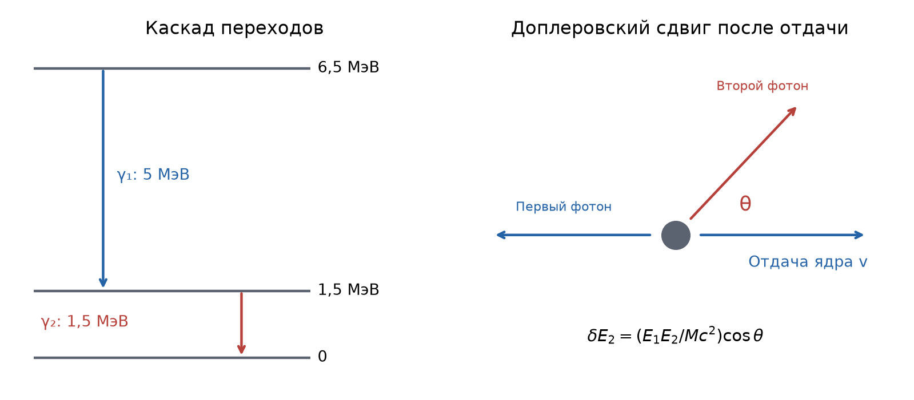
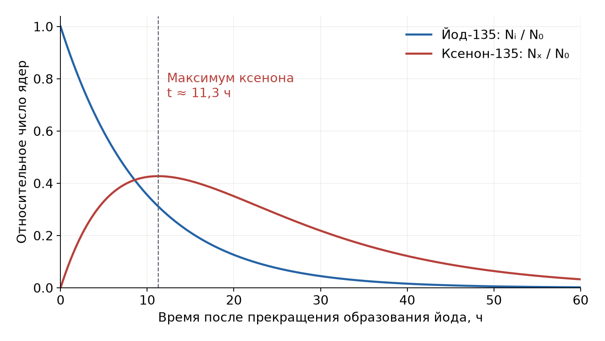

# Неделя 12 · 17–23 ноября

## Радиоактивность

[Все недели](../README.md) · [Указатель задач](../TASKS.md) · [Теория](#theory) · [К задачам](#tasks) · [← Неделя 11](./week-11.md) · [Неделя 13 →](./week-13.md)

<a name="tasks"></a>

**Задачи:** [0-12-1](#task-0-12-1) · [0-12-2](#task-0-12-2) · [7.69](#task-7-69) · [7.51](#task-7-51) · [7.20](#task-7-20) · [7.11](#task-7-11) · [9.11](#task-9-11) · [Т12.1](#task-t12-1) · [7.26](#task-7-26)

<a name="theory"></a>

## Теоретический минимум

### 1. Закон распада и активность

Если вероятность распада одного ядра за $`dt`$ равна $`\lambda dt`$, то среднее число ядер удовлетворяет уравнению


```math
dN=-\lambda Ndt\Rightarrow\frac{dN}{N}=-\lambda dt
\Rightarrow N(t)=N_0e^{-\lambda t}.
```


Активность $`\mathcal A=-dN/dt=\lambda N`$ измеряется в Бк: $`1`$ Бк $`=1`$ распад/с. Среднее время жизни $`\tau=1/\lambda`$, период полураспада $`T_{1/2}=\ln2/\lambda=\tau\ln2`$. Для мощности тепловыделения при полном поглощении энергии $`\varepsilon`$ одного распада $`P=\mathcal A\varepsilon`$.

### 2. Последовательные распады

В цепочке $`1\to2\to3`$ число дочерних ядер одновременно растёт за счёт первого распада и уменьшается за счёт второго:


```math
\dot N_1=-\lambda_1N_1,\qquad
\dot N_2=\lambda_1N_1-\lambda_2N_2.
```


При $`N_1(0)=N_0`$, $`N_2(0)=0`$, $`\lambda_1\ne\lambda_2`$ решение равно


```math
N_2(t)=\frac{\lambda_1N_0}{\lambda_2-\lambda_1}
\left(e^{-\lambda_1t}-e^{-\lambda_2t}\right).
```


Если $`\lambda_2\gg\lambda_1`$ и $`t\gg1/\lambda_2`$, устанавливается вековое равновесие: $`\lambda_2N_2\simeq\lambda_1N_1`$. Равны **активности**, а не числа ядер.

### 3. Энергия распада и отдача

Для атомных масс $`M_a`$ и с точностью до электронных энергий связи:


```math
\begin{aligned}
Q_{\beta^-}&=[M_a(A,Z)-M_a(A,Z+1)]c^2,\\[0pt]
Q_{\beta^+}&=[M_a(A,Z)-M_a(A,Z-1)-2m_e]c^2,\\[0pt]
Q_{\rm EC}&=[M_a(A,Z)-M_a(A,Z-1)]c^2.
\end{aligned}
```


В $`\beta`$-распаде энергия делится между электроном, нейтрино и отдачей ядра. Поэтому электронный спектр непрерывен. При электронном захвате и переходе в определённый уровень нейтрино почти моноэнергетично; для нерелятивистского ядра отдача $`R=p_\nu^2/(2M)\simeq E_\nu^2/(2Mc^2)`$.

### 4. Время жизни, ширина и туннелирование

Среднее время жизни уровня связано с его естественной полной шириной: $`\Gamma=\hbar/\tau`$. Движение источника добавляет доплеровский сдвиг $`\delta E\simeq E(v/c)\cos\theta`$. Узкий угол регистрации фиксирует направление фотона, но не устраняет разброс направлений отдачи ядер.

Для испускания заряженной частицы прозрачность барьера в ВКБ-приближении


```math
D\sim e^{-G},\qquad G=\frac2\hbar\int_{r_1}^{r_2}\sqrt{2m[U(r)-E]}\,dr,
\qquad\lambda\sim fD.
```


Здесь $`f`$ — частота попыток выхода, а для составной частицы может дополнительно входить вероятность её образования внутри ядра. При сравнении двух периодов сокращать эти множители можно только по отдельному допущению.

## Группа 0

<a name="task-0-12-1"></a>

### Задача 0-12-1. Объём радиоактивного индикатора

**Условие.** Препараты с радиоактивным изотопом натрий-24 используются в медицине для диагностики переноса веществ в организме. С этой целью пациенту ввели внутривенную дозу раствора, содержащего изотоп $`{}^{24}\mathrm{Na}`$. Активность 1 см$`^3`$ этого раствора $`\alpha_0=2000`$ распадов в секунду. Период полураспада изотопа $`{}^{24}\mathrm{Na}`$ равен $`T=15{,}3`$ часа. Через $`t=3`$ ч 50 мин активность 1 см$`^3`$ крови пациента стала равна $`\alpha=0{,}28`$ распадов в секунду. Каков объём введённого раствора, если общий объём крови пациента $`V=6`$ л?

**Краткая теория.** В учебной модели индикатор равномерно перемешался в крови, а его количество меняется только вследствие радиоактивного распада. Сопоставляем полные активности, предварительно приводя объёмы к одинаковым единицам.

**Решение.** Пусть введённый объём равен $`V_0`$ см$`^3`$. Исходная полная активность $`\alpha_0V_0`$; через $`t`$ она равна $`\alpha_0V_0\,2^{-t/T}`$. По измерению та же активность составляет $`\alpha V`$, где $`V=6000`$ см$`^3`$:


```math
\alpha_0V_0\,2^{-t/T}=\alpha V
\Rightarrow V_0=\frac{\alpha V}{\alpha_0}\,2^{t/T}.
```


```math
\boxed{V_0=\frac{0{,}28\cdot6000}{2000}
\,2^{(3+50/60)/15{,}3}\simeq1{,}00\ \text{см}^3.}
```


Размерности: отношение активностей на единицу объёма безразмерно, поэтому результат имеет размерность объёма. Выведение индикатора и переход в другие ткани в данной постановке не учитываются.

<a name="task-0-12-2"></a>

### Задача 0-12-2. Нагрев калориметра

**Условие.** Препарат полония активностью $`3{,}7\cdot10^9`$ распад/с помещен в калориметр теплоёмкостью 1 кал/К. Найти повышение температуры калориметра за 1 час, если известно, что полоний испускает $`\alpha`$-частицы с энергией 5,3 МэВ. Считать период полураспада полония много большим времени эксперимента.

**Краткая теория.** При почти постоянной активности число распадов равно $`\mathcal A t`$. Если энергия частиц полностью поглощается и теплопотерями пренебрегаем, $`C\Delta T=\mathcal A tE_\alpha`$.

**Решение.** Переведём энергию и теплоёмкость в СИ:


```math
E_\alpha=5{,}3\cdot10^6\cdot1{,}6022\cdot10^{-19}
=8{,}49\cdot10^{-13}\ \text{Дж},\quad C=4{,}184\ \text{Дж/К}.
```


Тогда $`Q=3{,}7\cdot10^9\cdot3600\cdot8{,}49\cdot10^{-13}=11{,}31`$ Дж, и


```math
\boxed{\Delta T=Q/C\simeq2{,}70\ \text{К}.}
```


Это оценка по заданной энергии $`\alpha`$-частиц. Поглощение отдачи дочерних ядер добавило бы около 2% для тяжёлого ядра полония; для точного учёта нужен его массовый номер.

## Группа 1

<a name="task-7-69"></a>

### Задача 7.69. Период альфа-распада тория по капельной модели

**Условие.** Для $`\alpha`$-распада четно-четных ядер период полураспада $`T_{1/2}`$ (в секундах) зависит от энергии $`\alpha`$-частицы $`\mathcal E_\alpha`$ (в МэВ) и заряда дочернего ядра $`Z`$ по закону Гейгера–Нэттола


```math
\lg T_{1/2}=\frac{9{,}54\cdot Z^{0{,}6}}{\sqrt{\mathcal E_\alpha}}-51{,}37.
```


Используя капельную модель ядра, найти период полураспада ядра тория $`{}^{226}_{90}\mathrm{Th}`$, если для ядра радия $`{}^{226}_{88}\mathrm{Ra}`$ $`T_{1/2}=1600`$ лет. Для кулоновского и симметричного коэффициентов в формуле Вайцзеккера принять значения $`C_{\rm кул}=0{,}71`$ МэВ и $`C_{\rm сим}=23{,}7`$ МэВ.

**Краткая теория.** Сначала по известному периоду радия восстанавливаем энергию его альфа-частиц. Затем находим разность энергий распада двух изобар из формулы Вайцзеккера. В этой разности объёмный, поверхностный и парный члены сокращаются.

**Решение.** **1. Радиевый распад.** Заряд дочернего ядра равен $`86`$, а период в секундах $`T_{\rm Ra}=1600\cdot3{,}156\cdot10^7`$. Обращая закон Гейгера–Нэттола,


```math
\mathcal E_{\alpha,\rm Ra}=\left[\frac{9{,}54\cdot86^{0{,}6}}{\lg(1600\cdot3{,}156\cdot10^7)+51{,}37}\right]^2
\simeq4{,}95\ \text{МэВ}.
```


**2. Разность энерговыделений.** Пусть $`B(A,Z)\gt 0`$ — энергия связи. Для распада на альфа-частицу


```math
Q(A,Z)=B(A-4,Z-2)+B(4,2)-B(A,Z).
```


В принятой оценке пренебрегаем отдачей тяжёлого дочернего ядра и полагаем $`\mathcal E_\alpha\simeq Q`$. При $`A=226`$ для обоих материнских ядер различаются только кулоновские и симметрийные члены


```math
B_C=-C_{\rm кул}\frac{Z^2}{A^{1/3}},\qquad
B_S=-C_{\rm сим}\frac{(A-2Z)^2}{A}.
```


Поскольку $`(A-4)-2(Z-2)=A-2Z`$, получаем


```math
\begin{aligned}
\Delta Q={}&C_{\rm кул}\left[\frac{90^2-88^2}{226^{1/3}}-\frac{88^2-86^2}{222^{1/3}}\right]\\[0pt]
&+C_{\rm сим}\left[(226-180)^2-(226-176)^2\right]\left(\frac1{226}-\frac1{222}\right).
\end{aligned}
```


Два вклада составляют примерно $`0{,}690`$ и $`0{,}726`$ МэВ; их сумма $`\Delta Q\simeq1{,}416`$ МэВ. Поэтому


```math
\mathcal E_{\alpha,\rm Th}\simeq4{,}9509+1{,}4159=6{,}3668\ \text{МэВ}.
```


**3. Торий.** Теперь заряд дочернего ядра $`Z=88`$:


```math
\lg T_{\rm Th}=\frac{9{,}54\cdot88^{0{,}6}}{\sqrt{6{,}3668}}-51{,}37\simeq4{,}128,
```


```math
\boxed{T_{\rm Th}\simeq1{,}34\cdot10^4\ \text{с}\simeq224\ \text{мин}.}
```


В задачнике промежуточные числа округлены до $`\mathcal E_{\alpha,\rm Th}=6{,}35`$ МэВ и $`\lg T\simeq4{,}2`$, а ответ дан как $`1{,}59\cdot10^4`$ с, или $`265`$ мин. Здесь показана подстановка без такого промежуточного округления. Из-за экспоненциальной чувствительности периода округление энергии заметно влияет на минуты; точность капельной модели не позволяет считать их точными. Учёт отдачи заменяет $`\mathcal E_\alpha\simeq Q`$ на $`\mathcal E_\alpha\simeq(222/226)Q`$, а экспериментальное значение, приведённое в книге, составляет $`30{,}9`$ мин.


<a name="task-7-51"></a>

### Задача 7.51. Время жизни промежуточного уровня в каскаде

**Условие.** На спектрометре высокого разрешения GAMS4 в Гренобле (Франция) у изотопа $`{}^{49}_{22}\mathrm{Ti}`$ зарегистрирован каскадный переход из высоковозбужденного в основное состояние с последовательным испусканием двух $`\gamma`$-квантов с энергиями $`\mathcal E_1=5`$ МэВ и $`\mathcal E_2=1{,}5`$ МэВ. Прецизионные измерения формы линии $`\mathcal E_2`$ показали, что она имеет ширину $`\Delta\mathcal E=400`$ эВ. Оценить время жизни уровня с энергией $`\mathcal E_2`$. Учесть, что детектор спектрометра регистрирует $`\gamma`$-излучение в узком телесном угле вблизи нормали к окну детектора.



**Краткая теория.** В решении «Допсеминаров» из полной ширины сначала оценивается вклад отдачи после первого фотона. Только оставшаяся естественная ширина связывается с временем жизни.

**Решение.** После первого испускания $`Mv=\mathcal E_1/c`$. Второй фотон излучается уже движущимся ядром:


```math
\delta E_2=\mathcal E_2\frac vc\cos\theta
=\frac{\mathcal E_1\mathcal E_2}{Mc^2}\cos\theta.
```


Хотя направление второго фотона отобрано детектором, первый фотон и противоположная ему отдача могут иметь разные направления. Поэтому $`\cos\theta`$ меняется от $`-1`$ до $`1`$, и полный доплеровский размах равен $`2D`$, где


```math
D=\frac{5\cdot1{,}5}{49\cdot931{,}5}\ \text{МэВ}
\simeq164\ \text{эВ}.
```


Следуя оценочному сложению ширин в книге,


```math
\Gamma\sim\Delta\mathcal E-2D\simeq400-328=72\ \text{эВ},
\qquad
\boxed{\tau\sim\frac\hbar\Gamma\simeq9\cdot10^{-18}\ \text{с}\sim10^{-17}\ \text{с}.}
```


При округлении $`D\approx160`$ эВ получается $`\Gamma\approx80`$ эВ и $`\tau\approx8\cdot10^{-18}`$ с, как в «Допсеминарах». Линейное вычитание ширин здесь является оценкой, а не точным правилом для свёртки профилей. Для точного времени жизни нужны форма линии, угловые корреляции и аппаратная функция; непосредственно подставлять 400 эВ в $`\hbar/\Gamma`$ нельзя без учёта отдачи.

<a name="task-7-20"></a>

### Задача 7.20. Период полураспада урана-234

**Условие.** Ядро $`{}^{234}_{92}\mathrm U`$ является продуктом распада основного изотопа урана $`{}^{238}_{92}\mathrm U`$. Определить период полураспада $`{}^{234}_{92}\mathrm U`$, если его содержание в естественном уране в настоящее время составляет 0,0055%. Период полураспада $`{}^{238}_{92}\mathrm U`$ $`T_8=4{,}51\cdot10^9`$ лет. Считать, что вначале «наработанного» $`{}^{234}_{92}\mathrm U`$ не было.

**Краткая теория.** Дочерний изотоп живёт намного меньше материнского. За геологическое время устанавливается равновесие скоростей его образования и распада.

**Решение.** Короткоживущие промежуточные $`{}^{234}\mathrm{Th}`$ и $`{}^{234}\mathrm{Pa}`$ не определяют медленную кинетику. Для эффективной цепи $`238\to234`$ при $`N_4(0)=0`$


```math
\frac{N_4(t)}{N_8(t)}
=\frac{\lambda_8}{\lambda_4-\lambda_8}
\left[1-e^{-(\lambda_4-\lambda_8)t}\right].
```


В пределе $`\lambda_4\gg\lambda_8`$, $`t\gg1/\lambda_4`$:


```math
\frac{N_4}{N_8}\simeq\frac{\lambda_8}{\lambda_4}
=\frac{T_4}{T_8}.
```


Относительное содержание $`0{,}0055\%=5{,}5\cdot10^{-5}`$; долю основного изотопа здесь приближённо принимаем за единицу. Поэтому


```math
\boxed{T_4\simeq5{,}5\cdot10^{-5}\cdot4{,}51\cdot10^9
=2{,}48\cdot10^5\ \text{лет}.}
```


Результат действительно намного меньше геологического возраста и $`T_8`$, что подтверждает использованный режим. Для молодого, неравновесного образца без известного возраста условие не определяло бы $`T_4`$ однозначно.

## Группа 2

<a name="task-7-11"></a>

### Задача 7.11. Отдача при электронном захвате

**Условие.** Определить энергию отдачи ядра атома лития, которое образуется в основном состоянии при поглощении электрона с K-оболочки ядром атома бериллия.

**Краткая теория.** Рассматривается захват $`{}^{7}\mathrm{Be}+e^-\to{}^{7}\mathrm{Li}+\nu_e`$. Для указанного основного состояния почти всё энерговыделение уносит нейтрино, а импульс сохраняется за счёт отдачи лития.

**Решение.** Из табличных атомных масс $`M_a({}^{7}\mathrm{Be})\simeq7{,}016930u`$, $`M_a({}^{7}\mathrm{Li})\simeq7{,}016004u`$:


```math
Q\simeq(7{,}016930-7{,}016004)\cdot931{,}494
=0{,}8626\ \text{МэВ}.
```


Масса захватываемого электрона уже учтена в разности атомных масс; добавлять её второй раз нельзя. Электронным возбуждением конечной оболочки в этой оценке пренебрегаем. Импульсы ядра и нейтрино равны по модулю:


```math
p_{\rm Li}=p_\nu\simeq\frac{Q}{c},\qquad
R=\frac{p_{\rm Li}^2}{2M_{\rm Li}}
\simeq\frac{Q^2}{2M_{\rm Li}c^2}.
```


```math
\boxed{R\simeq\frac{0{,}8626^2}{2\cdot7\cdot931{,}494}\ \text{МэВ}
\simeq57\ \text{эВ}.}
```


Отдача намного меньше $`Q`$, поэтому замена $`E_\nu=Q-R`$ на $`Q`$ самосогласованна.

<a name="task-9-11"></a>

### Задача 9.11. Максимум накопления ксенона

**Условие.** В работающем ядерном реакторе в числе многих элементов из урана все время образуются изотопы иода $`{}^{135}_{53}\mathrm I`$, претерпевающие следующую последовательность бета-распадов (периоды полураспада указаны)


```math
{}^{135}_{53}\mathrm I\xrightarrow{6{,}7\ \text{час}}{}^{135}_{54}\mathrm{Xe}
\xrightarrow{9{,}2\ \text{час}}{}^{135}_{55}\mathrm{Cs}\longrightarrow\ldots
```


Так как ядра $`{}^{135}_{54}\mathrm{Xe}`$ обладают очень большим сечением поглощения нейтронов, в работающем реакторе накопления этого изотопа не происходит. Однако при остановке реактора ксенон начинает накапливаться, тем самым уменьшается коэффициент размножения нейтронов и сразу же повторный запуск реактора затрудняется (образуется так называемая йодная яма). Через какое время после остановки реактора количество ядер $`{}^{135}_{54}\mathrm{Xe}`$ будет максимальным? Считать, что в момент остановки реактора ядер ксенона в нем нет.



**Краткая теория.** После остановки, в модели задачи, исчезает нейтронное выгорание. Число ядер ксенона определяется разностью скорости образования из иода и скорости собственного распада.

**Решение.** Обозначим $`\lambda_I=\ln2/6{,}7`$ ч$`^{-1}`$, $`\lambda_X=\ln2/9{,}2`$ ч$`^{-1}`$. Имеем $`N_I=N_0e^{-\lambda_It}`$ и


```math
\dot N_X+\lambda_XN_X=\lambda_IN_0e^{-\lambda_It}.
```


Умножим на $`e^{\lambda_Xt}`$ и проинтегрируем от 0 до $`t`$ при $`N_X(0)=0`$:


```math
N_Xe^{\lambda_Xt}
=\lambda_IN_0\frac{e^{(\lambda_X-\lambda_I)t}-1}{\lambda_X-\lambda_I},
```


```math
N_X(t)=\frac{\lambda_IN_0}{\lambda_X-\lambda_I}
\left(e^{-\lambda_It}-e^{-\lambda_Xt}\right).
```


В максимуме $`\dot N_X=0`$, поэтому $`\lambda_Ie^{-\lambda_It}=\lambda_Xe^{-\lambda_Xt}`$. Логарифмирование даёт


```math
t_{\max}=\frac{\ln(\lambda_I/\lambda_X)}{\lambda_I-\lambda_X}
=\frac{T_IT_X}{(T_X-T_I)\ln2}\ln\frac{T_X}{T_I}.
```


```math
\boxed{t_{\max}\simeq11{,}3\ \text{часа}.}
```


Начальный рост $`\dot N_X(0)\gt 0`$ и последующее стремление $`N_X\to0`$ подтверждают, что найден максимум. Это расчёт заданной цепочки, без дополнительных процессов реального реактора.

<a name="task-t12-1"></a>

### Задача Т12.1. Точность измерения границы β-спектра

**Условие.** С какой относительной точностью нужно измерять границу спектра кинетической энергии электронов от бета-распада атомарного трития, чтобы достичь точности эксперимента Troitsk Nu-mass, в котором было установлено ограничение на массу нейтрино $`m_\nu\lt 2.2`$ эВ? Масса атома $`{}^3\mathrm H=3{,}016049`$ а.е.м., а $`{}^3\mathrm{He}=3.016029`$ а.е.м.

**Краткая теория.** Массовый предел, записанный в эВ, означает предел на $`m_\nu c^2`$. Для оценки чувствительности сдвиг граничной энергии электрона имеет масштаб $`m_\nu c^2`$.

**Решение.** Используем атомные массы для $`\beta^-`$-распада:


```math
Q=[M_a({}^3\mathrm H)-M_a({}^3\mathrm{He})]c^2
=0{,}000020\cdot931{,}494\ \text{МэВ}
=18{,}63\ \text{кэВ}.
```


В грубой оценке $`T_{\max}\simeq Q`$ при безмассовом нейтрино, а ненулевая масса уменьшает доступную электрону энергию на величину порядка $`m_\nu c^2`$. Поэтому


```math
\boxed{\frac{\delta T}{T}\lesssim\frac{2{,}2\ \text{эВ}}{18630\ \text{эВ}}
\simeq1{,}2\cdot10^{-4}.}
```


Это требуемый масштаб относительной точности. Для реального анализа на уровне нескольких эВ нужны отдача дочернего иона, его электронные состояния и существенно более точные массы; округлённые массы из условия предназначены только для данной оценки.

<a name="task-7-26"></a>

### Задача 7.26. Сравнение протонного и α-распадов

**Условие.** Энергия $`\alpha`$-частиц, испускаемых тяжелыми ядрами ($`Z\sim90`$), равна $`\mathcal E_\alpha\sim4{,}5`$ МэВ, а период их полураспада $`T_\alpha\sim7\cdot10^8`$ лет. Оценить период полураспада такого же ядра по отношению к вылету протона той же энергии $`\mathcal E_p=4{,}5`$ МэВ. Считать задачу одномерной, кулоновский потенциал на поверхности ядра высоким ($`U\gg\mathcal E`$), а предэкспоненциальный множитель в выражении для проницаемости барьера константой.

**Краткая теория.** В заданном приближении меньшие масса и заряд протона резко уменьшают туннельный показатель. Сравниваем экспоненты, считая одинаковыми предэкспоненциальные множители, как прямо требует условие.

**Решение.** Пусть $`U=C/r`$, $`C=Zze^2/(4\pi\epsilon_0)`$, внешний поворотный радиус $`r_2=C/\mathcal E`$. В грубом приближении $`U-\mathcal E\simeq U`$ под интегралом и при пренебрежении внутренним радиусом


```math
G\simeq\frac{2\sqrt{2mC}}\hbar\int_0^{C/\mathcal E}\frac{dr}{\sqrt r}
=\frac{4C\sqrt{2m}}{\hbar\sqrt{\mathcal E}}.
```


Так как $`T\propto1/D=e^G`$, то


```math
\ln\frac{T_p}{T_\alpha}=G_p-G_\alpha
\simeq-\frac{4Z\alpha_{\rm fs}\sqrt2}{\sqrt{\mathcal E}}
\left(2\sqrt{m_\alpha c^2}-\sqrt{m_pc^2}\right).
```


При $`m_\alpha\simeq4m_p`$ скобка равна $`3\sqrt{m_pc^2}`$. Для $`Z\sim90`$ показатель по модулю имеет порядок 160–170. Формальное применение этой модели даёт


```math
T_p\sim(7\cdot10^8\ \text{лет})e^{-(160\text{–}170)}
\sim10^{-53}\text{–}10^{-57}\ \text{с}.
```


При буквальном $`Z=90`$ показатель равен примерно $`160{,}9`$, поэтому $`\boxed{T_p^{\rm formal}\sim3\cdot10^{-54}\ \text{с}}`$. В книге указаны показатель $`169`$ и время $`9\cdot10^{-57}`$ с. Эти округления не вполне согласованы: непосредственно $`7\cdot10^8`$ лет $`\cdot e^{-169}\simeq9\cdot10^{-58}`$ с. Экспонента крайне чувствительна к параметрам; точность итоговых степеней десяти в таком грубом приближении условна.

**Граница применимости книжной оценки.** В актуальном условии $`U\gg\mathcal E`$ требуется на поверхности ядра. У внешней точки поворота неизбежно $`U=\mathcal E`$, поэтому замена $`U-\mathcal E\to U`$ во всём интеграле не даёт точного показателя даже при высокой поверхности барьера. Если сохранить разность и лишь пренебречь внутренним радиусом, подстановка $`r=(C/\mathcal E)\sin^2\phi`$ даёт


```math
\begin{aligned}
G&=\frac{2\sqrt{2m}}{\hbar}\int_0^{C/\mathcal E}\sqrt{\frac Cr-\mathcal E}\,dr\\[0pt]
&=\frac{4C\sqrt{2m}}{\hbar\sqrt{\mathcal E}}\int_0^{\pi/2}\cos^2\phi\,d\phi
=\frac{\pi C\sqrt{2m}}{\hbar\sqrt{\mathcal E}}.
\end{aligned}
```


Показатели уменьшаются в $`\pi/4`$ раза относительно предыдущей грубой оценки; при $`Z=90`$ разность составляет около $`126{,}4`$, а формальное время — порядка $`10^{-39}`$ с. Конечный внутренний радиус также меняет экспоненту. Поэтому приведённые в ответе книги десятки порядков не обладают количественной надёжностью.

**Физический смысл.** Оба сверхмалых времени — формальные результаты переноса одинакового множителя между двумя каналами. Они намного меньше ядерного времени пролёта порядка $`10^{-22}`$–$`10^{-23}`$ с. Значит, калибровка протонного распада по реальному $`\alpha`$-распаду с одним и тем же множителем здесь непригодна для физического времени жизни. Надёжный вывод оценки — гораздо большая проницаемость протонного барьера; сверхмалое число нельзя интерпретировать буквально.

---

[Все недели](../README.md) · [Указатель задач](../TASKS.md) · [Теория](#theory) · [К задачам](#tasks) · [← Неделя 11](./week-11.md) · [Неделя 13 →](./week-13.md)

[Сообщить об ошибке в этой неделе](https://github.com/NeTotDEDD/FIZOS_Kvanty/issues/new?template=correction.yml)
