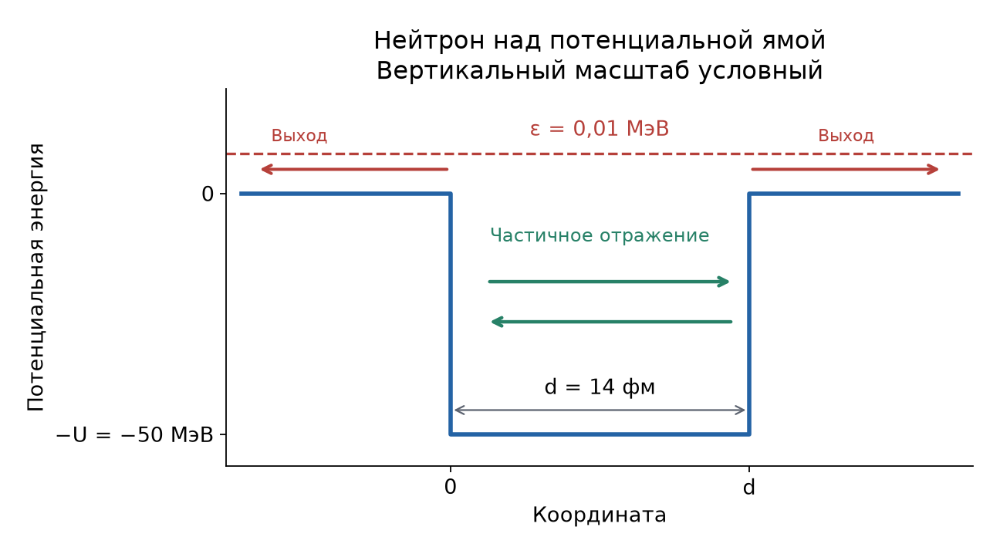
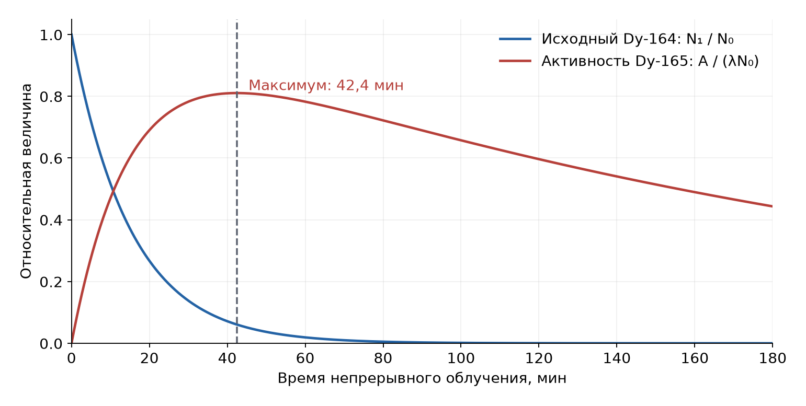

# Неделя 13 · 24–30 ноября

## Ядерные реакции

[Все недели](../README.md) · [Указатель задач](../TASKS.md) · [Теория](#theory) · [К задачам](#tasks) · [← Неделя 12](./week-12.md) · [Неделя 14 →](./week-14.md)

<a name="tasks"></a>

**Задачи:** [0-13-1](#task-0-13-1) · [0-13-2](#task-0-13-2) · [8.45](#task-8-45) · [8.53](#task-8-53) · [9.4](#task-9-4) · [8.68](#task-8-68) · [9.5](#task-9-5) · [Т13.1](#task-t13-1) · [8.72](#task-8-72)

<a name="theory"></a>

## Теоретический минимум

### 1. Энергия и порог реакции

Для реакции $`a+A\to b+B`$ определим энерговыделение как


```math
Q=(m_a+M_A-m_b-M_B)c^2.
```


Тогда закон сохранения энергии имеет вид $`T_b+T_B=T_a+T_A+Q`$. При $`Q>0`$ энергия покоя переходит в кинетическую; при $`Q<0`$ реакция требует затрат энергии. Если мишень покоится, порог больше $`|Q|`$: часть энергии неизбежно остаётся в движении центра масс. В нерелятивистском приближении


```math
T_{a,\mathrm{thr}}\simeq -Q\left(1+\frac{m_a}{M_A}\right).
```


В системе центра масс импульсы двух конечных частиц противоположны и равны по модулю. Поэтому $`T_b^*/T_B^*=M_B/m_b`$. Звёздочка далее обозначает величины в этой системе.

### 2. Сечение и прохождение через вещество

Сечение $`\sigma`$ имеет размерность площади и характеризует вероятность реакции. В слое $`dx`$ доля взаимодействующих частиц равна $`n\sigma\,dx`$, где $`n`$ — число ядер в единице объёма. Для независимых столкновений


```math
dI=-n\sigma I\,dx,\qquad I(x)=I(0)e^{-n\sigma x},\qquad P=1-e^{-n\sigma x}.
```


Единица сечения: $`1\ \text{бн}=10^{-24}\ \text{см}^2=100\ \text{фм}^2`$. Для медленных нейтронов нерезонансное поглощение часто подчиняется закону $`\sigma\propto1/v\propto\lambda`$. Этот закон не является общим законом для любого упругого рассеяния.

### 3. Образование составного ядра

В подходе «Допсеминаров» нейтрон сначала входит в ядерную потенциальную яму, после чего составное ядро распадается по одному из каналов. Для скачка потенциала от $`0`$ до $`-U`$


```math
k=\frac{\sqrt{2mE}}{\hbar},\quad k'=\frac{\sqrt{2m(E+U)}}{\hbar},\quad D=\frac{4kk'}{(k+k')^2}.
```


Здесь $`D`$ — отношение прошедшего и падающего потоков. При $`E\ll U`$ имеем $`D\simeq4\sqrt{E/U}`$. Сечение поглощения в парциальной волне с орбитальным числом $`l`$ равно


```math
\sigma_l^{\rm abs}=\frac{\pi}{k^2}(2l+1)P_l,
```


где $`P_l`$ — вероятность поглощения этой волны. Для $`kR\ll1`$ существенна преимущественно $`s`$-волна ($`l=0`$); для больших $`kR`$ существенны несколько волн.

### 4. Резонанс и время жизни

Для изолированного резонанса бесспиновых частиц формула Брейта—Вигнера даёт


```math
\sigma_{n\to b}(E)=\frac{\pi}{k^2}\frac{\Gamma_n\Gamma_b}{(E-E_r)^2+\Gamma^2/4},\qquad \Gamma=\sum_b\Gamma_b.
```


Параметр $`\Gamma`$ здесь — **полная ширина на половине высоты**. Суммируя по каналам, в максимуме получаем $`\sigma_{\rm total}(E_r)=4\pi\Gamma_n/(k^2\Gamma)`$. Вероятность выживания убывает как $`e^{-t/\tau}`$, поэтому $`\Gamma=\hbar/\tau`$; частичное время жизни для канала $`b`$ равно $`\tau_b=\hbar/\Gamma_b`$.

---

<a name="task-0-13-1"></a>

### Задача 0-13-1. Энергия нейтрона в реакции синтеза

**Условие.** В реакции синтеза ядер дейтерия и трития $`d+t\to\alpha+n+Q`$ выделяется энергия $`Q=17,8`$ МэВ. Какова энергия, уносимая нейтроном?

**Краткая теория.** В системе центра масс два продукта реакции имеют одинаковые модули импульсов. При нерелятивистских скоростях кинетическая энергия обратно пропорциональна массе.

**Решение.** Предполагаем, что начальной кинетической энергией можно пренебречь и центр масс исходных ядер покоится. Тогда


```math
\mathbf p_n=-\mathbf p_\alpha,\qquad T_n+T_\alpha=Q,\qquad \frac{T_n}{T_\alpha}=\frac{m_\alpha}{m_n}\simeq4.
```


Следовательно,


```math
\boxed{T_n=\frac{m_\alpha}{m_n+m_\alpha}Q\simeq\frac45Q=14{,}24\ \text{МэВ}.}
```


Альфа-частица уносит приблизительно $`3{,}56`$ МэВ. Если начальное движение существенно, надо также учитывать его энергию и переход из системы центра масс в лабораторную систему.

---

<a name="task-0-13-2"></a>

### Задача 0-13-2. Поглощение нейтрино в ядре Земли

**Условие.** Сечение поглощения нейтрино с энергией более 5 МэВ ядром железа составляет $`\sigma=10^{-42}`$ см². Какова вероятность поглотиться для такого нейтрино, двигающегося по диаметру в ядре Земли? Считать, что ядро состоит из железа ($`A=56`$ а.е.м., $`\rho=7,8`$ г/см³), его радиус $`R=3000`$ км.

**Краткая теория.** Вероятность хотя бы одного поглощения на пути $`L`$ равна $`1-e^{-n\sigma L}`$. При малой оптической толщине $`n\sigma L\ll1`$ экспоненту можно разложить.

**Решение.** Масса одного ядра железа приблизительно равна $`56u`$, где $`u=1{,}66054\cdot10^{-24}`$ г. Поэтому


```math
n=\frac{\rho}{56u}=\frac{7{,}8}{56\cdot1{,}66054\cdot10^{-24}}=8{,}39\cdot10^{22}\ \text{см}^{-3}.
```


Длина пути равна диаметру: $`L=2R=6\cdot10^8`$ см. Тогда


```math
n\sigma L=8{,}39\cdot10^{22}\cdot10^{-42}\cdot6\cdot10^8=5{,}03\cdot10^{-11}\ll1,
```


```math
\boxed{P=1-e^{-n\sigma L}\simeq n\sigma L\simeq5{,}0\cdot10^{-11}.}
```


---

<a name="task-8-45"></a>

### Задача 8.45. Нейтронный контраст

**Условие.** При просвечивании детали монохроматическими тепловыми нейтронами с длиной волны $`\lambda=1`$ Å на изображении было обнаружено слабое темное пятно, свидетельствующее о наличии внутри детали инородного включения. Контраст изображения (отношение интенсивностей прошедших нейтронов в области включения к соседним однородным областям) был равен 1,26. Какова должна быть длина волны нейтрона, чтобы контраст возрос до 2? Считать, что сечение взаимодействия нейтронов с веществом носит нерезонансный характер.

**Краткая теория.** Используем закон экспоненциального ослабления и закон $`1/v`$ для нерезонансного поглощения медленных нейтронов.

**Решение.** Обозначим оптические толщины двух сравниваемых участков через $`\tau_1`$ и $`\tau_2`$. Для одинакового падающего потока


```math
C=\frac{I_1}{I_2}=\frac{I_0e^{-\tau_1}}{I_0e^{-\tau_2}}=e^{\tau_2-\tau_1}.
```


При неизменной геометрии $`\tau_i=\int n_i\sigma_i\,dx\propto\lambda`$. Следовательно, $`\ln C=K\lambda`$, где $`K`$ не зависит от длины волны. Исключая $`K`$ между двумя измерениями, получаем


```math
\frac{\ln C'}{\ln C}=\frac{\lambda'}{\lambda},\qquad
\boxed{\lambda'=\lambda\frac{\ln2}{\ln1{,}26}\simeq3{,}00\ \text{Å}.}
```


Здесь подразумевается, как в используемой в «Допсеминарах» модели, что ослабление определяется поглощением с законом $`1/v`$. Одна лишь нерезонансность без этого предположения не задаёт зависимость произвольного сечения от энергии.

---

<a name="task-8-53"></a>

### Задача 8.53. Источник нейтронов на литии

**Условие.** Реакция $`{}^{7}_{3}\mathrm{Li}(p,n){}^{7}_{4}\mathrm{Be}`$ является удобным источником монохроматических нейтронов в интервале $`0,2\div1,5`$ МэВ. Для изменения энергии нейтронов можно менять как энергию первичных протонов, так и угол наблюдения. Найти: а) выделение энергии в реакции $`{}^{7}_{3}\mathrm{Li}(p,n){}^{7}_{4}\mathrm{Be}`$, зная массу атомов $`{}^{7}_{3}\mathrm{Li}`$, $`{}^{7}_{4}\mathrm{Be}`$, $`{}^{1}\mathrm H`$ и нейтрона в атомных единицах; б) при какой минимальной энергии протонов возможна это реакция. Какова связь между энергиями нейтрона и протона в лабораторной системе и системе центра масс?

**Краткая теория.** Используем дефект масс, сохранение энергии и импульса. При энергиях в несколько МэВ движение нуклонов можно описывать нерелятивистски.

**Решение.**

**1. Энерговыделение.** Электроны сокращаются при использовании атомных масс: слева литий и водород содержат в сумме четыре электрона, справа бериллий — четыре. Поэтому


```math
Q=[M({}^{7}\mathrm{Li})+M({}^{1}\mathrm H)-M({}^{7}\mathrm{Be})-m_n]c^2.
```


Подставим массы в единицах $`u`$:


```math
Q=(7{,}016004+1{,}007825-7{,}016930-1{,}008665)\cdot931{,}494\ \text{МэВ}
\simeq-1{,}645\ \text{МэВ}.
```


Реакция поглощает $`1{,}645`$ МэВ. В ответе книги эта положительная величина обозначает затраты энергии; при нашем определении энерговыделения $`Q`$ отрицательно.

**2. Порог.** Для протона, падающего на неподвижное ядро лития, в системе центра масс доступна энергия


```math
T_{\rm rel}=T_p\frac{M_{\rm Li}}{m_p+M_{\rm Li}}\simeq\frac78T_p.
```


На пороге вся она расходуется на увеличение энергии покоя, то есть $`7T_{p,\rm thr}/8+Q=0`$. Отсюда


```math
\boxed{T_{p,\rm thr}\simeq-\frac87Q\simeq1{,}88\ \text{МэВ}.}
```


**3. Энергии в системе центра масс.** Для прозрачности дальнейших формул положим $`m_n\simeq m_p=m`$, $`M_{\rm Be}\simeq M_{\rm Li}=7m`$. Доступная конечная кинетическая энергия равна $`7T_p/8+Q`$. Нейтрон получает долю $`7/8`$ этой энергии:


```math
\boxed{T_n^*=\frac78\left(\frac78T_p+Q\right)=\frac{49}{64}T_p+\frac78Q.}
```


Начальная энергия протона в той же системе равна $`T_p^*=49T_p/64`$, так что $`T_n^*=T_p^*+7Q/8`$.

**4. Переход в лабораторную систему.** Скорость центра масс $`V=p_p/(8m)`$. Сложение скоростей даёт $`\mathbf v_n=\mathbf V+\mathbf v_n^*`$. Возводя в квадрат и умножая на $`m/2`$, получаем


```math
T_n=T_n^*+\frac{mV^2}{2}+mVv_n^*\cos\theta^*,\qquad \frac{mV^2}{2}=\frac{T_p}{64},
```


```math
\boxed{T_n=T_n^*+\frac{T_p}{64}+2\sqrt{\frac{T_pT_n^*}{64}}\cos\theta^*.}
```


Здесь $`\theta^*`$ — угол вылета нейтрона в системе центра масс. Поэтому даже при фиксированной энергии протонов лабораторная энергия нейтрона зависит от направления.

Если задан лабораторный угол $`\theta`$, удобнее непосредственно исключить импульс бериллия:


```math
T_p+Q=T_n+\frac{p_p^2+p_n^2-2p_pp_n\cos\theta}{14m}.
```


С учётом $`p_p^2=2mT_p`$, $`p_n^2=2mT_n`$:


```math
\boxed{8T_n-2\sqrt{T_pT_n}\cos\theta=6T_p+7Q.}
```


Это квадратное уравнение относительно $`\sqrt{T_n}`$. При выборе корней необходимо оставить только вещественные неотрицательные значения; вблизи порога для некоторых лабораторных углов возможны две кинематические ветви.

---

<a name="task-9-4"></a>

### Задача 9.4. Сечение деления медленными нейтронами

**Условие.** Оценить эффективное сечение деления ядра $`{}^{235}_{92}\mathrm U`$ нейтронами с энергиями 0,025 эВ (тепловые нейтроны) и 10 кэВ. Считать, что сечение деления равно сечению образования составного ядра. Ядерный потенциал аппроксимировать прямоугольной одномерной потенциальной ямой глубиной 40 МэВ.

**Краткая теория.** При $`kR\ll1`$ основную роль играет $`s`$-волна. Её сечение образования составного ядра оцениваем как $`\pi D/k^2`$, где $`D`$ — проницаемость границы ямы.

**Решение.** Радиус ядра $`R\simeq1{,}3\cdot235^{1/3}\simeq8`$ фм. Приведённые длины волн $`1/k=\hbar c/\sqrt{2m_nc^2E}`$ равны приблизительно $`2{,}88\cdot10^4`$ фм и $`45{,}5`$ фм. Обе больше $`R`$, поэтому оценка через $`s`$-волну оправданна.

Поскольку $`E\ll U`$, имеем $`k'\gg k`$ и


```math
D=\frac{4kk'}{(k+k')^2}\simeq\frac{4k}{k'},\qquad
\sigma_f\simeq\frac{\pi}{k^2}D=\frac{4\pi}{kk'}
\simeq\frac{2\pi(\hbar c)^2}{m_nc^2\sqrt{EU}}.
```


Подставляя $`m_nc^2=939{,}565`$ МэВ, $`\hbar c=197{,}327\ \text{МэВ}\cdot\text{фм}`$ и переводя $`100\ \text{фм}^2=1`$ бн, получаем


```math
\boxed{\sigma_f(0{,}025\ \text{эВ})\simeq2{,}6\cdot10^3\ \text{бн},\qquad
\sigma_f(10\ \text{кэВ})\simeq4{,}1\ \text{бн}.}
```


Это нерезонансная оценка в заданной модели: вероятность деления после образования составного ядра по условию принята равной единице.

---

<a name="task-8-68"></a>

### Задача 8.68. Время жизни резонанса индия

**Условие.** При облучении ядра $`{}^{115}_{49}\mathrm{In}`$ нейтронами с энергией $`\mathcal E_n=1,44`$ эВ происходит их резонансное поглощение. Распад составного ядра происходит по двум каналам — радиационному (с испусканием $`\gamma`$-квантов) и упругому (с вылетом нейтрона). Полное сечение этой реакции равно $`\sigma_{\rm полн}=2,7\cdot10^4`$ бн. Ширина нейтронного канала распада $`\Gamma_n=1,2\cdot10^{-3}`$ эВ. Оценить среднее время жизни составного ядра относительно испускания $`\gamma`$-квантов, считая, что $`\Gamma_\gamma\gg\Gamma_n`$. Частицы считать бесспиновыми.

**Краткая теория.** В максимуме изолированного резонанса $`\sigma_{\rm полн}=4\pi\Gamma_n/(k^2\Gamma)`$, где $`\Gamma=\Gamma_n+\Gamma_\gamma`$. Частичное время жизни $`\tau_\gamma=\hbar/\Gamma_\gamma`$.

**Решение.** Для тяжёлой мишени приведённую массу можно заменить массой нейтрона. Тогда $`k^2=2m_n\mathcal E_n/\hbar^2`$ и


```math
\Gamma=\frac{4\pi}{k^2}\frac{\Gamma_n}{\sigma_{\rm полн}}
=\frac{2\pi\hbar^2\Gamma_n}{m_n\mathcal E_n\sigma_{\rm полн}}.
```


Численно


```math
\frac{4\pi}{k^2}=\frac{2\pi(197{,}327)^2}{939{,}565\cdot1{,}44\cdot10^{-6}}\ \text{фм}^2
\simeq1{,}81\cdot10^6\ \text{бн},
```


```math
\Gamma\simeq1{,}81\cdot10^6\frac{1{,}2\cdot10^{-3}}{2{,}7\cdot10^4}\ \text{эВ}
\simeq0{,}0804\ \text{эВ}.
```


Условие $`\Gamma_\gamma\gg\Gamma_n`$ выполняется: радиационная ширина примерно в 66 раз больше нейтронной. В принятом приближении


```math
\boxed{\tau_\gamma\simeq\frac{\hbar}{\Gamma}
=\frac{6{,}582\cdot10^{-16}}{0{,}0804}\ \text{с}
\simeq8{,}2\cdot10^{-15}\ \text{с}.}
```


Если вычесть $`\Gamma_n`$, получим $`\Gamma_\gamma\simeq0{,}0792`$ эВ и $`\tau_\gamma\simeq8{,}3\cdot10^{-15}`$ с.

**Сопоставление с ответом.** В книге указано $`4{,}1\cdot10^{-15}`$ с. Такое число получается при дополнительном множителе $`1/2`$ в связи времени жизни с шириной. При явно принятой здесь формуле Брейта—Вигнера с полной шириной $`\Gamma`$ согласованная связь — $`\tau=\hbar/\Gamma`$, и она даёт приведённый выше результат. Порядок величины совпадает, но множитель два нельзя устранять без изменения определения ширины.

---

<a name="task-9-5"></a>

### Задача 9.5. Вероятность деления составного ядра

**Условие.** Сечение деления $`{}^{238}_{92}\mathrm U`$ быстрыми нейтронами с энергией $`\mathcal E=5`$ МэВ равно $`\sigma(n,f)=\sigma_{\rm дел}=0,5`$ бн. Какова относительная вероятность этого нерезонансного процесса по отношению ко всем процессам, идущим через компаунд-состояние? Глубину одномерной прямоугольной потенциальной ямы ядра урана принять равной $`U=50`$ МэВ.

**Краткая теория.** Сечение деления равно сечению образования составного ядра, умноженному на вероятность его распада по каналу деления: $`\sigma_f=\sigma_cw_f`$.

**Решение.** В отличие от задачи 9.4, длина волны теперь сравнима с радиусом ядра:


```math
R\simeq1{,}3\cdot238^{1/3}=8{,}06\ \text{фм},\qquad
\frac1k=\frac{197{,}327}{\sqrt{2\cdot939{,}565\cdot5}}=2{,}04\ \text{фм}.
```


В оценке «Допсеминаров» учитываются парциальные волны вплоть до $`l_{\max}\simeq kR`$, с одной характерной проницаемостью $`D`$. Поскольку $`\sum_{l=0}^{L}(2l+1)=(L+1)^2`$,


```math
\sigma_c\simeq\frac{\pi D}{k^2}(kR+1)^2=\pi\left(R+\frac1k\right)^2D.
```


Для границы ямы


```math
D=\frac{4\sqrt{\mathcal E(\mathcal E+U)}}{(\sqrt{\mathcal E}+\sqrt{\mathcal E+U})^2}
=\frac{4\sqrt{5\cdot55}}{(\sqrt5+\sqrt{55})^2}\simeq0{,}712.
```


Отсюда


```math
\sigma_c\simeq\frac{\pi(8{,}06+2{,}04)^2\cdot0{,}712}{100}\ \text{бн}
\simeq2{,}28\ \text{бн},
```


```math
\boxed{w_f=\frac{\sigma_f}{\sigma_c}\simeq\frac{0{,}5}{2{,}28}\simeq0{,}22\approx20\%.}
```


Приближённое суммирование парциальных волн и замена их проницаемостей одним $`D`$ соответствуют оценочному характеру задачи.

---

<a name="task-t13-1"></a>

### Задача Т13.1. Выход фотонейтрона из ядра

**Условие.** В некоторых ядрах возможно выбивание нейтрона при поглощении гамма-кванта (так называемые фотонейтроны). Например, ядро висмута-209 может испускать нейтрон при поглощении гамма кванта с энергией более $`E_0=7,46`$ МэВ. Оценить время, через которое фотонейтрон покинет родительское ядро $`{}^{209}\mathrm{Bi}`$ после поглощения гама-кванта, если энергия гамма-кванта больше пороговой на $`\delta E=0,01`$ МэВ. Для оценки считать эффективный потенциал в ядре висмута прямоугольной одномерной потенциальной ямой глубиной $`U=50`$ МэВ и шириной $`d=14`$ фм. Сравнить уширение уровня с его энергией.

**Краткая теория.** Даже над ямой квантовая частица отражается от скачка потенциала. Среднее время выхода равно времени между последовательными ударами о границы, делённому на вероятность выхода за один удар.



**Решение.** Пренебрегая малой отдачей тяжёлого остаточного ядра, положим энергию нейтрона вне ямы $`\varepsilon=\delta E=0{,}01`$ МэВ. Внутри ямы его кинетическая энергия $`U+\varepsilon`$, поэтому


```math
v_{\rm in}=\sqrt{\frac{2(U+\varepsilon)}{m_n}},\qquad
D=\frac{4\sqrt{\varepsilon(U+\varepsilon)}}{(\sqrt{\varepsilon}+\sqrt{U+\varepsilon})^2}
\simeq4\sqrt{\frac{\varepsilon}{U}}.
```


Расстояние между последовательными встречами с границами равно $`d`$, поскольку выход возможен через обе стенки. Интервал между попытками $`t_0=d/v_{\rm in}`$. Среднее число попыток для геометрического распределения равно $`1/D`$:


```math
\tau\simeq\frac{d}{v_{\rm in}D}
\simeq\frac d4\sqrt{\frac{m_n}{2\varepsilon}}.
```


В удобных единицах


```math
\tau\simeq\frac{14\cdot10^{-15}}{4c}\sqrt{\frac{939{,}565}{2\cdot0{,}01}}
\simeq2{,}53\cdot10^{-21}\ \text{с}.
```


Это согласуется с ответом $`2{,}55\cdot10^{-21}`$ с при округлении констант. Точная проницаемость скачка даёт около $`2{,}60\cdot10^{-21}`$ с.


```math
\boxed{\tau\simeq2{,}5\cdot10^{-21}\ \text{с},\qquad
\Gamma\simeq\frac{\hbar}{\tau}\simeq0{,}26\ \text{МэВ}\simeq250\ \text{кэВ}\gg\varepsilon=10\ \text{кэВ}.}
```


Следовательно, это не узкий квазистационарный уровень с точно заданной энергией над порогом. Расчёт оценивает характерное время утечки в заданной одномерной модели; описание через отдельные попытки и ширину здесь не следует понимать как точную форму спектральной линии.

---

<a name="task-8-72"></a>

### Задача 8.72. Максимум активности облучаемого диспрозия

**Условие.** В коллимированный немонохроматический пучок реакторных нейтронов плотностью $`n_0=10^{12}`$ см⁻³ помещена тонкая пластинка из диспрозия $`{}^{164}_{66}\mathrm{Dy}`$. При захвате нейтрона образуется радиоактивный изотоп $`{}^{165}_{66}\mathrm{Dy}`$ с периодом полураспада $`T_{1/2}=140`$ мин. Эта реакция в широком диапазоне энергий носит нерезонансный характер. Определить, через какое время после начала облучения активность (скорость распада $`{}^{165}_{66}\mathrm{Dy}`$) будет максимальна. Сечение радиационного захвата нейтрона ядром $`{}^{164}_{66}\mathrm{Dy}`$ при скорости нейтронов $`v_0=2200`$ м/с (энергия 0,025 эВ) равно $`\sigma_0=5000`$ бн.

**Краткая теория.** При нерезонансном захвате медленных нейтронов $`\sigma(v)v=\mathrm{const}`$. Облучение постепенно расходует исходный изотоп, поэтому скорость образования радиоактивного изотопа убывает. Его накопление описывается той же системой уравнений, что и цепочка двух последовательных распадов.



**Решение.** Пусть $`n(v)\,dv`$ — плотность нейтронов со скоростями от $`v`$ до $`v+dv`$, $`\int n(v)dv=n_0`$. Скорость захвата одним исходным ядром


```math
a=\int n(v)v\sigma(v)\,dv=\sigma_0v_0\int n(v)\,dv=n_0\sigma_0v_0.
```


Спектр скоростей не требуется именно благодаря закону $`1/v`$. В единицах СГС


```math
a=10^{12}\cdot5000\cdot10^{-24}\cdot2{,}2\cdot10^5
=1{,}10\cdot10^{-3}\ \text{с}^{-1},\qquad
\lambda=\frac{\ln2}{140\cdot60}=8{,}25\cdot10^{-5}\ \text{с}^{-1}.
```


Введём числа ядер $`N_1`$ и $`N_2`$ исходного и радиоактивного изотопов. Для тонкой пластинки поток можно считать неизменным; дальнейшим захватом на дочерних ядрах пренебрегаем, поскольку его сечение не задано. Тогда


```math
\dot N_1=-aN_1,\qquad \dot N_2=aN_1-\lambda N_2,\qquad
N_1(0)=N_0,\quad N_2(0)=0.
```


Первое уравнение даёт $`N_1=N_0e^{-at}`$. Умножая второе на $`e^{\lambda t}`$ и интегрируя,


```math
N_2(t)=\frac{aN_0}{a-\lambda}\left(e^{-\lambda t}-e^{-at}\right).
```


Активность $`\mathcal A=\lambda N_2`$ максимальна одновременно с $`N_2`$. Условие $`\dot N_2=0`$ приводит к


```math
ae^{-at}=\lambda e^{-\lambda t},\qquad
\boxed{t_{\max}=\frac{\ln(a/\lambda)}{a-\lambda}\simeq2{,}54\cdot10^3\ \text{с}\simeq42{,}4\ \text{мин}.}
```


Если ошибочно считать количество исходного изотопа постоянным, получится монотонное приближение к насыщению и конечный максимум исчезнет. Здесь выгорание существенно: $`1/a\simeq15`$ мин.


---

[Все недели](../README.md) · [Указатель задач](../TASKS.md) · [Теория](#theory) · [К задачам](#tasks) · [← Неделя 12](./week-12.md) · [Неделя 14 →](./week-14.md)

[Сообщить об ошибке в этой неделе](https://github.com/NeTotDEDD/FIZOS_Kvanty/issues/new?template=correction.yml)
