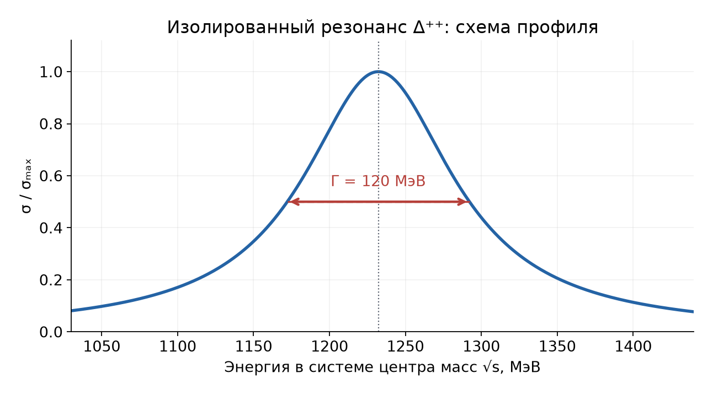
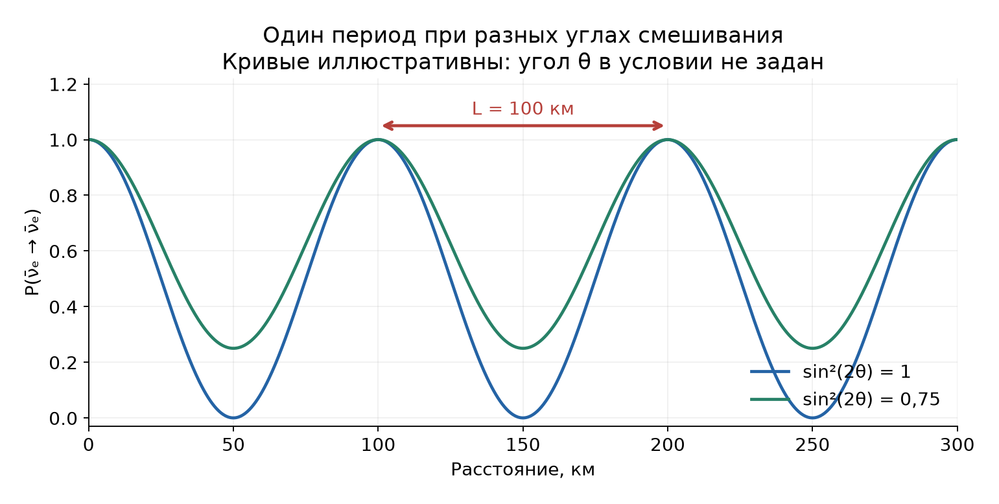

# Неделя 14 · 1–7 декабря

## Фундаментальные взаимодействия и частицы

[Все недели](../README.md) · [Указатель задач](../TASKS.md) · [Теория](#theory) · [К задачам](#tasks) · [← Неделя 13](./week-13.md)

<a name="tasks"></a>

**Задачи:** [0-14-1](#task-0-14-1) · [0-14-2](#task-0-14-2) · [10.69](#task-10-69) · [10.62](#task-10-62) · [10.92](#task-10-92) · [10.21](#task-10-21) · [10.99](#task-10-99) · [Т14.1](#task-t14-1) · [10.111](#task-10-111)

<a name="theory"></a>

## Теоретический минимум

### 1. Релятивистская кинематика

Полная энергия частицы связана с импульсом соотношением $`E^2=p^2c^2+m^2c^4`$, а кинетическая энергия равна $`T=E-mc^2`$. Для системы частиц удобно использовать инвариант


```math
s=\left(\sum_iE_i\right)^2-c^2\left|\sum_i\mathbf p_i\right|^2.
```


Он одинаков во всех инерциальных системах отсчёта. В системе центра масс суммарный импульс равен нулю, поэтому $`\sqrt s`$ — полная энергия в этой системе. На пороге рождения частиц их относительное движение отсутствует:


```math
\sqrt{s_{\rm thr}}=\sum_fm_fc^2.
```


Для частицы $`a`$, падающей на неподвижную мишень $`b`$,


```math
s=m_a^2c^4+m_b^2c^4+2m_bc^2E_a.
```


Здесь $`E_a`$ — **полная**, а не кинетическая энергия. Для встречных пучков одинаковой массы и одинаковой энергии суммарный импульс равен нулю и $`\sqrt s=2E_{\rm beam}`$.

### 2. Движение в магнитном поле

Сила Лоренца не меняет энергию, но поворачивает импульс. При движении перпендикулярно полю $`|q|vB=pv/R`$, откуда


```math
p=|q|BR,\qquad pc\,[\text{ГэВ}]=0{,}299792458\,B\,[\text{Тл}]\,R\,[\text{м}]
```


для частицы с модулем заряда $`e`$. Для винтовой траектории по радиусу её проекции определяется поперечная компонента импульса $`p_\perp`$.

### 3. Кварки и законы сохранения

Барионы содержат три валентных кварка, мезоны — кварк и антикварк. Заряды $`u`$-кварка и $`d,s`$-кварков равны соответственно $`+2e/3`$ и $`-e/3`$; у антикварков знаки противоположны. Барионное число кварка равно $`1/3`$, антикварка — $`-1/3`$.

При составлении реакции проверяем электрический заряд, барионное число и лептонные числа. Например, $`\nu_\mu`$ и $`\mu^-`$ имеют мюонное лептонное число $`+1`$, их античастицы — $`-1`$. Слабый заряженный ток связывает $`\nu_\mu`$ с $`\mu^-`$ посредством $`W`$-бозона. Аддитивная кварковая модель сечений — приближение: сечение адронов оценивают суммой взаимодействий их составляющих.

### 4. Резонансы и радиус взаимодействия

При образовании короткоживущего состояния сечение имеет резонансную зависимость от энергии. Если $`\Gamma`$ — полная ширина на половине высоты, то среднее время жизни $`\tau=\hbar/\Gamma`$.

Обмен массивной частицей массы $`M`$ даёт характерный радиус $`r\sim\hbar/(Mc)`$. Это масштаб экспоненциального убывания потенциала Юкавы, а не геометрический размер переносчика взаимодействия.

---

<a name="task-0-14-1"></a>

### Задача 0-14-1. Порог рождения протон-антипротонной пары

**Условие.** Определите минимальную кинетическую энергию протона, налетающего на неподвижный протон, необходимую для рождения пары протон–антипротон.

**Краткая теория.** На пороге конечные частицы покоятся относительно друг друга в системе центра масс. Для неподвижной мишени порог удобно находить через инвариант $`s`$.

**Решение.** Реакция имеет вид


```math
p+p\to p+p+p+\bar p.
```


Она сохраняет заряд ($`2e`$ с обеих сторон) и барионное число ($`2=3-1`$). Минимальная конечная энергия в системе центра масс равна $`4m_pc^2`$. В лабораторной системе полная энергия падающего протона $`E=m_pc^2+T`$, поэтому


```math
s=2m_p^2c^4+2m_pc^2(m_pc^2+T)=4m_p^2c^4+2m_pc^2T.
```


Приравнивая к пороговому значению $`(4m_pc^2)^2`$, получаем


```math
2m_pc^2T_{\min}=12m_p^2c^4,\qquad
\boxed{T_{\min}=6m_pc^2\simeq5{,}63\ \text{ГэВ}.}
```


Энергии $`2m_pc^2`$ хватило бы только на массу новой пары. При неподвижной мишени сохранение импульса требует также движения всей конечной системы, что и повышает лабораторный порог.

---

<a name="task-0-14-2"></a>

### Задача 0-14-2. Энергия электрона по кривизне следа

**Условие.** Определить энергию релятивистского электрона, если радиус кривизны его следа в камере Вильсона, помещенной в магнитное поле $`B=10^5`$ Гс, составляет $`R=2`$ м.

**Краткая теория.** Магнитная жёсткость траектории задаёт импульс: $`p=eBR`$. Энергия затем находится из релятивистского соотношения между $`E`$ и $`p`$.

**Решение.** В стандартной для этой задачи геометрии скорость перпендикулярна полю. Переведём поле: $`10^5`$ Гс $`=10`$ Тл. Тогда


```math
pc=0{,}299792458\cdot10\cdot2\ \text{ГэВ}=5{,}996\ \text{ГэВ}.
```


Поскольку $`m_ec^2=0{,}000511`$ ГэВ, масса покоя даёт пренебрежимо малую поправку:


```math
\boxed{E=\sqrt{p^2c^2+m_e^2c^4}\simeq pc\simeq6{,}0\ \text{ГэВ}.}
```


Кинетическая энергия отличается от полной на $`0{,}511`$ МэВ. Если дан только радиус проекции винтового следа, то найдено $`p_\perp`$, а для полной энергии дополнительно нужен наклон траектории к полю.

---

<a name="task-10-69"></a>

### Задача 10.69. Аддитивная кварковая модель сечений

**Условие.** В реакциях при больших энергиях ($`\sim100`$ ГэВ) известны полные сечения $`\sigma_1`$ и $`\sigma_2`$ соответственно для реакций $`(K^++\Sigma^+)`$ и $`(K^++\Xi^0)`$. Определить на основе кварковой модели сечение $`\sigma_3`$ для реакции $`(K^++\Omega^-)`$.

**Краткая теория.** В аддитивной модели сечение столкновения адронов складывается из сечений всех пар их валентных кварков. При больших энергиях в этой оценке не различают соответствующие кварк-кварковые и кварк-антикварковые сечения.

**Решение.** Кварковый состав частиц:


```math
K^+=u\bar s,\qquad\Sigma^+=uus,\qquad\Xi^0=uss,\qquad\Omega^-=sss.
```


Введём три элементарных сечения: $`a=\sigma_{uu}`$, $`b=\sigma_{us}=\sigma_{u\bar s}`$, $`c=\sigma_{s\bar s}`$. Для каждого бариона надо посчитать шесть пар — по три для каждого из двух составляющих каона.

| Мишень | Пары с $`u`$ каона | Пары с $`\bar s`$ каона | Полное сечение |
|---|---|---|---|
| $`uus`$ | $`2a+b`$ | $`2b+c`$ | $`\sigma_1=2a+3b+c`$ |
| $`uss`$ | $`a+2b`$ | $`b+2c`$ | $`\sigma_2=a+3b+2c`$ |
| $`sss`$ | $`3b`$ | $`3c`$ | $`\sigma_3=3b+3c`$ |

Из первых двух равенств


```math
2\sigma_2-\sigma_1=2(a+3b+2c)-(2a+3b+c)=3b+3c.
```


Следовательно,


```math
\boxed{\sigma_3=2\sigma_2-\sigma_1.}
```


Результат относится к аддитивной модели; он не является точным законом для любых энергий и любых механизмов адронного рассеяния.

---

<a name="task-10-62"></a>

### Задача 10.62. Масса и время жизни изобары

**Условие.** В полном сечении реакции $`\pi^+p\to\pi^+p`$ при $`T_\pi=190`$ МэВ наблюдается резонанс с полной шириной $`\Gamma=120`$ МэВ, называемый $`\Delta^{++}`$-изобарой. Определить время жизни и энергию покоя этой частицы.

**Краткая теория.** Масса промежуточного резонанса определяется полной энергией столкновения в системе центра масс. Время жизни связано с полной шириной формулой $`\tau=\hbar/\Gamma`$.



**Решение.** Считаем протон мишени покоящимся. Тогда


```math
M_\Delta^2c^4=s=m_p^2c^4+m_\pi^2c^4+2m_pc^2E_\pi,
```


где $`E_\pi=m_\pi c^2+T_\pi`$. Следовательно,


```math
M_\Delta c^2=\sqrt{(m_pc^2+m_\pi c^2)^2+2m_pc^2T_\pi}.
```


Подставляя $`m_pc^2=938{,}272`$ МэВ и $`m_\pi c^2=139{,}570`$ МэВ, получаем


```math
\boxed{M_\Delta c^2\simeq1232{,}2\ \text{МэВ}\simeq1{,}23\ \text{ГэВ}.}
```


Время жизни:


```math
\boxed{\tau=\frac{6{,}5821\cdot10^{-22}\ \text{МэВ}\cdot\text{с}}{120\ \text{МэВ}}
\simeq5{,}49\cdot10^{-24}\ \text{с}.}
```


Резонанс соответствует образованию и распаду $`\pi^++p\to\Delta^{++}\to\pi^++p`$; заряд промежуточной частицы действительно равен $`+2e`$.

---

<a name="task-10-92"></a>

### Задача 10.92. Порог регистрации нейтрино на кислороде

**Условие.** Обыкновенная вода $`\mathrm H_2\mathrm O`$ используется для регистрации нейтрино по реакции, обратной $`K`$-захвату. Регистрируются вторичные заряженные лептоны. Какова пороговая энергия регистрируемых таким детектором нейтрино? При какой энергии нейтрино возможна регистрация как электронных, так и мюонных нейтрино? Энергии покоя ядер: $`{}^{16}_{8}\mathrm O`$ — 14895 МэВ, $`{}^{16}_{9}\mathrm F`$ — 14910 МэВ.

**Краткая теория.** В реакции заряженного слабого тока нейтрино превращается в отрицательный лептон, а заряд ядра увеличивается на единицу. Порог включает массу лептона и кинематическую отдачу.

**Решение.** Рассматриваем каналы


```math
\nu_e+{}^{16}_{8}\mathrm O\to{}^{16}_{9}\mathrm F+e^-,\qquad
\nu_\mu+{}^{16}_{8}\mathrm O\to{}^{16}_{9}\mathrm F+\mu^-.
```


Обозначим энергии покоя ядер через $`\mathcal M_O=M_Oc^2`$, $`\mathcal M_F=M_Fc^2`$, лептона — через $`\mu_l=m_lc^2`$. Пренебрегая массой нейтрино и считая ядро кислорода неподвижным, имеем


```math
s=\mathcal M_O^2+2\mathcal M_OE_\nu.
```


На пороге $`s=(\mathcal M_F+\mu_l)^2`$, поэтому


```math
E_{\nu,\rm thr}=\frac{(\mathcal M_F+\mu_l)^2-\mathcal M_O^2}{2\mathcal M_O}
=\Delta_l+\frac{\Delta_l^2}{2\mathcal M_O},\qquad
\Delta_l=\mathcal M_F-\mathcal M_O+\mu_l.
```


Для электрона $`\Delta_e=15+0{,}511=15{,}511`$ МэВ:


```math
\boxed{E_{\nu_e,\rm thr}=15{,}511+\frac{15{,}511^2}{2\cdot14895}\simeq15{,}52\ \text{МэВ}.}
```


Для мюона $`\Delta_\mu=15+105{,}658=120{,}658`$ МэВ:


```math
\boxed{E_{\nu_\mu,\rm thr}=120{,}658+\frac{120{,}658^2}{2\cdot14895}\simeq121{,}15\ \text{МэВ}.}
```


Таким образом, оба указанных канала доступны при $`E_\nu\gtrsim121`$ МэВ. В книжном ответе приведено около $`121{,}5`$ МэВ; точная подстановка данных условия и массы мюона даёт $`121{,}15`$ МэВ. Речь идёт о пороге данного ядерного канала, а не всех возможных способов регистрации нейтрино в воде.

---

<a name="task-10-21"></a>

### Задача 10.21. Рождение красивых мезонов во встречных пучках

**Условие.** Определить, выше какой минимальной энергии $`\mathcal E_{\min}`$ встречных электрон-позитронных пучков, имеющих одинаковую энергию, могут рождаться частицы из семейства «красивых» ($`B`$-мезоны). Энергия покоя $`B`$-мезона $`m_Bc^2\approx5279`$ МэВ.

**Краткая теория.** Во встречных пучках одинаковой энергии лабораторная система совпадает с системой центра масс. При электромагнитном рождении открытой красоты образуется пара $`B\bar B`$.

**Решение.** Импульсы электрона и позитрона взаимно сокращаются, поэтому $`\sqrt s=2E_{\rm beam}`$. На пороге мезоны не имеют относительного движения:


```math
2E_{\rm beam,thr}=2m_Bc^2.
```


Следовательно,


```math
\boxed{E_{\rm beam,thr}=m_Bc^2=5{,}279\ \text{ГэВ}\quad\text{для каждого пучка},}
```


```math
\boxed{\sqrt{s_{\rm thr}}=2m_Bc^2=10{,}558\ \text{ГэВ}\quad\text{суммарно}.}
```


Число $`10{,}56`$ ГэВ в ответе книги относится к суммарной энергии встречных пучков. Различение этих двух величин исключает неоднозначность формулировки. На самом пороге фазовый объём обращается в нуль; ненулевая скорость рождения требует энергии немного выше порога.

---

<a name="task-10-99"></a>

### Задача 10.99. Масса паработтомониума и тип перехода

**Условие.** В августе 2008 г. группа BABAR Collaboration сообщила о регистрации $`\eta_b(1S)`$-мезона — основного состояния боттомониума, соответствующего антипараллельной ориентации спинов пары $`(b,\bar b)`$ (так называемый паработтомониум в состоянии $`1{}^1S_0`$). На встречных $`(e^-,e^+)`$-пучках при суммарной энергии $`\mathcal E=10355`$ МэВ рождался $`\Upsilon(3S)`$-мезон, соответствующий возбужденному состоянию системы $`(b\bar b)`$ с параллельными спинами (так называемый ортоботтомониум в состоянии $`3{}^3S_1`$). Рожденный мезон распадался на мезон $`\eta_b(1S)`$ и $`\gamma`$-квант: $`\Upsilon(3S)\to\eta_b(1S)+\gamma`$. Определить массу $`\eta_b(1S)`$-мезона и типа испускаемого $`\gamma`$-кванта, если энергия $`\gamma`$-кванта $`\mathcal E_\gamma=921{,}2`$ МэВ. Какова разница в энергиях основных состояний орто- и паработтомониума, определяемая переворотом спина одного из кварков? Масса основного состояния ортоботтомониума $`m_{\Upsilon(1S)}=9460{,}4`$ МэВ/$`c^2`$. (См. также задачи 10.56, 10.59 и 10.60.)

**Краткая теория.** В системе покоя исходного мезона конечный мезон и фотон имеют противоположные импульсы. Массу находим с учётом отдачи, а тип фотона — по изменению полного момента и чётности.

**Решение.** В условии $`\bar b`$ обозначает антикварк. Суммарная энергия равных встречных пучков — энергия покоя рождаемого мезона. После распада $`p_\eta=\mathcal E_\gamma/c`$, а $`E_\eta=\mathcal E-\mathcal E_\gamma`$. Следовательно,


```math
m_\eta^2c^4=E_\eta^2-p_\eta^2c^2
=(\mathcal E-\mathcal E_\gamma)^2-\mathcal E_\gamma^2
=\mathcal E^2-2\mathcal E\mathcal E_\gamma.
```


Подстановка даёт


```math
\boxed{m_\eta=\frac{\sqrt{10355^2-2\cdot10355\cdot921{,}2}}{c^2}\ \text{МэВ}
\simeq9388{,}72\ \text{МэВ}/c^2.}
```


Вычесть только энергию фотона из $`\mathcal E`$ недостаточно: остаток $`9433{,}8`$ МэВ включает кинетическую энергию отдачи конечного мезона, около $`45{,}1`$ МэВ.

Переход $`3{}^3S_1\to1{}^1S_0`$ имеет $`J_i=1`$, $`J_f=0`$, поэтому фотон несёт мультипольный момент $`K=1`$. Чётность кварк-антикваркового состояния $`P=(-1)^{L+1}`$ одинакова для двух $`S`$-состояний. Электрический диполь E1 менял бы чётность, а магнитный диполь M1 её сохраняет. Поэтому


```math
\boxed{\text{испускается фотон M1}.}
```


Магнитный оператор может менять полный спин пары с $`S=1`$ на $`S=0`$. Поскольку радиальные квантовые числа тоже различны, это подавленный M1-переход: в ведущем длинноволновом приближении радиальные функции ортогональны, а ненулевую амплитуду дают поправки. Это влияет на интенсивность, но не меняет мультипольность.

Для **основных** состояний надо сравнивать $`\Upsilon(1S)`$ и $`\eta_b(1S)`$:


```math
\boxed{\Delta E_{\rm hf}=(m_{\Upsilon(1S)}-m_\eta)c^2
=9460{,}4-9388{,}72\simeq71{,}68\ \text{МэВ}.}
```


В ответе книги напечатано $`71{,}4`$ МэВ; из данных условия и указанной там же массы $`9388{,}7`$ МэВ/$`c^2`$ следует $`71{,}7`$ МэВ.


<a name="task-t14-1"></a>

### Задача Т14.1. Рождение W-бозона нейтрино

**Условие.** Мюонное нейтрино, попав в жидководородную камеру, рождает W-бозон при рассеянии на протоне, если энергия нейтрино превышает 3,5 ТэВ. Напишите уравнение реакции, определите заряд и массу образующегося W-бозона и получите оценку для характерного радиуса слабого взаимодействия.

**Краткая теория.** Превращение $`\nu_\mu\to\mu^-`$ требует рождения положительно заряженного переносчика слабого взаимодействия. Масса определяется порогом реакции на неподвижной мишени.

**Решение.** Реакция в рассматриваемом канале имеет вид


```math
\boxed{\nu_\mu+p\to\mu^-+W^++p.}
```


Мюон сохраняет мюонное лептонное число исходного нейтрино, протон — барионное число. Из сохранения заряда $`+e=-e+q_W+e`$ следует $`q_W=+e`$.

Для практически безмассового нейтрино и покоящегося протона


```math
s=m_p^2c^4+2m_pc^2E_\nu.
```


На пороге три конечные частицы неподвижны относительно друг друга, поэтому


```math
m_Wc^2=\sqrt{m_p^2c^4+2m_pc^2E_{\nu,\rm thr}}-m_pc^2-m_\mu c^2.
```


Ведущая оценка при $`m_W\gg m_p,m_\mu`$ даёт


```math
m_Wc^2\simeq\sqrt{2m_pc^2E_{\nu,\rm thr}}
=\sqrt{2\cdot0{,}938\cdot3500}\ \text{ГэВ}
\simeq81\ \text{ГэВ}.
```


Именно эта оценка указана в ответе. Если удержать массы конечных протона и мюона, из округлённого порога $`3{,}5`$ ТэВ получается около $`80{,}0`$ ГэВ. Значит,


```math
\boxed{q_W=+e,\qquad m_W\sim81\ \text{ГэВ}/c^2.}
```


Характерный радиус слабого взаимодействия находим по приведённой комптоновской длине волны переносчика:


```math
r_W\sim\frac{\hbar c}{m_Wc^2}
\simeq\frac{197{,}327}{81\cdot10^3}\ \text{фм}
=2{,}44\cdot10^{-3}\ \text{фм},
```


```math
\boxed{r_W\sim2{,}4\cdot10^{-18}\ \text{м}\sim10^{-16}\ \text{см}.}
```


---

<a name="task-10-111"></a>

### Задача 10.111. Нейтринные осцилляции

**Условие.** Согласно современным представлениям нейтрино (антинейтрино) рождается и исчезает как частица определенного типа $`\nu_e`$, $`\nu_\mu`$ или $`\nu_\tau`$, но при этом является суперпозицией состояний $`\nu_1`$, $`\nu_2`$, $`\nu_3`$ с определенными массами. В упрощенной модели (пренебрегая разницей между $`\nu_1`$ и $`\nu_2`$) можно выразить состояния $`\nu_e`$ и $`\nu_\mu`$ как $`\nu_e=\cos\theta\,\nu_1+\sin\theta\,\nu_2`$; $`\nu_\mu=-\sin\theta\,\nu_1+\cos\theta\,\nu_2`$, где $`\theta`$ — константа, называемая углом смешивания. В реакторном эксперименте Kamland наблюдались осцилляции потока нейтронных антинейтрино, испускаемых ядерным реактором. Эксперимент показал, что вероятность зарегистрировать электронное антинейтрино с энергией $`\mathcal E=3`$ МэВ осциллирует с расстоянием до реактора с периодом $`L\approx100`$ км. Найти разность квадратов энергий покоя антинейтрино типов 1 и 2 (в эВ²), предполагая, что она мала по сравнению с $`\mathcal E`$ и что в начальный момент времени импульсы антинейтрино типов 1 и 2 совпадали.

**Краткая теория.** Состояния с определённой массой приобретают разные фазы при распространении. Их интерференция изменяет вероятность обнаружить исходный тип нейтрино. Период зависит от разности квадратов масс; угол смешивания задаёт амплитуду осцилляций.



**Уточнение обозначений условия.** Приведённые две формулы задают двухсостоянийную модель с различными массами $`m_1,m_2`$. Фраза «пренебрегая разницей между $`\nu_1`$ и $`\nu_2`$» не может означать их точное вырождение — тогда осцилляций не было бы. В этой модели опускается третье независимое массовое состояние. «Нейтронных антинейтрино» в тексте следует понимать как реакторные электронные антинейтрино; размерностно малым является $`|(m_2^2-m_1^2)c^4|/\mathcal E^2`$.

**Решение.** Пусть при $`t=0`$ рождено электронное антинейтрино. В двухкомпонентной модели с действительным смешиванием его эволюция имеет тот же вид, что и для нейтрино:


```math
|\bar\nu(t)\rangle=\cos\theta\,e^{-iE_1t/\hbar}|\bar\nu_1\rangle
+\sin\theta\,e^{-iE_2t/\hbar}|\bar\nu_2\rangle.
```


Общий пространственный множитель $`e^{ipx/\hbar}`$ сократился, поскольку импульсы по условию одинаковы. Проецируем состояние на исходное:


```math
\mathcal A_{ee}=\cos^2\theta\,e^{-iE_1t/\hbar}+\sin^2\theta\,e^{-iE_2t/\hbar}.
```


Возводя модуль в квадрат и используя $`1-\cos\varphi=2\sin^2(\varphi/2)`$, получаем


```math
\begin{aligned}
P_{ee}&=\cos^4\theta+\sin^4\theta+2\sin^2\theta\cos^2\theta\cos\frac{(E_2-E_1)t}{\hbar}\\[0pt]
&=1-\sin^2(2\theta)\sin^2\frac{(E_2-E_1)t}{2\hbar}.
\end{aligned}
```


Для ультрарелятивистских частиц


```math
E_i=\sqrt{p^2c^2+m_i^2c^4}\simeq pc+\frac{m_i^2c^4}{2pc},\qquad
E_2-E_1\simeq\frac{(m_2^2-m_1^2)c^4}{2\mathcal E}.
```


Полагая $`t\simeq x/c`$,


```math
P_{ee}(x)=1-\sin^2(2\theta)\sin^2\left(\frac{(m_2^2-m_1^2)c^4x}{4\mathcal E\hbar c}\right).
```


Период функции $`\sin^2 y`$ по аргументу равен $`\pi`$, поэтому


```math
\frac{|m_2^2-m_1^2|c^4L}{4\mathcal E\hbar c}=\pi,\qquad
\boxed{|m_2^2-m_1^2|c^4=\frac{4\pi\mathcal E\hbar c}{L}=\frac{2\mathcal E hc}{L}.}
```


Подставляем $`hc=1{,}23984\cdot10^{-6}\ \text{эВ}\cdot\text{м}`$, $`L=10^5`$ м:


```math
\boxed{|m_2^2-m_1^2|c^4=\frac{2\cdot3\cdot10^6\cdot1{,}23984\cdot10^{-6}}{10^5}
\simeq7{,}44\cdot10^{-5}\ \text{эВ}^2.}
```


Из одного периода определяется модуль разности. Положительный знак $`m_2^2-m_1^2`$ можно получить соглашением о нумерации состояний; абсолютные массы и угол смешивания по данному периоду не определяются.


---

[Все недели](../README.md) · [Указатель задач](../TASKS.md) · [Теория](#theory) · [К задачам](#tasks) · [← Неделя 13](./week-13.md)

[Сообщить об ошибке в этой неделе](https://github.com/NeTotDEDD/FIZOS_Kvanty/issues/new?template=correction.yml)
